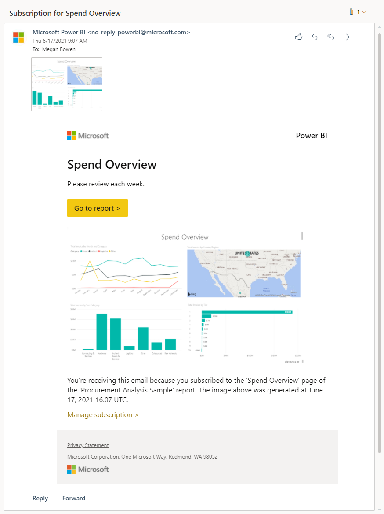

# Email subscriptions for reports and dashboards in the Power BI service

[!INCLUDE [applies-no-desktop-yes-service](../includes/applies-no-desktop-yes-service.md)]

Subscribe yourself and others to Power BI reports, dashboards, and paginated reports. You receive an email on a schedule you set. The email contains a snapshot and link to the report or dashboard. If you're a workspace administrator, learn how to manage subscriptions in your workspace, including how to take over subscriptions owned by others.

## Subscribe to a report or dashboard in the Power BI service 

It's never been easier to stay up-to-date on your most important dashboards and reports. Subscribe to reports and dashboards that matter most to you, and Power BI emails a snapshot to your inbox. You tell Power BI how often you want to receive the emails: daily, weekly, or when the data refresh. You can even set a specific time for Power BI to send the emails or have it run now. Set up to 24 subscriptions per report or dashboard, and provide unique recipients, times, and frequencies for each subscription.  

:::image type="content" source="./media/end-user-subscribe/power-bi-email-sent.png" alt-text="Email for subscription to a report.":::

## Requirements
The requirements apply to users in the organization and to [Azure Active Directory (Azure AD) Business-to-Business (B2B) guest users](../enterprise/service-admin-azure-ad-b2b.md). To create a subscription for yourself, you need permissions to access the particular report or dashboard and **either**:

- A Power BI Pro or [Premium Per User (PPU) license](../consumer/end-user-license.md), or
- Access to a workspace backed by a [Power BI Premium capacity](../enterprise/service-premium-what-is.md) 

Your Power BI admin also needs to enable subscriptions in your tenant. If you’re an admin, see [Enable subscriptions in the Power BI admin portal](../admin/service-admin-portal-export-sharing.md#users-can-set-up-email-subscriptions). To export or subscribe to paginated reports, [several tenant switches must be enabled](#subscribe-to-paginated-reports).

## Subscribe to a report or dashboard
Whether you're subscribing to a dashboard or to a report page, the process is similar. A single button allows you to subscribe to the Power BI service dashboards and reports. Subscribing to a report offers you a few more field options, so we'll use a report for our example. 

:::image type="content" source="./media/end-user-subscribe/power-bi-subscribe.png" alt-text="Screenshot showing the Subscribe to report icon on the top menu bar.":::

Subscribing to a *paginated* report is slightly different, as outlined in [Subscribe to paginated reports](#subscribe-to-paginated-reports) in this article.

1. Open the report, and from the top menu bar, select **Subscribe to report** .  

2. Select **Add new subscription** and give your subscription a name. By default, your subscription is given the same name as your report page or dashboard. Optionally, change the name of the subscription to something more meaningful.

   :::image type="content" source="./media/end-user-subscribe/power-bi-subscribe-to-report.png" alt-text="Screenshot of the Subscribe to emails screen.":::

3. Use the yellow slider to turn the subscription on and off. Setting the slider to **Off** doesn't delete the subscription. To delete the subscription, select the trashcan icon.

4. Edit or add recipients by email address, ensuring that you have at least one. 

    > [!NOTE] 
    > B2B Guest users can only subscribe themselves. 

5. When creating a subscription for a report, you choose whether to **Include my changes**. When **Include my changes** is unchecked, Power BI ignores all changes you might have made to the report, and subscribes you to the report as published by the author. When **Include my changes** is checked, Power BI subscribes you to the report including all changes you've made to the report. Changes include:  

    - filters (filter pane)
    - slicers
    - personalized visuals
    - cross-filtering or cross-highlighting
    - drill down or drill up
    - bookmarks
    - spotlights
    - focus mode

    If you're the author of the report, **Include my changes** is a great way to create individualized subscriptions for recipients. First, customize your report based on conditions such as country/region, team/department, and category. Then, subscribe colleagues to the customized report views.

    > [!NOTE]
    > The **Include my changes** field isn't available for dashboards or paginated reports. 

6. Select a **Frequency** for your subscription. You may choose Hourly, Daily, Weekly, or After data refresh (once daily).  
    
    > [!TIP]
    > To receive a subscription email only on certain days, select Hourly or Weekly and then select the week day checkboxes. If you select Monthly, enter the day(s) of the month you wish to receive the subscription email.

    - If you choose Hourly, Daily, Weekly, or Monthly, choose a **Scheduled Time** for the subscription. You can have it run on the hour, or at 15, 30, or 45 minutes past for a specified time zone. Select morning (AM) or afternoon/evening (PM). If you choose Hourly, select the **Scheduled Time** you want the subscription to start, and it will run every hour after the **Scheduled Time**.  

If your subscription is ready, select **Save**. To make your subscription more precise, select **More options**. 

1. Optionally, add a subject and message for recipients. 

2. Select the **Report page** you want to appear in the preview image. To subscribe to more than one page in a report, either select **Add new subscription** and choose a different page from the dropdown, or select the **Full report attachment as** checkbox under **Also include**. (For more information about full report attachments, see step 4.) 

    > [!TIP]
    > By default, a report subscription inherits the name of the active report page. Consider changing the subscription name if you select a different report page. 
 
3. Select a **Start date** and optionally, an **End date** for your subscription. By default, the start date is the date you created the subscription and the end date is one year later. You can change it to any date in the future at any time before the subscription ends. When a subscription reaches an end date, it stops until you re-enable it. You receive notifications before the scheduled end date to ask if you'd like to extend it.

4. Include additional information in the email. Select one or more of these checkboxes.
    - **Permission to access the report/dashboard in Power BI**: Give recipients permission to open and view the report or dashboard in the Power BI service (app.powerbi.com).
    - **Link to report/dashboard in Power BI**: Include a "Go to report" button in the body of the email that links to the report or dashboard in the Power BI service.
    - **Preview image (for Power BI reports only)**: Include a preview of the report page in the body of the email.
    - **Full report attachment as (for Power BI reports only)**: If the report is in a workspace backed by a Premium capacity or Premium Per User (PPU) license, add the full report as an attachment instead of only a single report page. Select PDF or PowerPoint for the attachment format. The attachment respects all privacy labels for the report. The size of the attachment is limited to no more than 20 pages and less than 25 MB.

10. Optionally, to test out your subscription, select **Run now** to send the email to you right away. It doesn't trigger a data refresh of the underlying dataset. If everything looks good, select **Save**. 

You receive an email and snapshot of the report or dashboard on the schedule you set. Subscriptions that have the frequency set to **After data refresh** will only send an email after the first scheduled refresh on that day.  

> [!NOTE]
> To avoid subscription emails going to your spam folder, add the Power BI email alias (no-reply-powerbi@microsoft.com) to your contacts. If you're using Microsoft Outlook, right-click the alias and select **Add to Outlook contacts**.

   
   
   
## Subscribe others 

To create a subscription that includes others, in addition to the [requirements necessary to create your own subscriptions](#requirements), you also need:

- A Contributor, Member, or Admin role in that workspace. You know that you have the Contributor, Member, or Admin role in a workspace if you're able to edit reports or dashboards in that workspace. Read more about [roles in workspaces](../collaborate-share/service-roles-new-workspaces.md).  

- To be part of the organization. [B2B guest users](../enterprise/service-admin-azure-ad-b2b.md) can't subscribe others only themselves. For more information, read [B2B guest users can set up and be subscribed to email subscriptions](#b2b-guest-users-can-set-up-and-be-subscribed-to-email-subscriptions).

- If the report or dashboard isn't hosted in a Premium capacity, as indicated by the diamond icon, you can still subscribe others. However, they must also have a Power BI Pro or Premium Per User (PPU) license. 

    :::image type="content" source="media/end-user-subscribe/power-bi-premium.png" alt-text="Workspaces showing diamond icon for Premium and diamond with person icon for PPU.":::

### Use group email aliases 
When creating a subscription, you can add other email addresses in the same domain to the subscription. If the report or dashboard is hosted in a [Premium capacity](../enterprise/service-premium-what-is.md), you can subscribe group aliases, whether they're in your domain or not. You don't have to subscribe individual email addresses. The aliases are based on the current active directory. 

|Group type      |Supported in email subscriptions  |
|---------|---------|
|[Microsoft 365 groups](/microsoft-365/admin/create-groups/office-365-groups)     |      Yes   |
|[Distribution groups](/exchange/recipients-in-exchange-online/manage-distribution-groups/manage-distribution-groups)    |    Yes     |
|[Dynamic distribution groups](/exchange/recipients-in-exchange-online/manage-dynamic-distribution-groups/manage-dynamic-distribution-groups)     |      Yes   |
|[Security groups](/microsoft-365/admin/email/create-edit-or-delete-a-security-group)     |    No     |
|[Mail-enabled security groups](/microsoft-365/admin/create-groups/compare-groups?view=o365-worldwide#microsoft-365-groups&preserve-view=true)    |     Yes    |

There are different ways of creating a Microsoft 365 group. For example, you can create a group in Outlook, a distribution group in Teams, or a mail-enabled security group. The Microsoft 365 distribution group for Teams doesn't work for mail enablement, so can't be used for direct sharing and email subscriptions.

> [!NOTE]
> Workspaces backed by a Premium Per User (PPU) license are different from those backed by a Premium capacity, and don't support subscribing group aliases.  

## Subscriptions for users outside your organization

### Subscribe external users 

You can subscribe external users to a report or dashboard if your report or dashboard is hosted in a Premium capacity. B2B guest users can't add subscriptions for external users. 

- If you subscribe external users to a report or dashboard, they'll receive a share notification immediately after you select  **Save and close** in the subscription pane. This notification is sent only to external users, not internal users, because external users require an invitation link to view the report or dashboard. 

- Premium Per User workspaces don't qualify as Premium capacity workspaces. 

- *Sharing* content with a colleague outside of your domain doesn't require a Premium capacity. For example, if you're aaron@contoso.com, you can share with anyone@fabrikam.com, but you can't **subscribe** anyone@fabrikam.com, unless that content is hosted in a Premium capacity. 

### B2B guest users can set up and be subscribed to email subscriptions

B2B guest users can create their own content subscription to which they have access and users in the organization can subscribe them to emails. B2B users must first be added by member of the organization to set up and subscribe to email content. For more information about B2B guest users and how to add them to your organization, read [Distribute content to external guest users with Azure AD B2B](../enterprise/service-admin-azure-ad-b2b.md).

In addition to B2B guest users meeting the requirements to subscribe themselves, the Power BI tenant admin must turn on a setting to allow B2B guest users to create email subscriptions. For more information on how to turn on this setting, read [Export and sharing tenant settings](../admin/service-admin-portal-export-sharing.md#b2b-guest-users-can-set-up-and-be-subscribed-to-email-subscriptions).

## Subscribe to paginated reports 

### Subscribe yourself or others to paginated reports
Your Power BI admin must [enable subscriptions in your tenant](../admin/service-admin-portal-export-sharing.md). In addition, the relevant tenant switches have to be enabled:
- Export to Excel
- Export to .csv
- Export reports as PowerPoint presentations or PDF documents
- Export reports as MHTML documents
- Export reports as Word documents
- Export reports as XML documents
- Create email subscriptions (**Tenant settings** > **Export and sharing settings** > **Create email subscriptions**)
:::image type="content" source="./media/end-user-subscribe/power-bi-paginated.png" alt-text="Screenshot of tenant settings with relevant export settings outlined.":::

In general, the process for subscribing to paginated reports is the same as [subscribing to reports and dashboards](#subscribe-to-a-report-or-dashboard), but there are a few differences worth noting. This section spells out these differences and other considerations to keep in mind when subscribing to paginated reports.  

### Paginated reports parameters 

Paginated reports allow you to specify the view of the report people receive in the subscription by setting the parameters in the subscription pane.  

- Subscriptions can be sent with either the currently selected or default parameters for your report. You may set different parameter values for each subscription you create for your report. 

- If your report author has set expression-based parameters (for example, the default is always today's date), the subscription uses that as the default value. You can change other parameter values and choose to use current values, but unless you explicitly change that value as well, the subscription uses the expression-based parameter. 

### Update parameters for an existing paginated report subscription

If you have an existing subscription to a paginated report, and you want to update the parameters applied to the report, follow these steps. 

1. Re-render the paginated report with the new  parameters.
1. Open the **Subscriptions** page.
1. Select **Use current (rendered report) values**.
    :::image type="content" source="./media/end-user-subscribe/power-bi-paginated-new.png" alt-text="Screenshot of Report parameters with Use current selected.":::

1. Select **Save**.

### Considerations unique to paginated report subscriptions

- You can subscribe other users in your organization to paginated reports that connect to any currently supported data sources, including Azure Analysis Services or Power BI datasets. Keep in mind the report attachment reflects the data based on your permissions.
- You can set up an unlimited number of subscriptions per paginated report. 
- B2B guest users can only create subscriptions for themselves.
- The maximum attachment size is 25 MB.
- Unlike subscriptions for dashboards or Power BI reports, your subscription contains an attachment of the entire report output. The following attachment types are supported: PDF, PowerPoint presentation (PPTX), Excel Workbook (XLSX), Word Document (DOCX), CSV file, and XML. 
- Optionally, include a preview image of the report in the email body. The image may differ slightly from the first page of your attached report document, depending on the attachment format you select. 
- There's no **After Data Refresh** option for frequency with paginated reports. You always get the latest values from the underlying data source.
- Paginated report subscriptions in the Power BI service are similar to email standard subscriptions in Power BI Report Server and SQL Server Reporting Services. However, you can't create data-driven subscriptions for paginated reports in the Power BI service.

## Manage subscriptions
Subscriptions are managed on a workspace level. Subscriptions can be viewed and managed by their creator and by the users assigned the *Admin* role. Admins in the workspace can view, edit, and take over all subscriptions inside the workspace. The Power BI admin can view subscriptions, view logs, and turn certain subscription features on and off.

# [Creator](#tab/creator)

### Subscriptions in a workspace

To see all subscriptions that you own in a given workspace, start by selecting that workspace to make it active. Then, from the upper right corner of the Power BI service, select the gear icon  > **Settings** > **Subscriptions**. This example shows all of your subscriptions for the workspace named **Sales and Marketing for DOCS**.

For help understanding workspaces, see [Workspaces in Power BI](../consumer/end-user-workspaces.md). 

:::image type="content" source="media/end-user-subscribe/power-bi-manage-workspaces.png" alt-text="Screenshot showing workspace with Subscriptions selected from the top.":::

From here, you see all subscriptions you've created in the currently selected workspace. For each subscription, Power BI displays the name you gave to the subscription, the name of the content you're subscribing to, and the content type. If you selected **Include my changes**, the **State** column includes the date. Search for subscriptions by keyword or filter by any of these fields. Select **Edit** to make changes to a subscription’s settings.   

### Subscriptions across all workspaces

To see all of your subscriptions, start by selecting **My workspace** to make it active. Then, from the upper right corner of the Power BI service, select the gear icon  > **Settings** > **Subscriptions**.

:::image type="content" source="media/end-user-subscribe/power-bi-settings.png" alt-text="Screenshot showing cog icon selected.":::

:::image type="content" source="media/end-user-subscribe/power-bi-my-workspace.png" alt-text="Screenshot showing all subscriptions for a user.":::

From here, you'll see a list of all your subscriptions across all workspaces. Power BI displays the name of the subscription, the name of the associated workspace, the name of the content you're subscribing to, and the content type. If you selected **Include my changes**, the **State** column includes the date. Search for subscriptions by keyword or filter by any of these fields. Select **Edit** to make changes to a subscription’s settings. 

Alternately, another way to see all of your subscriptions across all workspaces is to open the **Subscriptions** pane from a dashboard or report in **My workspace**, and select **Manage all subscriptions**.   

:::image type="content" source="media/end-user-subscribe/power-bi-my-workspace-manage.png" alt-text="Screenshot showing Subscription pane with Manage all subscriptions outlined in red.":::

# [Administrator](#tab/admin)

### Workspace administrators
Users who have been assigned the [Admin role](../collaborate-share/service-roles-new-workspaces.md) in a workspace can view all subscriptions that have been created for Power BI reports, dashboards, or paginated reports in that workspace, regardless of owner. Information on the subscription name, owner, report or dashboard name, and content type is provided. Workspace admins can also edit and take over subscriptions owned by others.

> [!NOTE]
> Subscriptions created for reports and dashboards in an app or those hosted in your **My workspace** can only be managed by the user who created the subscriptions. 

To navigate to this view from within a workspace, select the gear icon  > **Settings** > **Subscriptions**. 

:::image type="content" source="media/end-user-subscribe/power-bi-view-admin.png" alt-text="Screenshot showing all subscriptions for a workspace.":::

Users with the Admin role can also make edits or take over ownership of subscriptions that aren't their own.  

If for example, the owner of a subscription is on vacation and a new recipient needs to be added to their subscription, an admin can modify the subscription by selecting **Edit** and making the necessary updates to the subscription. The owner of this subscription receives an email notification that their workspace admin has made an edit.  

:::image type="content" source="media/end-user-subscribe/power-bi-admin-edit.png" alt-text="Screenshot showing a list of subscriptions with the pencil icon selected.":::

Admins can also take over ownership of subscriptions in the workspaces they manage. Being able to take over a subscription is essential when the original owner leaves a team or an organization. When the admin completes the take over, the original owner receives an email, and no longer sees this subscription in their list of subscriptions.

:::image type="content" source="media/end-user-subscribe/power-bi-admin-take-over.png" alt-text="Screenshot showing a list of subscriptions with the take over icon selected.":::

### Power BI administrators

#### Subscription controls and tracking for administrators 

Power BI administrators have levers of control over subscriptions. 

- [Users can set up email subscriptions](../admin/service-admin-portal-export-sharing.md) for all members of the organization. 

- Enable all members of the organization, or specific users, to send email subscriptions to external users. See [Users can send email subscriptions to external users](../admin/service-admin-portal-export-sharing.md). 

- [Enable specific attachment formats](../admin/service-admin-portal-export-sharing.md) for paginated report subscriptions (PDF, PowerPoint presentation (PPTX), Excel Workbook (XLSX), Word Document (DOCX), CSV file, and XML).
- [B2B guest users can set up and be subscribed to email subscriptions](../admin/service-admin-portal-export-sharing.md#b2b-guest-users-can-set-up-and-be-subscribed-to-email-subscriptions) to allow B2B guest users to create and subscribe to their own email subscriptions. 

### View subscription audit and activity logs 

Power BI administrators can use the Power BI audit and activity logs to view details about subscriptions. These details include: 

- Created by 
- Creation date 
- Content subscribed to 
- Workspace of content 
- Frequency 
- Modified by 
- Modified date 

See [Operations available in the audit and activity logs](../admin/service-admin-auditing.md#operations-available-in-the-audit-and-activity-logs) in "Track user activities in Power BI" for details. 

---
## Considerations and limitations 

For help with troubleshooting for the subscriptions feature, see [Troubleshoot Power BI subscriptions](service-troubleshoot-subscribe.yml).  

**General**
  
- If you aren't able to use the subscription feature, contact your system administrator or IT help desk. Your organization may have disabled this feature or a maximum subscriber limit may have been reached.
- Power BI automatically pauses refresh on datasets associated with dashboards and reports that haven't been visited in more than two months. However, if you add a subscription to a dashboard or report, it doesn't pause even if it goes unvisited.
- On Daylight savings day, you won't receive your subscription emails but will receive two emails per subscription the day after. 

**Row-level security (RLS)**
- For Power BI reports, dashboards, or paginated reports that use a dataset with row-level security (RLS), use caution when creating subscriptions for yourself and others. Power BI warns you that the data contains RLS, but customers often scroll past the warning message. 

  The static image sent in the subscription email displays data ***based on the owner of the subscription***. For this reason, when creating subscriptions, be careful to ensure that confidential information isn't included in the static image. Other than that static image, the report or dashboard itself opens (or not) and displays data based on the user's permissions.  

**Power BI reports**  

- Report page subscriptions are tied to the name of the report page. If you subscribe to a report page, and it gets renamed, you have to re-create your subscription.    

**Apps** 

- For [Power BI apps](../consumer/end-user-apps.md) you've installed, you can only create subscriptions for others if you're the owner of the app.
- Subscriptions created within apps can be viewed and managed from the associated workspace by users with the admin role in that workspace.  

**Unsupported features**    

* Dataset refresh operations using an XMLA endpoint.

* The following Power BI visuals aren't supported.  When you subscribe to a report containing these visuals, they display an error symbol. 
    - Power BI [custom visuals](../developer/visuals/develop-power-bi-visuals.md). The exception is those Power BI custom visuals that have been [certified](../developer/visuals/power-bi-custom-visuals-certified.md).
    - [ESRI ArcGIS](../visuals/power-bi-visualizations-arcgis.md) visuals
    - [R visuals](../visuals/service-r-visuals.md)
    - [Power Apps visuals](../visuals/power-bi-visualization-powerapp.md)
    - [Python visuals](../connect-data/desktop-python-visuals.md)
    - [Power Automate visuals](../create-reports/power-bi-automate-visual.md) 
    - [The Paginated report visual](../visuals/paginated-report-visual.md)
    - [Visio visuals](https://appsource.microsoft.com//product/office/WA104381132?corrid=090b6a91-07e7-aa81-d025-7cb56f4f6293&src=office&exp=ubp8)

## Next steps

[Troubleshoot Power BI subscriptions](service-troubleshoot-subscribe.yml)   
[Search for and sort content](../consumer/end-user-search-sort.md)
