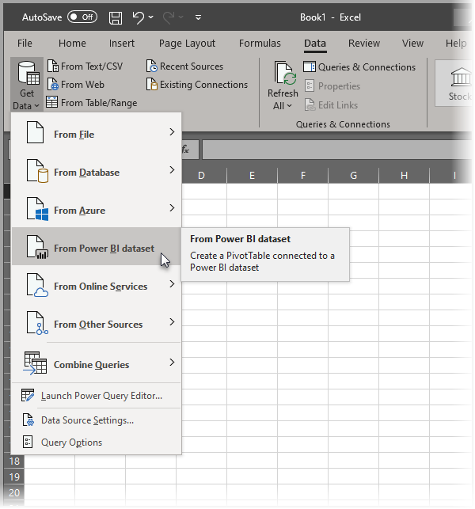

# Start in Power BI to analyze in Excel

With **Analyze in Excel**, you can bring Power BI datasets into Excel, and then view and interact with them using PivotTables, charts, slicers, and other Excel features. 

## Connect to Power BI data with Analyze in Excel

In the Power BI service, to the workspace that contains the dataset or report you want to analyze in Excel and use any of these options:

- Select **More options (...)** next to the dataset or report name and select **Analyze in Excel**.

    
    
- Open the report and select **Export** > **Analyze in Excel**.

    :::image type="content" source="media/service-analyze-in-excel/start-powerbi-export-analyze-excel.png" alt-text="Start from a report, select Export, then Analyze in Excel.":::

- Select a dataset. In the **Dataset details** pane, under **Analyze in Excel**, select **Analyze**.

    :::image type="content" source="media/service-analyze-in-excel/start-powerbi-dataset-analyze-excel.png" alt-text="Start from a dataset, then select Analyze in Excel.":::

    >[!NOTE]
    >Remember that if you select Analyze in Excel for a report, it is the report's underlying dataset that is brought into Excel.

For any of these options, the Analyze in Excel feature should install automatically. Select **Download**.

:::image type="content" source="media/service-analyze-in-excel/install-analyze-excel-first-updates.png" alt-text="Install Analyze in Excel updates.":::

If not, or for more details, see [Install Analyze in Excel](#install-analyze-in-excel) later in this article.

The Power BI service generates an Excel workbook that contains an OLAP connection to the Power BI dataset, and downloads this workbook to your computer. 

The workbook file name matches the dataset (or report, or other data source) from which it was derived. So if the report was called *Sales Analysis*, then the downloaded file would be **Sales Analysis.xlsx**.

Open the new Excel file.

The first time you open the file, you may have to **Enable Editing**, depending on your [Protected view](https://support.microsoft.com/en-gb/office/what-is-protected-view-d6f09ac7-e6b9-4495-8e43-2bbcdbcb6653?ui=en-us&rs=en-gb&ad=gb).

You may also have to **Enable Content**, depending on your [Trusted document](https://support.microsoft.com/en-us/office/trusted-documents-cf872bd8-47ec-4c02-baa5-1fdba1a11b53) settings.

When using Analyze in Excel, any sensitivity label that's applied to a Power BI dataset is automatically applied to the Excel file. If the sensitivity label on the dataset later changes to be more restrictive, when you refresh the data in Excel, the label applied to the Excel file updates automatically. If the dataset changes to become less restrictive, no label inheritance or update occurs.

If you manually set sensitivity labels in Excel, they aren’t automatically overwritten by the dataset's sensitivity label. Instead, a policy tip appears with a recommendation to upgrade the label.

For more information, see [how to apply sensitivity labels in Power BI](../admin/service-security-apply-data-sensitivity-labels.md).

## Install Analyze in Excel

To use Analyze in Excel, you must first download the feature from Power BI and install it from links provided after you [sign in to the Power BI service](https://app.powerbi.com). Usually, it installs automatically when you [select Analyze in Excel](#connect-to-power-bi-data-with-analyze-in-excel) in the Power BI service. If not, follow these steps to install. Power BI detects the version of Excel you have on your computer, and automatically downloads the appropriate version (32-bit or 64-bit).

1. In the Power BI service in your browser, select **More options (...)** in the upper-right corner, then select **Download > Analyze in Excel updates**. This menu item applies to new installations of updates of Analyze in Excel.

    

    Power BI detects whether you have installed Analyze in Excel. If not, Power BI prompts you to download.

    

When you select **Download**, Power BI detects the version of Excel you have installed and downloads the appropriate version of the Analyze in Excel installer. You see a download status in the bottom of your browser, or wherever your browser displays download progress. 

When the download completes, run the installer (.msi) to install Analyze in Excel. The name of the installation process is different from Analyze in Excel; the name will be **Microsoft Analysis Services OLE DB Provider** as shown in the following image, or something similar.

Once it completes, you're ready to select a report in the Power BI service (or other Power BI data element, like a dataset), and then analyze it in Excel.

## Saving and sharing your new workbook

You can **Save** the Excel workbook you create with the Power BI dataset, just like any other workbook. However, you can't publish or import the workbook back into Power BI. You can only publish or import workbooks into Power BI that have data in tables, or that have a data model. Because the new workbook just has a connection to the dataset in Power BI, publishing or importing it into Power BI would be going in circles!

Once your workbook is saved, you can share it with other Power BI users in your organization. 

When a user opens the workbook that you’ve shared your workbook with them, they see your PivotTables and data as they were when you last saved the workbook. That data may not be the latest version. To get the latest data, users must use the **Refresh** button on the **Data** ribbon. And since the workbook connects to a dataset in Power BI, the first time users try to refresh the workbook, they must sign in to Power BI and install the Excel updates.

Refresh for external connections isn't supported in Excel Online. Since users need to refresh the dataset, we recommend that they open the workbook in the desktop version of Excel.

> [!NOTE]
> Administrators for Power BI tenants can use the *Power BI admin portal* to disable the use of **Analyze in Excel** with on-premises datasets housed in Analysis Services (AS) databases. When that option is disabled, **Analyze in Excel** is disabled for AS databases, but continues to be available for other datasets.

## Other ways to access Power BI datasets from Excel
Users with specific Office SKUs can also connect to Power BI datasets from within Excel by using the **Get Data** feature in Excel. If your SKU doesn't support this feature, the **Get Data** menu option doesn't appear.

From the **Data** ribbon menu, select **Get Data > From Power BI dataset**.

In the pane that appears, you can browse datasets you have access to, see if datasets are certified or promoted, and determine whether data protection labels have been applied to those datasets. 

For more information about getting data into Excel in this way, see [Create a PivotTable from Power BI datasets](https://support.office.com/article/31444a04-9c38-4dd7-9a45-22848c666884) in the Excel documentation.

You can also access **featured tables** in Excel, in the **Data Types** gallery. To learn more about featured tables and how to access them, see [Access Power BI featured tables in Excel (preview)](service-excel-featured-tables.md).

## Next steps

You might also be interested in the following articles:

* [Use cross-report drillthrough in Power BI Desktop](../create-reports/desktop-cross-report-drill-through.md)
* [Using slicers Power BI Desktop](../visuals/power-bi-visualization-slicers.md)
* [Troubleshooting Analyze in Excel](desktop-troubleshooting-analyze-in-excel.md)
* [Access Power BI featured tables in Excel (preview)](service-excel-featured-tables.md).
* [How to apply sensitivity labels in Power BI](../admin/service-security-apply-data-sensitivity-labels.md)
