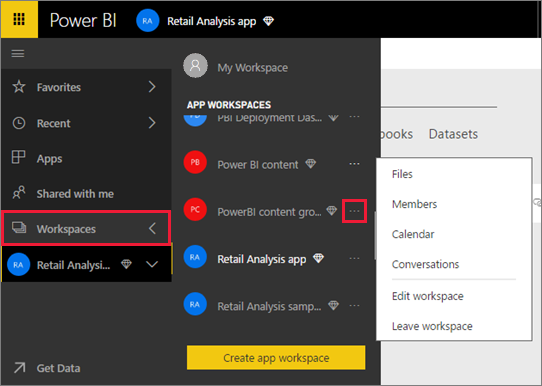
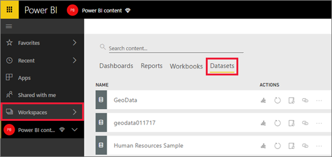

# Connect to files stored in OneDrive for a classic workspace
When you [create a *classic* workspace in Power BI](service-create-workspaces.md), you're also creating a Microsoft 365 group, with an associated OneDrive for Business. This article explains how to store and update your Excel, CSV, and Power BI Desktop files on that OneDrive for Business. Those updates are automatically reflected in the Power BI reports and dashboards based on the files.

> [!NOTE]
> The *new* workspace experience changes the relationship between Power BI workspaces and Microsoft 365 groups. You don't automatically create a Microsoft 365 group every time you create one of the new workspaces. You can also [set a workspace OneDrive for a new workspace](service-create-the-new-workspaces.md#set-a-workspace-onedrive).

Adding files to your classic workspace is a two-step process: 

1. First you [upload files to the OneDrive for Business](#1-upload-files-to-the-onedrive-for-business-for-your-workspace) for your workspace.
2. Then you [connect to those files from Power BI](#2-import-excel-files-as-datasets-or-as-excel-online-workbooks).

> [!NOTE]
> Workspaces are only available with a [Power BI Pro](../fundamentals/service-features-license-type.md) license.
> 

## 1 Upload files to the OneDrive for Business for your workspace
1. In the Power BI service, select the arrow next to Workspaces > select the ellipsis (**…**) next to your workspace name. 
   
   
2. Select **Files** to open the OneDrive for Business for your workspace on Microsoft 365.
   
   > [!NOTE]
   > If you don't see **Files** on the workspace menu, select **Members** to open the OneDrive for Business for your workspace. There, select **Files**. Microsoft 365 sets up a OneDrive storage location for your app's group workspace files. This process may take some time.
   > 
   > 
3. Here, you can upload your files to the OneDrive for Business for your workspace. Select **Upload**, and navigate to your files.
   
   

## 2 Import Excel files as datasets or as Excel Online workbooks
Now that your files are in the OneDrive for Business for your workspace, you have a choice. You can: 

* [Import the data from the Excel workbook as a dataset](../connect-data/service-get-data-from-files.md). Then use the data to build reports and dashboards you can view in a web browser and on mobile devices.
* Or [connect to a whole Excel workbook in Power BI](../connect-data/service-excel-workbook-files.md) and display it exactly as it appears in Excel Online.

### Import or connect to the files in your workspace
1. In Power BI, switch to the workspace, so the workspace name is in the top-left corner. 
2. Select **Get Data** at the bottom of the nav pane. 
   
   
3. In the **Files** box, select **Get**.
   
   
4. Select **OneDrive** - *Your Workspace Name*.
   
    
5. Select the file you want > **Connect**.
   
    At this point, you decide whether to [import the data from the Excel workbook](../connect-data/service-get-data-from-files.md), or [connect to the whole Excel workbooks](../connect-data/service-excel-workbook-files.md).
6. Select **Import** or **Connect**.
   
    
7. If you select **Import**, then the workbook appears on the **Datasets** tab. 
   
    
   
    If you select **Connect**, then the workbook is on the **Workbooks** tab.
   
    

## Next steps
* [Create apps and workspaces in Power BI](../collaborate-share/service-create-distribute-apps.md)
* [Import data from Excel workbooks](../connect-data/service-get-data-from-files.md)
* [Connect to whole Excel workbooks](../connect-data/service-excel-workbook-files.md)
* More questions? [Try the Power BI Community](https://community.powerbi.com/)
* Feedback? Visit [Power BI Ideas](https://ideas.powerbi.com/forums/265200-power-bi)
