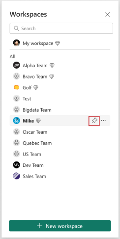
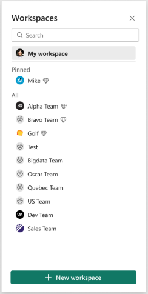
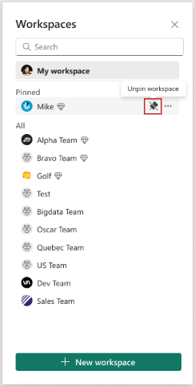

# Create a workspace in Power BI

This article explains how to create *workspaces*, spaces to collaborate with colleagues. In them, you create collections of dashboards, reports, and paginated reports. If you want, you can also bundle that collection into an *app* and distribute it to a broader audience. For more background, see the [Workspaces in Power BI](service-new-workspaces.md) article.

:::image type="content" source="media/service-create-the-new-workspaces/power-bi-new-workspaces.png" alt-text="Screenshot of a workspace in Power B I.":::

## Create a workspace

1. Select **Newe** > **Workspaces** > **New workspace**.
   
     

2. Give the workspace a unique name. If the name isn't available, edit it to come up with a name that's unique.
   
    When you create an app from the workspace, by default it will have the same name and icon as the workspace. You can change both when you create the app.
   
1. Here are some optional settings for your workspace. They're explained in more detail in the [Workspace settings](#workspace-settings) section later in this article:

    - Upload a **Workspace image**. Files can be .png or .jpg format. File size has to be less than 45 KB. 
    - [Specify a Workspace OneDrive](#set-a-workspace-onedrive) to use a Microsoft 365 Group file storage location (provided by SharePoint).    
    - [Add a Contact list](#create-a-contact-list), the names of people to contact for information about the workspace. By default, the workspace admins are the contacts.
    - [Allow contributors to update the app](#allow-contributors-to-update-the-app) for the workspace
    - [Assign the workspace to a Premium capacity](#premium-capacity-settings).
    - Connect the workspace to an Azure Data Lake Gen2 storage account (in preview). Read about this functionality in the article [Configuring dataflow storage to use Azure Data Lake Gen 2](../transform-model/dataflows/dataflows-azure-data-lake-storage-integration.md#connect-to-an-azure-data-lake-gen-2-at-a-workspace-level).

1. Select **Save**.

    Power BI creates the workspace and opens it. You see it in the list of workspaces you’re a member of.

## Workspace settings

To see these workspace settings, expand **Advanced** in the **Settings** pane.

### Create a contact list

You can specify which users receive notification about issues occurring in the workspace. By default, any user or group specified as a workspace admin is notified, but you can add others to the *contact list*. Users or groups in the contact list are listed in the user interface (UI) to help users get help related to the workspace.

1. Access the **Contact list** setting in one of two ways:

    In the **Create a workspace** pane when you first create it.

    In the nav pane, select the arrow next to **Workspaces**, select **More options** (...) next to the workspace name > **Workspace settings**. The **Settings** pane opens.

    

2. Under **Advanced**, **Contact list**, accept the default, **Workspace admins**, or add your own list of **Specific users or groups**. 

    

3. Select **Save**.

### Set a workspace OneDrive

The Workspace OneDrive feature allows you to configure a Microsoft 365 Group whose SharePoint document library is available to workspace users. You create the Group *outside* of Power BI first, with one available method being from OneDrive. Read about creating a [OneDrive shared library](https://support.microsoft.com/office/create-a-new-shared-library-from-onedrive-for-work-or-school-345c8599-05d8-4bf8-9355-2b5cfabe04d0).

> [!NOTE]
> Creating Microsoft 365 Groups may be restricted in your environment, or the ability to create them from your OneDrive site may be disabled. If this is the case, speak with your IT department.

Power BI doesn't synchronize permissions between users or groups with workspace access, and users or groups with Microsoft 365 Group membership. A best practice is to give [access to the workspace](service-give-access-new-workspaces.md) to the same Microsoft 365 Group whose file storage you configured. Then manage workspace access by managing membership of the Microsoft 365 Group.

1. Access the **Workspace OneDrive** setting in one of two ways:

    In the **Create a workspace** pane when you first create it.

    In the nav pane, select the arrow next to **Workspaces**, select **More options** (...) next to the workspace name > **Workspace settings**. The **Settings** pane opens.

    

2. Under **Advanced** > **Workspace OneDrive**, type the name of the Microsoft 365 group that you created earlier. Type just the name, not the URL. Power BI automatically picks up the OneDrive for the group.

    

3. Select **Save**.

### Access the workspace OneDrive location

After you've configured the OneDrive location, you get to it in the same way you get to other data sources in the Power BI service.

1. In the nav pane, select **Data hub**, then type the OneDrive location in the **Filter** box.

    :::image type="content" source="media/service-create-the-new-workspaces/power-bi-get-data-files.png" alt-text="Screenshot of Data hub, get files." lightbox="media/service-create-the-new-workspaces/power-bi-get-data-files.png":::

    Power BI should automatically detect the workspace OneDrive, so it appears under **Location**. It may take some time for the workspace OneDrive to appear on the **Data hub** page after you've configured it.

1. Select the semantic model.

### Allow contributors to update the app

You can create and publish *apps* from a workspace. Each workspace can hold the content for an associated *app*, a collection of dashboards, reports, and semantic models which you can distribute to others in your organization. Read more about [publishing apps from workspaces](service-create-distribute-apps.md).

By default, only workspace Admins and Members can create, publish and update the app for the workspace. The **Allow contributors to update the app for this workspace** setting lets workspace Admins delegate the ability to update the app for the workspace to users with the workspace Contributor role. Read more about the different [roles in workspaces](service-roles-new-workspaces.md).

1. Access the **Allow contributors to update the app** setting in one of two ways:

    In the **Create a workspace** pane when you first create it.

    In the nav pane, select the arrow next to **Workspaces**, select **More options** (...) next to the workspace name > **Workspace settings**. The **Settings** pane opens.

    
2. Under **Advanced**, expand **Security settings**. Select **Allow contributors to update the app for this workspace**. 

When these features are enabled, contributors can:

* Update app metadata such as name, icon, description, support site, and color.
* Add or remove items included in the app, like adding reports or semantic models.
* Change the visibility of the items for all the audience groups in the audience tab.

However, contributors can't:

* Create or publish the app for the first time.
* Add users to the app or change who has permission to the app.
* Enable or disable automatic installation of app for app users.
* Enable or disable advance settings under Manage audience access pane. These settings include share and build permissions for the semantic models in the audience groups.
* Allow or prevent app consumers saving a copy of reports included in the app.  

## Premium capacity settings

On the **Premium** tab in the **Settings** pane, you can choose settings related to Premium capacities.

1. Set **Premium capacity** to **On**.

    

1. Choose either Premium capacity or **Premium Per User**. Read more about [Premium Per User](../enterprise/service-premium-per-user-faq.yml).

    :::image type="content" source="media/service-create-the-new-workspaces/power-bi-workspace-premium-per-user.png" alt-text="Screenshot of Choose Premium or Premium Per User.":::

1. Choose **Default storage limit**. Read more about [enabling large semantic models](../enterprise/service-premium-large-models.md#enable-large-semantic-models).

## Give users access to your workspace

Now that you've created the workspace, you'll want to add other users to *roles* in the workspace, so you can collaborate with them. See these articles for more information:

- [Give users access to a workspace](service-give-access-new-workspaces.md)
- [Roles in workspaces in Power BI](service-roles-new-workspaces.md)

## Pin workspaces

Quickly access your favorite workspaces by pinning them to the top of the workspace flyout list. 

1. Open the workspace flyout from the nav pane and hover over the workspace you want to pin. Select the **Pin to top** icon.

    

1. The workspace is added in the **Pinned** list.

    

1. To unpin a workspace, select the unpin button. The workspace is unpinned.

    

## Related content

* Read about [workspaces in Power BI](service-new-workspaces.md)
* [Publish an app from a workspace in Power BI](service-create-distribute-apps.md)
* Questions? [Try asking the Power BI Community](https://community.powerbi.com/)
