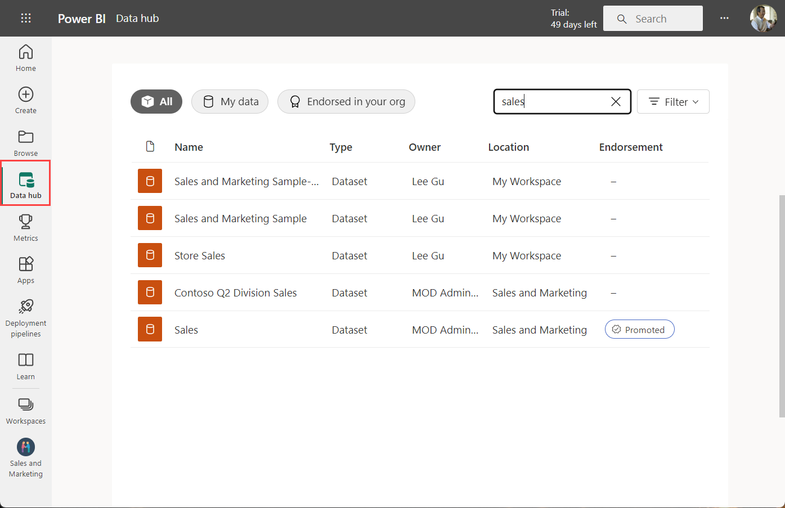

# Create the new workspaces in Power BI

This article explains how to create one of the *new workspaces* instead of a *classic* workspace. Both kinds of workspaces are places to collaborate with colleagues. In them, you create collections of dashboards, reports, and paginated reports. If you want, you can also bundle that collection into an *app* and distribute it to a broader audience. For more background, see the [new workspaces](service-new-workspaces.md) article.

Ready to migrate your classic workspace? See [Upgrade classic workspaces to the new workspaces in Power BI](service-upgrade-workspaces.md) for details.

> [!NOTE]
> To enforce row-level security (RLS) for Power BI Pro users browsing content in a workspace, assign the users the Viewer Role. See [Roles in the new workspaces](service-new-workspaces.md#roles-in-the-new-workspaces) for an explanation of the different roles.

## Create one of the new workspaces

1. Start by creating the workspace. Select **Workspaces** > **Create workspace**.
   
     

2. You're automatically creating an upgraded workspace, unless you opt to **Revert to classic**.
   
     
     
     If you select **Revert to classic**, you [create a classic workspace](service-create-workspaces.md) based on a Microsoft 365 group.

2. Give the workspace a unique name. If the name isn't available, edit it to come up with a unique name.
   
     The app you create from the workspace will have the same name and icon as the workspace.
   
1. Here are some optional items you can set for your workspace:

    - Upload a **Workspace image**. Files can be .png or .jpg format. File size has to be less than 45 KB. 
    - [Specify a Workspace OneDrive](#set-a-workspace-onedrive) to use a Microsoft 365 group file storage location.    
    - [Add a Contact list](#create-a-contact-list). By default, the workspace admins are the contacts. 
    - [Allow contributors to update the app](#allow-contributors-to-update-the-app) for the workspace
    - To assign the workspace to a **Dedicated capacity**, on the **Premium** tab select **Dedicated capacity**.

        

1. Select **Save**.

    Power BI creates the workspace and opens it. You see it in the list of workspaces you’re a member of. 

## Give access to your workspace

Anyone who has an admin role in a workspace can give others access to the workspace by adding them to the different roles. Workspace creators are automatically admins. See [Roles in the new workspaces](service-new-workspaces.md#roles-in-the-new-workspaces) for an explanation of the roles.

1. Because you're an admin, on the workspace content list page, you see **Access**.

    

1. Add security groups, distribution lists, Microsoft 365 groups, or individuals to these workspaces as admins, members, contributors, or viewers. 

    

9. Select **Add** > **Close**.

## Set a workspace OneDrive

The Workspace OneDrive feature allows you to configure a Microsoft 365 group whose SharePoint Document Library file storage is available to workspace users. You create the group outside of Power BI first. 

Power BI doesn't synchronize permissions of users or groups who are configured to have workspace access with the Microsoft 365 group membership. The best practice is to give [access to the workspace](#give-access-to-your-workspace) to the same Microsoft 365 group whose file storage you configure in this setting Microsoft 365 group. Then manage workspace access by managing membership of the Microsoft 365 group. 

1. Access the new **Workspace OneDrive** setting in one of two ways:

    In the **Create a workspace** pane when you first create it.

    In the nav pane, select the arrow next to **Workspaces**, select **More options** (...) next to the workspace name > **Workspace settings**. The **Settings** pane opens.

    

2. Under **Advanced** > **Workspace OneDrive**, type the name of the Microsoft 365 group that you created earlier. Type just the name, not the URL. Power BI automatically picks up the OneDrive for the group.

    

3. Select **Save**.

### Access the workspace OneDrive location

After you've configured the OneDrive location, you get to it in the same way you get to other data sources in the Power BI service.

1. In the nav pane, select **Get Data**, then in the **Files** box select **Get**.

    

1.  The **OneDrive – Business** entry is your own personal OneDrive for Business. The second OneDrive is the one you added.

    

## Create a contact list

You can specify which users receive notification about issues occurring in the workspace. By default, any user or group specified as a workspace admin is notified, but you can add others to the *contact list*. Users or groups in the contact list are listed in the user interface (UI) to help users get help related to the workspace.

1. Access the new **Contact list** setting in one of two ways:

    In the **Create a workspace** pane when you first create it.

    In the nav pane, select the arrow next to **Workspaces**, select **More options** (...) next to the workspace name > **Workspace settings**. The **Settings** pane opens.

    

2. Under **Advanced**, **Contact list**, accept the default, **Workspace admins**, or add your own list of **Specific users or groups**. 

    

3. Select **Save**.

## Allow contributors to update the app

The **Allow contributors to update the app for this workspace** setting allows workspace Admins to delegate to users in the Contributor role the ability to update the app for the workspace. By default, only workspace Admins and Members can publish and update the app for the workspace. 

1. To access this setting, in the nav pane, select the arrow next to **Workspaces**, select **More options** (...) next to the workspace name > **Workspace settings**. The **Settings** pane opens.

    

2. Under **Advanced**, expand **Security settings**. Select **Allow contributors to update the app for this workspace**. 

When enabled, contributors can:
* Update app metadata like name, icon, description, support site, and color
* Add or remove items included in the app, like adding reports or datasets
* Change the app navigation or default item the app opens on

However, contributors can't:
* Publish the app for the first time
* Change who has permission to the app

## Apps in the new workspaces

You can create and consume *apps* the new workspace experiences, instead of content packs. Apps are collections of dashboards, reports, and datasets that connect to third-party services and organizational data. Apps make it easy to get data from the services such as Microsoft Dynamics CRM, Salesforce, and Google Analytics.

In the new workspace experience, you can't create or consume organizational content packs. Ask your internal teams to provide apps for any content packs you’re currently using. 

### Distribute an app

If you want to distribute official content to a large audience in your organization, you can publish an *app* from your workspace.  When your content is ready, you choose which dashboards and reports you want to publish, and publish them as an app. You can create one app from each workspace.

Read about how to [publish an app from the new workspaces](service-create-distribute-apps.md).

## Next steps
* Read about [organizing work in the new workspaces experience in Power BI](service-new-workspaces.md)
* [Create classic workspaces](service-create-workspaces.md)
* [Publish an app from the new workspaces in Power BI](service-create-distribute-apps.md)
* Questions? [Try asking the Power BI Community](https://community.powerbi.com/)
