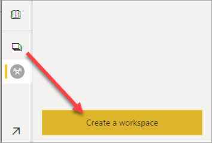
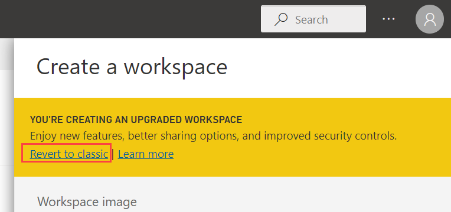
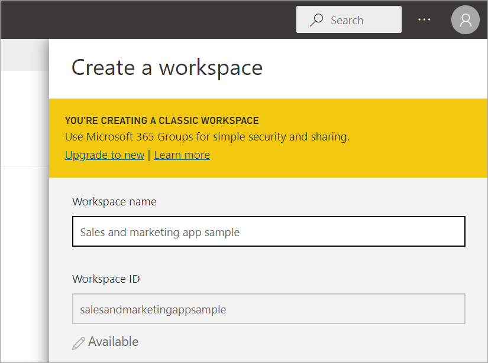
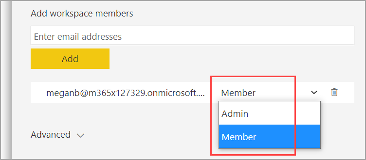
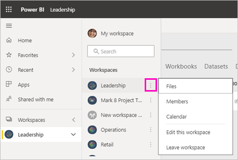
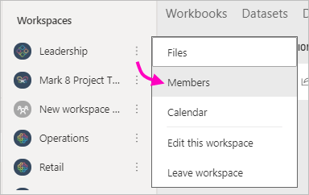
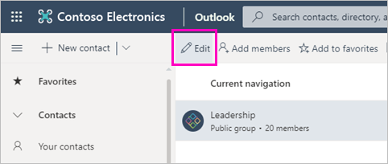
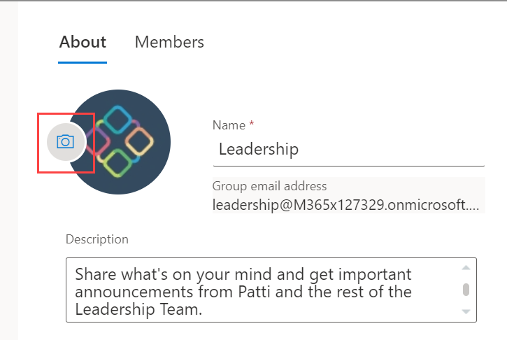

# Create classic workspaces in Power BI

In Power BI, you can create *workspaces*, places to collaborate with colleagues to create and refine collections of dashboards, reports, and paginated reports.  This article is about creating a classic workspace. Power BI also has the new workspace experience, which is now the default. See [New and classic workspace differences](service-new-workspaces.md#new-and-classic-workspace-differences) to compare the two. 

Ready to migrate your classic workspace? See [Upgrade classic workspaces to the new workspaces in Power BI](service-upgrade-workspaces.md) for details.

When you create a classic workspace, you're creating an underlying, associated Microsoft 365 group. All the workspace administration is in Microsoft 365. You can add colleagues to these workspaces as members or admins. In the workspace, you can all collaborate on dashboards, reports, and other articles that you plan to publish to a wider audience. Everyone you add to a workspace needs a Power BI Pro license.

## Create a classic workspace based on a Microsoft 365 group

When you create a workspace, it’s built on a Microsoft 365 group.

1. Select **Workspaces** > **Create workspace**. 
   
       

    Here you'll put the content that you and your colleagues collaborate on.

2. In the **You're creating an upgraded workspace** banner, click **Revert to classic**. 

    

    > [!NOTE]
    > If you don't see this banner, your Power BI admin has blocked the ability to create classic workspaces. You can [create one of the new workspaces](service-create-the-new-workspaces.md) instead.

3. Give the workspace a name. If the corresponding **Workspace ID** isn't available, edit it to come up with a unique ID.
   
    

    When you create an app from the workspace, by default it will have the same name and icon as the workspace. You can change both when you create the app.

3. You have a few more options to set. If you choose **Public**, anyone in your organization can see what’s in the workspace. **Private** means only members of the workspace can see its contents.
   
     
   
    You can't change the Public/Private setting after you've created the group.

4. You can also choose if members can **edit** or have **view-only** access.

     

5. Add email addresses of people you want to have access to the workspace, and select **Add**. You can’t add group aliases, just individuals.

     Only add people to the workspace that you want to edit the content. If they're only going to view the content, don't add them to the workspace. Include them when you publish the app.

6. Decide whether each person is a member or an admin.
   
     
   
    Admins can edit the workspace itself, including adding other members. Members can edit the content in the workspace, unless they have view-only access. Both admins and members can publish the app.

7. Select **Save**.

Power BI creates the workspace and opens it. It appears in the list of workspaces you’re a member of. Because you’re an admin, you can select **More options** (...) to go back and make changes to it, adding new members or changing their permissions.

When you first create it, you may need to wait an hour or so for the workspace to propagate to Microsoft 365.

### Add an image to your Microsoft 365 workspace (optional)
By default, Power BI creates a little colored circle for your app, with the app's initials. You may want to customize it with an image. To add an image, you need an Exchange Online license.

1. Select **Workspaces**, select **More options** (...) next to the name of the workspace, then **Members**. 
   
     
   
    The Microsoft 365 Outlook account for the workspace opens in a new browser window.
2. Select the **Edit** pencil.
   
     
3. Select the camera image, and find the image you want to use.
   
     

     Images can be .png, .jpg, or .bmp files. Their file size can be large, up to 3 MB. 

4. Select **OK**, then **Save**.
   
    The image replaces the colored circle in the Microsoft 365 Outlook window.
   
     
   
    In a few minutes, it will appear in the app in Power BI, too.

## Add content to your workspace

After you've created a workspace, it's time to add content to it. It's just like adding content to your My Workspace, except the other people in the workspace can see and work on it, too. A big difference is that when you get done, you can [publish the content as an app](service-create-distribute-apps.md).

When you view content in the content list of a workspace, the workspace name is listed as the owner.

## Distribute an app

If you want to distribute official content to a large audience within your organization, you can publish an app from your workspace.  When the content in the workspace is ready, you choose which dashboards and reports you want to publish, and then publish them as an *app*. You can create one app from each workspace. See [Publish an app from a workspace](service-create-distribute-apps.md) for details.

## Apps or organizational content packs?

Apps are the evolution of organizational content packs, which are being deprecated. Now is a good time to upgrade your content packs to apps, if you haven't started yet. Ready to migrate your classic workspace now? See [Upgrade classic workspaces to the new workspaces in Power BI](service-upgrade-workspaces.md) for details.

## Next steps

- [Install and use apps in Power BI](service-create-distribute-apps.md)
- [Create the new workspaces](service-create-the-new-workspaces.md)
- [Upgrade classic workspaces to the new workspaces in Power BI](service-upgrade-workspaces.md)
- Questions? [Try asking the Power BI Community](https://community.powerbi.com/)
