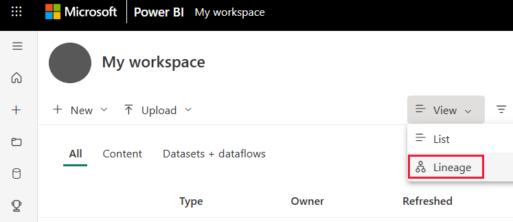

# Data lineage
In modern business intelligence (BI) projects, understanding the flow of data from the data source to its destination can be a challenge. The challenge is even bigger if you have built advanced analytical projects spanning multiple data sources, artifacts, and dependencies. Questions like "What happens if I change this data?" or "Why isn't this report up to date?" can be hard to answer. They may require a team of experts or deep investigation to understand. We designed a data lineage view to help you answer these questions.

 
Power BI has several artifact types, such as dashboards, reports, datasets, and dataflows. Many datasets and dataflows connect to external data sources such as SQL Server, and to external datasets in other workspaces. When a dataset is external to a workspace you own, it may be in a workspace owned by someone in IT or another analyst. External data sources and datasets make it harder to know where the data is coming from, ultimately. For complex projects and for simpler ones, we introduce lineage view.

In lineage view, you see the lineage relationships between all the artifacts in a workspace, and all its external dependencies. It shows connections between all workspace artifacts, including connections to dataflows, both upstream and downstream.    

> [!NOTE]  
> This video might use earlier versions of Power BI Desktop or the Power BI service.

<iframe width="560" height="315" src="https://www.microsoft.com/videoplayer/embed/RE4HmJG" frameborder="0" allowfullscreen></iframe>

## Explore lineage view

Every workspace, whether new or classic, automatically has a lineage view. You need at least a Contributor role in the workspace to view it. See [Permissions](#permissions) in this article for details.

* To access lineage view, go to the workspace list view. Tap the arrow next to **List view** and select **Lineage view**.

   

In this view, you see all the workspace artifacts and how the data flows from one artifact to another.

**Data sources**

You see the data sources from which the datasets and dataflows get their data. On the data source cards, you see more information that can help identify the source. For example, for Azure SQL server you also see the database name.

 
**Gateways**

If a data source is connected via an on-premises gateway, the gateway information is added to the data source card. If you have permissions, either as a gateway admin or as a data source user, you see more information, such as the gateway name.

**Datasets and dataflows**
 
On datasets and dataflows, you see the last refresh time, as well as if the dataset or dataflow is certified or promoted.

 
If a report in the workspace is built on a dataset or a dataflow that is located in another workspace, you see the source workspace name on the card of that dataset or dataflow. Select the name of the source workspace to go to that workspace.

* For any artifact, select **More options (...)** to view the options menu. It features all the same actions that are available in list view.

To see more metadata on any artifact, select the artifact card itself. Additional information about the artifact is displayed in a side pane. In the image below, the side pane displays the metadata of a selected dataset.

 
## Show lineage for any artifact 

Say you want to see the lineage for a specific artifact.

* Select the double arrows under the artifact.

   

   Power BI highlights all the artifacts related to that artifact, and dims the rest. 

## Navigation and full screen 

Lineage view is an interactive canvas. You can use the mouse and touchpad to navigate in the canvas, as well as to zoom in or out.

* To zoom in and out, use either the menu in the bottom-right corner or your mouse or touchpad.
* To have more room for the graph itself, use the full screen option at the bottom-right corner. 

    

## Permissions

* You need a Power BI Pro license to see lineage view.
* Lineage view is available only to users with access to the workspace.
* Users must have an Admin, Member, or Contributor role in the workspace. Users with a Viewer role can't switch to lineage view.

## Considerations and limitations

- Lineage view isn't available on Internet Explorer. See [Supported browsers for Power BI](../fundamentals/power-bi-browsers.md) for details.    
- Currently, the lineage view scope for dataflows is limited to what exists in the current workspace. For more information see [Dataflows features limitations](../transform-model/dataflows/dataflows-features-limitations.md)

## Next steps

* [Intro to datasets across workspaces (preview)](../connect-data/service-datasets-across-workspaces.md)
* [Dataset impact analysis](service-dataset-impact-analysis.md)
