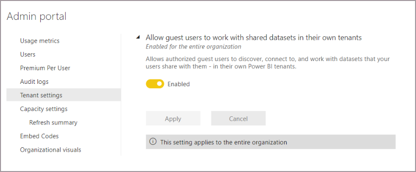
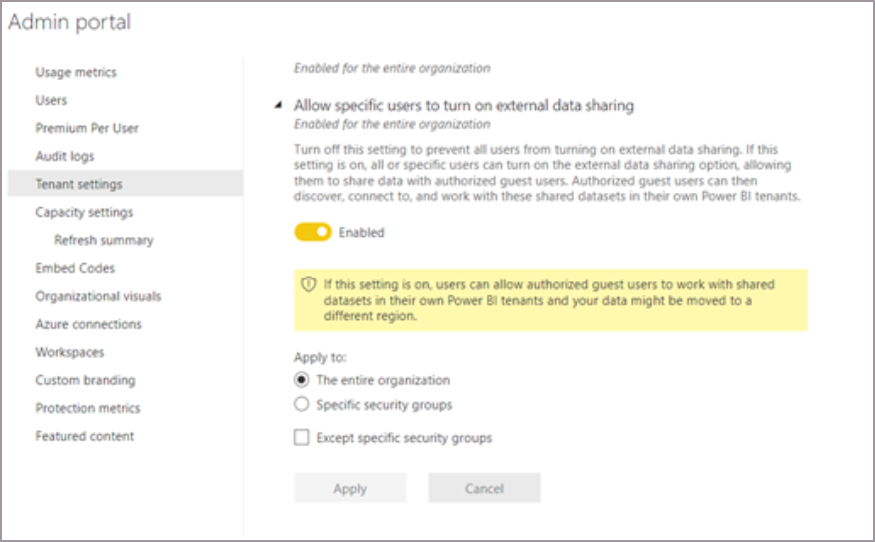

# Use in-place dataset sharing to enable external users to view and share datasets in their own tenants (preview) - Admin info

Power BI in-place dataset sharing allows data providers to share datasets with external users that they can access in their organizations tenants. This article provides instructions for the Power BI administrator on how to enable tenant settings to allow in-place dataset sharing.

## Requirements

For a full list of requirements necessary to use in-place datset sharing, see the requirements section of [About Power BI in-place dataset sharing with guest users in external organizations](./service-dataset-external-org-share-about.md#requirements).

## Licensing

Users must have an active Power BI account and a Power BI Pro or Premium license. For detailed information on licensing requirements, see the licensing requirements section of [Distribute Power BI content to external guest users with Azure AD B2B](../enterprise/service-admin-azure-ad-b2b.md#licensing).

## Allow guest users to work with shared datasets in their own tenants 

Azure AD B2B guest users can access datasets shared with them in their own tenants. Use the following steps to enable access by external users of datasets shared with them by users within your organization: 

1. In the admin portal, go to **Tenant settings**.

1. Click on **Allow guest users to work with shared datasets in their own tenants**.
 
1. Set the toggle to **Enable**.

    

> [!NOTE]
> This setting is off by default for customers. If this setting is disabled, a guest user will still be able to access the dataset in the provider tenant but not in their own tenant.

## Allow specific users to turn on external data sharing 

As a Power BI admin, you can specify which users or user groups can share datasets externally with guests from a different tenant through the in-place mechanism. Disabling this setting prevents any user from sharing datasets externally by restricting the ability of users to turn on external sharing for datasets they own or manage.  

> [!NOTE]
> The **Allow specific users** setting is on by default for customers. However, external users won't be able access any datasets shared in-place if the setting **Allow specific users to turn on external data sharing** is off.  

1. In the admin portal, go to **Tenant settings**.

1. Click on **Allow specific users to turn on external data sharing**.

1. Make sure the toggle is set to **Enable**.

1. Specify if you want this setting to apply to **The entire organization**, **Specific security groups**, or to exclude specific security groups. Click the checkbox next to **Except specific security groups** to add any groups you want to exclude.
 
1. Click **Apply**.

    

## Next steps
- [Use Power BI in-place dataset sharing (preview) to share datasets with external users](service-dataset-external-org-share-provider.md)
- [Access shared datasets in Power BI as a guest user from an external organization (preview)](service-dataset-external-org-share-view.md)
