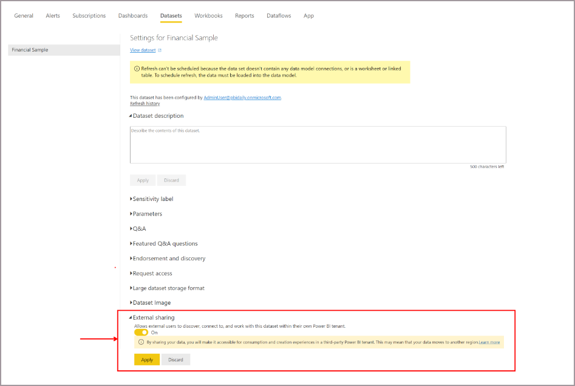
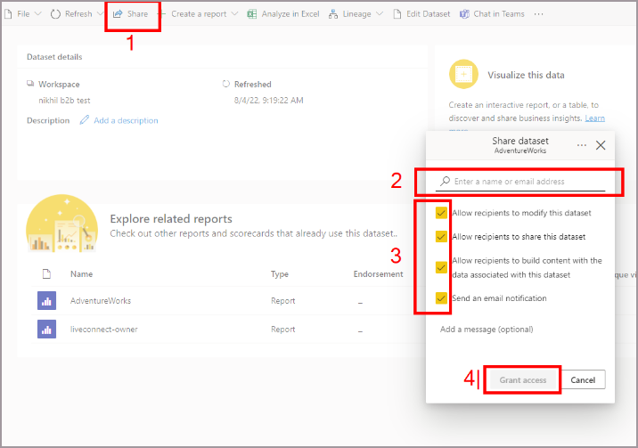

# Use Power BI in-place semantic model sharing (preview) to share semantic models with external users - data provider

Data providers can use in-place semantic model sharing (preview) to share semantic models with external users that they can access in their organization's tenant. A data provider is the source data owner who intends to share a semantic model externally with a data consumer (external user). This article provides guidance on how to enable external sharing and share semantic models.

> [!NOTE]
> Before a data provider can share, there are two new tenant settings that must be enabled for the specified data provider by their Power BI admins. For more information about these settings, see [Information for Power BI administrators](./service-dataset-external-org-share-admin.md).

## Enable external sharing 

 Before sharing the semantic model, the provider must first enable external sharing. The following instructions are for the provider who wants to share the data: 

1. Select the semantic model you intend to share with external guest user.

1. To access semantic model settings, go to **File** and click **Settings**. 

1. Scroll to the bottom of the page and click on the dropdown for **External sharing**. 

1. Turn on the external sharing switch and click **Apply**. This will allow external users (who have at least “build” access to this semantic model) to discover, connect to, and work with this semantic model within their own Power BI tenant”.

     

> [!NOTE] 
> If **Allow specific users to turn on external data sharing** is disabled by the Power BI admin for the specific user/user groups, they won't be able to turn on this semantic model property.  

## Share the Semantic model 

1. Open the semantic model that you want to share with external users 

1. Share the semantic model with an external user. 

    > [!NOTE] 
    > Only registered guest users in your Microsoft Entra tenant can access the shared semantic model. Registered guest users will be tagged as **EXT** in their domain name to show they're an external guest.

1. External users need to have at least “Build” access to the semantic model to access semantic models in their own tenant. So, select the **Allow recipients to build content with the data associated with this semantic model** checkbox. 

    > [!NOTE] 
    > The **Allow recipients to modify this semantic model** option is not supported for B2B external sharing. So, guests won't be able to modify the source semantic model. This means that even if this option is checked, external guests can't change the semantic model. 

1. Click **Grant access**. 

    

## Related content

- [Access shared semantic models in Power BI as a guest user from an external organization (preview)](service-dataset-external-org-share-view.md)
