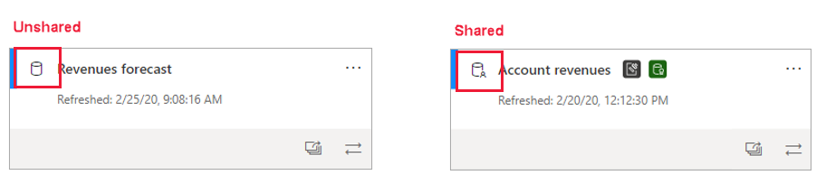
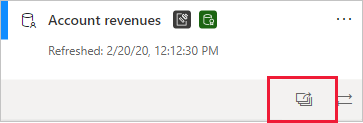
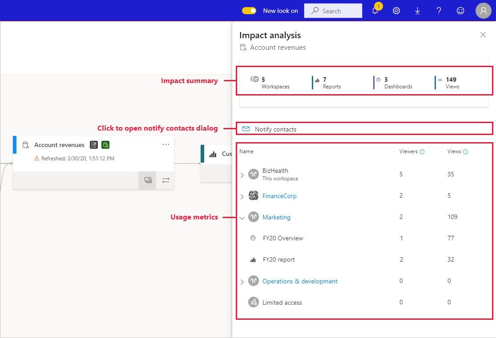
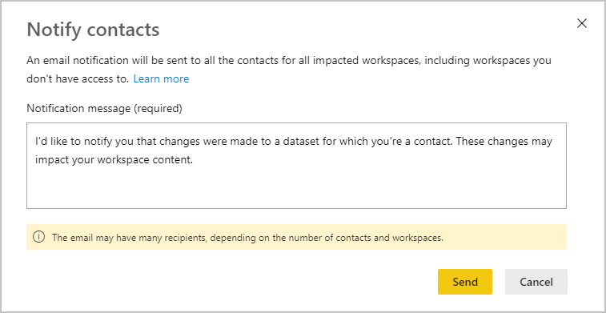
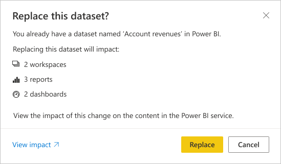

# Dataset impact analysis

When you make changes to a dataset, or are considering making changes, it is important to be able to assess the impact those changes will have on downstream reports and dashboards that depend on that dataset. **Dataset impact analysis** provides you with information that can help you make this assessment.
* It shows you how many workspaces, reports, and dashboards might be affected by your change, and provides easy navigation to the workspaces where the affected reports and dashboards are located so that you can investigate further.
* It shows you how many unique visitors and the number of views there are on the potentially affected items. This helps you determine the overall impact of the change for the downstream item. For instance, it is probably more important to investigate the effect of a change on a report that has 20,000 unique viewers than it is to investigate the effect of the change on a report that has three viewers.
* It provides an easy way of notifying the relevant people about a change you made or are thinking about making.

Dataset impact analysis is easily launched from within [data lineage view](service-data-lineage.md).

## Identifying shared datasets

You can perform dataset impact analysis on both shared and unshared datasets. However, it is particularly useful for datasets which are shared across workspaces, where it is much more complicated to get a clear picture of downstream dependencies than it is with unshared datasets, all of whose dependencies are located in the same workspace as the dataset itself.

In lineage view, you can tell the difference between shared datasets and unshared datasets by the icon that appears in the upper left-hand corner of the dataset's card.

## Perform dataset impact analysis

You can perform impact analysis on any dataset in the workspace, whether it is shared or not. You cannot perform impact analysis on external datasets that are displayed in lineage view but are in fact located in another workspace. To perform impact analysis on an external dataset, you need to navigate to the source workspace.

To perform dataset impact analysis, click the impact analysis button on the dataset card.

The impact analysis side panel opens.

* The **impact summary** shows you the number of potentially impacted workspaces, reports, and dashboards, as well as the total number of views for all the downstream reports and dashboards that are connected to the dataset.
* The **notify contacts** link opens a dialog where you can create and send a message about any dataset changes you make to the contact lists of the affected workspaces. 
* The **usage breakdown** that shows you, for each workspace, the total number of views for the potentially impacted reports and dashboards it contains, and for each report and dashboard, the total number of viewers and views, where
   * Viewers: The number of distinct users that viewed a report or dashboard.
   * Views: The number of views for a report or dashboard

The usage metrics relate to the last 30 days, excluding the current day. The count includes usage coming via related apps. The metrics help you understand dataset use across the tenant, as well as assess the impact any changes to your dataset may have.

## Notify contacts

If you've made a change to a dataset or are thinking about making a change, you might want to contact the relevant users to tell them about it. When you notify contacts, an email is sent to the [contact lists](../collaborate-share/service-create-the-new-workspaces.md#create-a-contact-list) of all the impacted workspaces. Your name appears on the email so the contacts can find you and reply back in a new email thread. 

1. Click **Notify contacts** in the impact analysis side pane. The notify contacts dialog will appear.

   

1. In the text box, provide some detail about the change.
1. When the message is ready, click **Send**.

> [!NOTE]
> Notify contacts is not available if the dataset you are performing impact analysis on is located in a classic workspace.

## Privacy

In order to perform impact analysis on a dataset, you must have write permissions to it. In the impact analysis side pane, you only see real names for workspaces, reports, and dashboards that you have access to. Items that you don't have access to are listed as **Limited access**. This is because some item names may contain personal information.

Even if you don't have access to some workspaces, you will still see summarized usage metrics for those workspaces, and your notify contacts messages will reach the contact lists of those workspaces.

## Impact analysis from Power BI Desktop

When you make a change to a dataset in Power BI Desktop and then republish it to the Power BI service, a message shows you how many workspaces, reports, and dashboards are potentially impacted by the change, and asks you to confirm that you want to replace the currently published dataset with the one you modified. The message also provides a link to the full dataset impact analysis in the Power BI service, where you can see more information and take action to mitigate the risks of your change.

> [!NOTE]
> The information shown in the message only indicates potential impact - it does not necessarily indicate that anything has broken. Oftentimes dataset changes have no adverse effect on their downstream reports and dashboards - still, you'll get this message that gives you clarity concerning potential impact.
>
>In the message, the number of workspaces is only shown if more than one workspace contains impacted reports and dashboards.

## Considerations and limitations

* Usage metrics are currently not supported for classic and personal workspaces.

## Next steps

* [Intro to datasets across workspaces (preview)](../connect-data/service-datasets-across-workspaces.md)
* [Data lineage](service-data-lineage.md)

