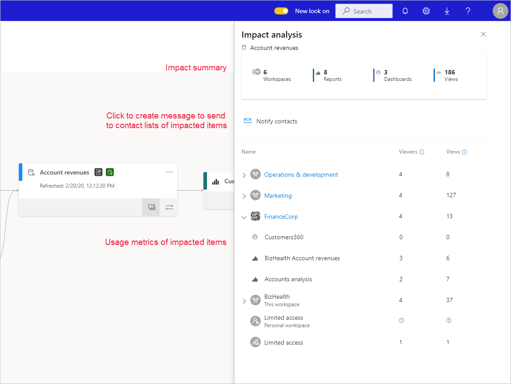
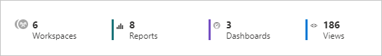

# Dataset impact analysis (preview)

When you make changes to a dataset, or are considering making changes, it is important to be able to assess the impact those changes will have on downstream reports and dashboards that depend on that database. **Dataset impact analysis** provides you with information that can help you make this assessment.
* It shows you how many workspaces, reports, and dashboards might be affected by your change, and provides easy navigation to the workspaces where the affected reports and dashboards are located so that you can investigate further.
* It shows you how many unique visitors and page views there are on the potentially affected items. This helps you determine the overall impact of the change for the downstream item. For instance, it is probably more important to investigate the effect of a change on a report that has 20,000 unique viewers than it is to investigate the effect of the change on a report that has 3 viewers.
* It provides an easy way of notifying the relevant people about a change you made or are thinking about making.

Dataset impact analysis is easily launched from within [data lineage view](service-data-lineage.md).

## Identifying shared datasets

You can perform dataset impact analysis on both shared and unshared datasets. However, it is particularly useful for datasets which are shared across workspaces, where it is much more complicated to get a clear picture of downstream dependencies than it is with unshared datasets, all of whose dependencies are located in the same workspace as the dataset itself.

In lineage view, you can tell the difference between shared datasets and unshared datasets by the icon that appears in the upper left-hand corner of the dataset's card.

## Perform dataset impact analysis

To see all the downstream dependencies for a dataset, click the impact analysis button on the dataset card.

You can perform impact analysis on any dataset in the workspace. , whether it is shared or not. You cannot perform impact analysis on external datasets that are displayed in lineage view but that are located in another workspace. To perform impact analysis on an external dataset, you need to navigate to the source workspace.

## View usage metrics: viewers and views

You can see the total number of views that summarize the number of views for all the downstream reports and dashboards that are connected to the dataset.

In addition, you can see the usage breakdown for each workspace, report and dashboard. The usage metrics can assist you to understand how the dataset is being used across the tenant and also to assess how big is the impact of your dataset and how careful you should be before making a change. 
The usage metrics includes two metrics: 
* Viewers – number of distinct users that viewed a report or dashboard 
* Views – number of views for report or dashboard

The usage metrics relates to the last 30 days excluding today.
It counts also usage that comes from related apps.

## Notify contacts

If you've made a change to a dataset or are thinking about making a change, you might want to contact the relevant users to tell them about the change. When you notify users, an email is sent out to the [contact lists](service-create-the-new-workspaces.md#workspace-contact-list) of the all the impacted workspaces.

Click **Notify contacts** to send a message to the contact lists of all the impacted workspaces.

After selecting the notify contacts button, you will be prompt with a message that allows you to provide a custom text to describe the exact change and its timeline. 
The message is sent as an email from the Power BI service to everyone on contact lists of all the impacted workspaces. The contact list is defined by default to the workspace admins. For personal workspaces that are impacted, the workspace owner will get the email. 
Your name will be on the email that is sent so the contacts can find you and reply back with a new email thread. 

## Privacy

In order to perform impact analysis on a dataset, you must have write permissions to it. In the impact analysis side pane, you only see real names for workspaces, reports, and dashboards that you have access to. Items that you don't have access to are listed as **Limited access**. This is because some item names may contain personal information.

Even if you don't have access to some workspaces, you will still see summarized usage metrics for those workspaces, and your notify contacts messages will reach the contact lists of those workspaces.

## Impact analysis from Power BI Desktop

When you make a change to a dataset in Power BI Desktop and then republish it to the Power BI service, a message shows you how many workspaces, reports, and dashboards are potentially impacted by the change, and asks you to confirm that you want to replace the currently published dataset with the one you modified. The message also provides a link to the full dataset impact analysis in the Power BI service, where you can see more information and take action to mitigate the risks of your change.

> [!NOTE]
> The information shown in the message only indicates potential impact - it does not necessarily indicate that anything has broken. Oftentimes dataset changes have no adverse affect on their downstream reports and dashboards - still, you'll get this message that gives you clarity concerning potential impact.
>
>In the message, the number of workspaces is only shown if more than one workspace contains impacted reports and dashboards.

## Limitations

* Usage metrics are currently not supported for classic and personal workspaces.
* The notify contacts feature is not available if the dataset you are performing impact analysis on is located in a classic workspace.

## Next steps

* [Intro to datasets across workspaces (preview)](../service-datasets-across-workspaces.md)
* [Data lineage](service-data-lineage.md)
