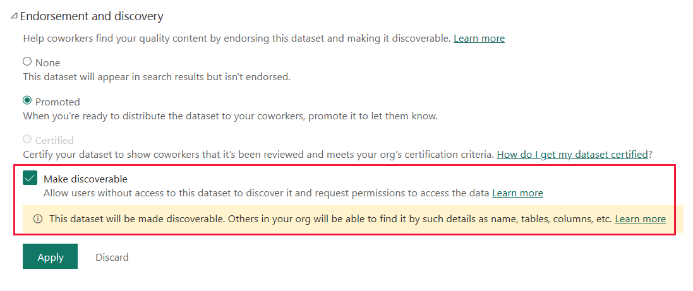

# Dataset discoverability

Discoverability is a feature that makes it possible for users to find endorsed datasets that they don't have access to. Without discoverability, the full value of [endorsement](service-endorsement-overview.md), that is, directing users to quality data, is not fully realized.

## Discoverability overview

Endorsement is a way of telling users that a dataset is a trusted, quality source of data that they can safely use. However, in Power BI, endorsed datasets, like all other datasets, are only visible to those who have access to them. This makes it difficult for people without access to find these trusted sources of data. Not only do they not have access to an endorsed dataset, they don't know it exists, so they can't even request access.

To overcome this problem, authorized users who have an [Admin or Member role](service-roles-new-workspaces.md) in the workspace where a endorsed dataset resides can mark that dataset as discoverable. After the dataset has been marked as discoverable, it will be listed in the [datasets hub](../connect-data/service-datasets-hub.md), even for users who don't have access to it. They can then request [build permission](../connect-data/service-datasets-build-permissions.md) on the dataset by whatever [access request mechanism](../connect-data/service-datasets-build-permissions.md#configure-how-users-request-build-permission) has been provided.

To be operable in an organization, dataset discovery must be set up by a Power BI administrator. See [How to set up dataset discoverability in an organization](#how-to-set-up-dataset-discovery-in-an-organization), below.

## How to mark a dataset as discoverable

If you have an [Admin or Member role](service-roles-new-workspaces.md) in the workspace where an endorsed dataset resides, you can mark that dataset as discoverable.

1. Go to dataset settings and open the **Endorsement and discovery** section.

1. In the dialog, select the **Make discoverable** checkbox. The checkbox will be only be active if the dataset is promoted or certified. Make sure that the dataset has a useful description. This description is what users see in the datasets hub when they click the dataset's info icon, even if they don't yet have access to the dataset itself.   

 When a dataset is marked as discoverable, users who don't yet have access to it will be able to find it in the Datasets hub, and will be able to request access to it.

## How to set up dataset discovery in an organization

You must be a Power BI administrator to set up dataset discoverability in your organization.

Go to  **Admin portal > Tenant settings > Discovery settings** and configure the following settings:

* **Make promoted content discoverable**: When you enable this setting, users you specify who have sufficient permissions to promote content will also be able to mark that content as discoverable. You can also specify users and/or groups to exclude from the permitted, specified groups. 

* **Make certified content discoverable**: When you enable this setting, users you specify who are authorized to certify content will also be able to mark that content as discoverable. You can also specify users and/or groups to exclude from the permitted, specified groups.

* **Discover content**: When you enable this setting, users you specify will be able to find endorsed content that has been marked as discoverable, even if they don't yet have access to it. You can also specify users and/or groups to exclude from the permitted, specified groups.

## Next steps
* [Datasets hub](../connect-data/service-datasets-hub.md)
* [Endorsement](service-endorsement-overview.md)
* [Build permission for shared datasets](../connect-data/service-datasets-build-permissions.md)
* Questions? [Try asking the Power BI Community](https://community.powerbi.com/)