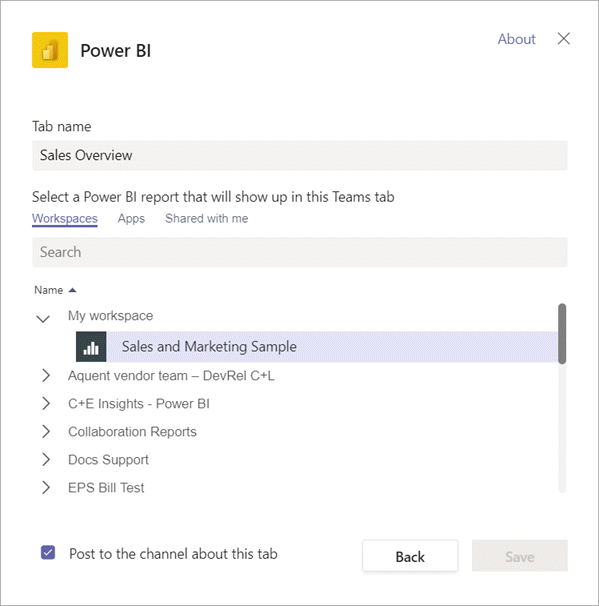

# Embed Power BI content in Microsoft Teams

You can easily embed interactive Power BI reports in Microsoft Teams channels and chats. 

## Requirements

To use the **Power BI** tab in Microsoft Teams, ensure these elements:

- Microsoft Teams has the **Power BI** tab.
- To add a report in Microsoft Teams with the **Power BI** tab, you have at least a Viewer role in the workspace that hosts the report. For information about the different roles, see [Roles in the new workspaces](service-new-workspaces.md#roles-in-the-new-workspaces).
- To see the report in the **Power BI** tab in Microsoft Teams, users must have permission to view the report.
- Users must be Microsoft Teams users with access to channels and chats.

See [Collaborate in Microsoft Teams with Power BI](service-embed-report-microsoft-teams.md) for background on how Power BI and Microsoft Teams work together, including other requirements.

## Embed a report in Microsoft Teams

Follow these steps to embed your report in a Microsoft Teams channel or chat.

1. Open a channel or chat in Microsoft Teams, and select the **+** icon.

    

1. Select the **Power BI** tab.

    

1. Use the provided options to select a report from a workspace or a Power BI app.

    

1. The tab name updates automatically to match the name of the report name, but you can change it.

1. Select **Save**.

### Reports you can embed on the Power BI tab

You can embed the following types of reports on the **Power BI** tab:

- Interactive and paginated reports.
- Reports in **My workspace**, new workspace experiences, and classic workspaces.
- Reports in Power BI apps.

## Start a conversation

When you add a Power BI report tab to Microsoft Teams, Microsoft Teams automatically creates a tab conversation for the report.

- Select the **Show tab conversation** icon in the upper-right corner.

    

    The first comment is a link to the report. Everyone in that Microsoft Teams channel can see and discuss the report in the conversation.

    

## Known issues and limitations

- In Microsoft Teams, when you export data from a visual in a Power BI report, it's automatically saved to your Downloads folder. It's an Excel file called "data (*n*).xlsx" where *n* is the number of times you've exported data to the same folder.
- You can't embed Power BI dashboards in the **Power BI** tab for Microsoft Teams.
- [URL filters](service-url-filters.md) aren't supported with the **Power BI** tab for Microsoft Teams.
- In national clouds, the **Power BI** tab isn't available. An older version might be available that doesn't support the new workspace experience or reports in Power BI apps.
- After you save the tab, you don't change the tab name through the tab settings. Use the **Rename** option to change it.
- See the [Known issues and limitations](service-collaborate-microsoft-teams.md#known-issues-and-limitations) section of the "Collaborate in Microsoft Teams" article for other issues.

## Next steps

- [Collaborate in Microsoft Teams with Power BI](service-collaborate-microsoft-teams.md)

More questions? [Try asking the Power BI Community](https://community.powerbi.com/).
