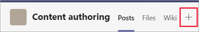
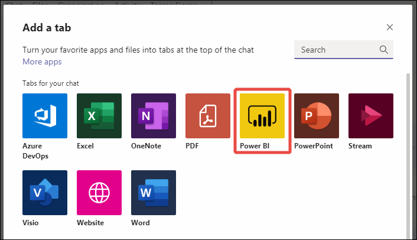

# Embed Power BI content in Microsoft Teams

You can easily embed interactive Power BI reports in Microsoft Teams channels and chats. 

## Requirements

To embed a report on the **Power BI** tab in Teams, you need to meet these requirements:

- Teams has the **Power BI** tab.
- You have at least a Viewer role in the workspace that hosts the item. 
- You have permission to view the organizational app
 
For information about the different roles, see [Roles in workspaces](service-roles-new-workspaces.md).

To view a report on the **Power BI** tab in Teams, your users need to meet these requirements:

- They're Teams users with access to channels and chats.
- They have permission to view the items in Power BI.

See [Collaborate in Microsoft Teams with Power BI](service-collaborate-microsoft-teams.md) for background on how Power BI and Microsoft Teams work together, including other requirements.

## Embed a report in Microsoft Teams

Follow these steps to embed your report in a Microsoft Teams channel or chat.

1. Open a channel or chat in Microsoft Teams, and select the **+** icon.

    

1. Select the **Power BI** tab.

    

1. Select **Save** to Add the **Power BI** tab and go to report configuration.

    :::image type="content" source="media/service-embed-report-microsoft-teams/service-embed-report-microsoft-teams-tab-save.png" alt-text="Screenshot of the new added Power BI tab for Microsoft Teams.":::

1. You see a configuration screen like this one:

    :::image type="content" source="media/service-embed-report-microsoft-teams/service-embed-report-microsoft-teams-tab-configuration-screen.png" alt-text="Screenshot of the configuration screen of new added Power BI tab for Microsoft Teams.":::

1. Choose any of these options to embed an item in the tab:

    - Paste a link to a supported item in the **Paste a Power BI link** box and select **Add tab**. The tab is then configured.

        > [!NOTE]
        > If you use **Share link** to embed your report, make sure that other users have access to this report and have the required permissions. They don't get access automatically unless your sharing link includes permissions.

    - Select **Browse workspaces** to select a report from a workspace or a Power BI app. Choose any report, app, or scorecard available for you in the **Select a report, app or scorecard** dialog. You can use the **Search** box to find the artifact you're looking for.

    - Select **Create new** to create a new report.

### Reset a report in Microsoft Teams tab

If you want to change the item in a **Power BI** tab, you can reset it and configure a new item. Follow these steps.

1. Right-click the Teams tab name, and select **Settings**.
1. Select the **Reset tab** button.

The tab resets. You will see the configuration screen in the tab where you can set a new report, app, or scorecard.

The **Settings** dialog helps you adjust permissions for reports. To set permission for organizational apps, work with the app owners. 

To rename the tab, Right-click the Teams tab name, and select **Rename**.

### Items you can embed in the Power BI tab

You can embed the following item types on the **Power BI** tab:

- Power BI interactive reports (.pbix files).
- Power BI paginated reports (.rdl files).
- Power BI scorecards
- Power BI organizational apps
- Power BI interactive reports in organizational apps

These items must be hosted in Power BI workspaces, including My workspace, or published through a Power BI organizational app.

You can pick these items from the Browse workspaces option or paste a link to the item.

### Links you can use to configure the Power BI tab

Using a link to configure your Power BI tab provides you additional options to customize the experience for your users. 
- Use links with 'include my changes' to open a specific page and apply specific filters when users open the tab.
- Use sharing links to reduce the need for users to request access to reports.

When configuring the Power BI tab, the links you use can include the following options:
- Sharing links generated by the Share option in Power BI
- Links with include my changes (shared views)
- Links generated by copy link to visual
- Links from the address bar

## Start a conversation

When you add a Power BI report tab to Microsoft Teams, Microsoft Teams automatically creates a tab conversation for the report.

- Select the **Show tab conversation** icon in the upper-right corner.

    

    The first comment is a link to the report. Everyone in that Microsoft Teams channel can see and discuss the report in the conversation.

    

## Known issues and limitations

- In Microsoft Teams, when you export data from a visual in a Power BI report, the data is automatically saved to your *Downloads* folder. It's an Excel file called **data (*n*).xlsx**, where *n* is the number of times you've exported data to the same folder.
- You can't embed Power BI dashboards in the **Power BI** tab for Microsoft Teams.
- [URL filters](service-url-filters.md) aren't supported with the **Power BI** tab for Microsoft Teams.
- In national/regional clouds, the **Power BI** tab isn't available.
- After you save the tab, you don't change the tab name through the tab settings. Use the **Rename** option to change it.
- When you view Power BI tabs in Teams mobile, the best viewing experience is through the [Power BI mobile apps](../consumer/mobile/mobile-apps-for-mobile-devices.md). In the Teams Mobile tabs list, select **More options (...)** > **Open in browser**. When you have the Power BI mobile app installed on your device, the report opens in the Power BI mobile app. 
- When embedding Power BI organizational apps in Teams Tabs, items that can't be embedded in Teams will open in a new browser window. 
- For the best experience using links, use links created by the **Share** option in Power BI.
- Links don't support [query string parameters](service-url-filters.md). 
- Links don't support personal bookmarks, since those can't be shared with other users. 
- Cross-tenant links aren't supported.
- For other issues, see "Known issues and limitations" in [Collaborate in Microsoft Teams](service-collaborate-microsoft-teams.md#known-issues-and-limitations).

## Related content

- [Collaborate in Microsoft Teams with Power BI](service-collaborate-microsoft-teams.md)

More questions? [Try asking the Power BI Community](https://community.powerbi.com/).
