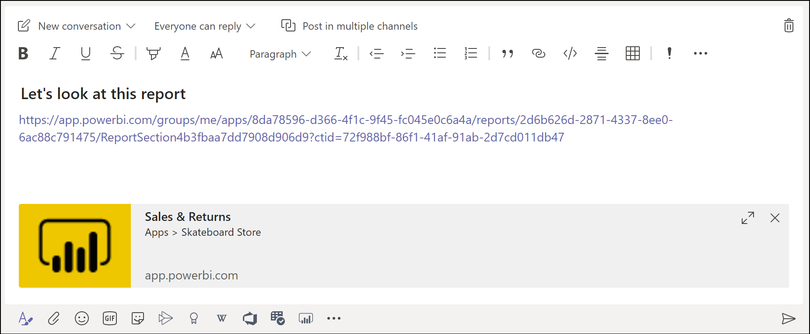

# Embed reports in Microsoft Teams with the Power BI tab

With the updated Power BI tab for Microsoft Teams, you can easily embed interactive reports in Microsoft Teams channels and chats. Use the Power BI tab for Microsoft Teams to help your colleagues find the data your team uses and to discuss the data within your team channels.  When you paste a link to your reports, dashboards, and apps into the Microsoft Teams message box, the link preview shows information about them. Your users can more easily understand which item the link takes them to.

## Requirements

For the **Power BI tab for Microsoft Teams** to work, ensure:

- Your users have a Power BI Pro license, or the report is contained in a [Power BI Premium capacity (EM or P SKU)](../admin/service-premium-what-is.md) with a Power BI license.
- Microsoft Teams has the Power BI tab.
- Users have signed in to the Power BI service to activate their Power BI license to consume the report.
- To add a report in Microsoft Teams with the Power BI tab, you must have at least a Viewer role in the workspace hosting the report. See [Roles in the new workspaces](service-new-workspaces.md#roles-in-the-new-workspaces) for information about the different roles.
- To see the report in the Power BI tab in Microsoft Teams, users must have permission to view the report.

Additionally, for the **link previews** to work, ensure:
- Users meet the requirements to use the Power BI tab for Microsoft Teams.
- Users have signed in to the Power BI Bot service. 

## Embed your report

Follow these steps to embed your report in a Microsoft Teams channel or chat.

1. Open a channel or chat in Microsoft Teams and select the **+** icon.

    

2. Select the Power BI tab.

    

3. Use the provided options to pick a report from a workspace, Shared with me, or a Power BI app.

    

4. The Tab name is updated automatically to match the name of the report name, but you can change it. 

5. Press **Save**.

## Supported reports for embedding the Power BI tab
You can embed the following types of reports on the Power BI tab:

- Interactive and paginated reports.
- Reports in My workspace, new workspace experiences, and classic workspaces.
- Reports in Power BI apps.

## Get a link preview

Follow these steps to get a link preview for content in the Power BI service.

1. Copy a link to a report, a dashboard, or an app in the Power BI service. For example, copy the link from the browser address bar.

2. Paste the link to the Microsoft Teams message box. Sign in to the link preview service if prompted. You may need to wait a few seconds for the link preview to load.

    

3. The basic link preview is shown after successful sign in.

    

4. Select the expand icon to show the rich preview card.

    

5. The rich link preview card shows the link and relevant action buttons

    

6. Send the message.

## Grant access to reports

Embedding a report in Microsoft Teams or sending a link to an item doesn't automatically give users permission to view the report - you need to [allow users to view the report in Power BI](service-share-dashboards.md). You can use an Office 365 Group for your Team to make it easier. 

> [!IMPORTANT]
> Make sure to review who can see the report within the Power BI service and grant access to those not listed.

One way to ensure everyone on your team has access to reports is to place the reports in a single workspace in Power BI and give the Office 365 Group for your team access to the workspace.

## Link previews 

Link previews are provided for the following items in Power BI:
- Reports
- Dashboards
- Apps

The link preview service requires your users to sign in. To sign out, select the Power BI icon at the bottom of the message box, then select sign out.

## Start a conversation

When you add a Power BI report tab to Teams, Teams automatically creates a tab conversation for the report. 

- Select **Show tab conversation** in the upper-right corner.

    

    The first comment is a link to the report. Everyone in that Teams channel can see and discuss the report in the conversation.

    

## Known issues and limitations

- Power BI doesn't support the same localized languages that Microsoft Teams does. As a result, you may not see proper localization within the embedded report.
- Power BI dashboards can't be embedded in the Power BI tab for Microsoft Teams.
- Users without a Power BI license or permission to the report see a "Content is not available" message.
- You may have issues if using Internet Explorer 10. <!--You can look at the [browsers support for Power BI](../consumer/end-user-browsers.md) and for [Office 365](https://products.office.com/office-system-requirements#Browsers-section). -->
- [URL filters](service-url-filters.md) aren't supported with the Power BI tab for Microsoft Teams.
- In national clouds, the new Power BI tab isn't available. An older version may be available that doesn't support new workspace experience workspace or reports in Power BI apps. 
- After you save the tab, you can't change the tab name through the tab settings. Use the rename option to change it.
- Single Sign-on isn't supported for the link preview service.
- Link previews don't work in meeting chat or private channels.

## Next steps
- [Share a dashboard with colleagues and others](service-share-dashboards.md)  
- [Create and distribute an app in Power BI](service-create-distribute-apps.md)  
- [What is Power BI Premium?](../admin/service-premium-what-is.md)

More questions? [Try asking the Power BI Community](https://community.powerbi.com/)
