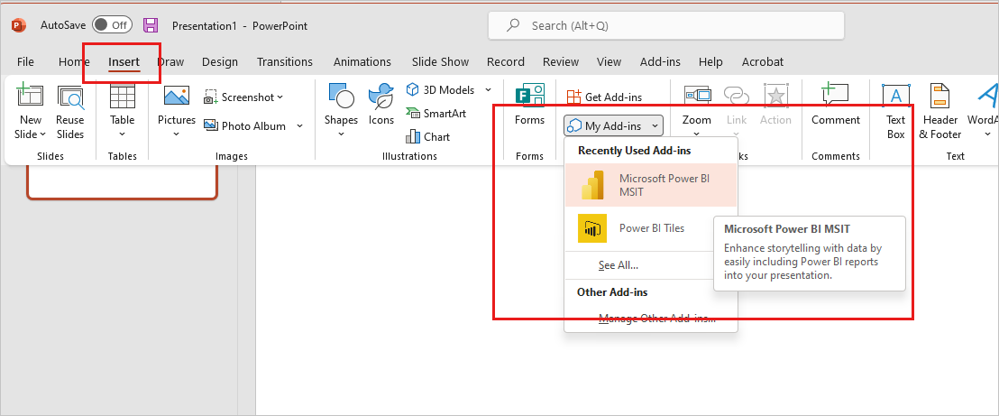

# Embed a report page in PowerPoint

With the Power BI report add-in for PowerPoint, you can easily embed interactive Power BI report pages in PowerPoint slides.

Report pages embedded into PowerPoint using the Power BI report add-in for PowerPoint respect all Power BI permissions and data security, including [row-level security (RLS)](../enterprise/service-admin-rls.md), so your data remains secure.

## Requirements

To embed a Power BI report page into PowerPoint, the Power BI report add-in must be installed in PowerPoint. If it is not installed, see [Get the Power BI report add-in for PowerPoint](TBD).

## Embed your report page

To embed a live Power BI report page into PowerPoint, you first need to [get the URL](#get-the-report-page-url) to the page URL. You then [paste the URL](#paste-the-report-page-url-into-the-powerpoint-add-in) into the Power BI report add-in in PowerPoint.

### Get the report page URL

There are three ways to get the report page URL:

* Through the **Share** option
* Through the **Export** option
* From the browser's address bar

These methods differ in whether or not they can preserve the report page's current state, and what permissions people who open the PowerPoint presentation will have for viewing the report. The table below summarizes the differences.

| URL source | Supports inserting current state | Can users who open the presentation view the report? |
|---------|---------|---------|
| Share     | Yes        | Yes        |
| Export     | Yes         |  Depends on the user's Power BI permissions |
| Address bar     | No        |  Depends on the user's Power BI permissions |

Use the **Share** option if you want to be sure that all users who open the presentation will be able to view the report.

Choose how you want to get the report page URL.

# [Share option](#tab/share)

1. Open the report to the page you want to insert. If desired, configure the page to the desired state using filters, selection, slicers, etc.

1. Choose **Share**.

    

1. Choose the permissions you want to grant and who you want to grant them to, as described in the [sharing reports documentation](service-share-dashboards#share-a-report-via-link). Click **Apply**.

    

1. Check the **Include my changes** box if you want to share the report pages current state, and then select **PowerPoint**.

    

1. Copy the URL to paste into the Power BI PowerPoint add-in. Alternatively choose **Open in PowerPoint** to insert the report page directly into a new, blank PowerPoint presentation.

    

Typically, the link generated by this method provides viewing access to the report.

# [Export option](#tab/export)

1. Open the report to the page you want to insert. If desired, configure the page to the desired state using filters, selection, slicers, etc.

1. Choose **Export > PowerPoint > Embed live data**.

    

1. Check the **Include page's current data and filter selections** box if you want to export the current state, and then copy the URL to paste into the Power BI PowerPoint add-in. Alternatively choose **Open in PowerPoint** to insert the report page directly into a new, blank PowerPoint presentation.

    

# [Browser address bar](#tab/addressbar)

Open the report to the page you want to insert, copy the URL from the browser’s address bar, and then copy the URL to paste into the Power BI PowerPoint add-in.

---

### Paste the report page URL into the PowerPoint add-in

When you have the report page URL, paste it into the Power BI report add-in in PowerPoint.

1. Open PowerPoint and navigate to the slide where you want to insert the report and select the Power BI add-in.

    
 
    If you don't see the add-in, see [Get the Power BI report add-in for PowerPoint](TBD).

1. Paste the report page URL into the text box and then click **Insert**. The report will load into the add-in.

    :::image type="content" source="media/service-embed-report-powerpoint/insert-report-page-url.gif" alt-text="Screenshot of inserting the Power B I report page into the add-in.":::

## Working with the embedded report page

When you first insert a report page into PowerPoint, the initial view is determined by the URL you used. This initial state is called the default view. As you work with the report, you can always restore the default view if you want to go back to it.

You interact with the report just as you would in the Power BI service. You can apply filters and slicers, select data points, and drill down on data.

You can interact with the report in both edit mode and presentation modes. The main difference between the two modes is that changes you make to a view in edit mode are persistent, whereas changes you make while in presentation mode are not persistent. This behavior is useful for preparing presentations, which will be discussed later. 

In addition to the report data and visuals of the report itself, there are a number of controls and features that help you with your work.

## Next steps

More questions? [Try asking the Power BI Community](https://community.powerbi.com/)
