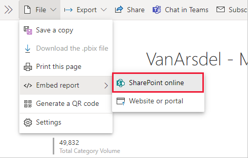

# Embed a report web part in SharePoint Online

The Power BI report web part for SharePoint Online allows you to embed interactive Power BI reports in SharePoint Online pages.

When you use the **Embed in SharePoint Online** option, the embedded reports respect all item permissions and data security through [row-level security (RLS)](/fabric/security/service-admin-row-level-security), so you can easily create secure internal portals.

## Requirements

For **Embed report in SharePoint Online** reports to work:

* The Power BI web part for SharePoint Online requires [Modern Pages](https://support.office.com/article/Allow-or-prevent-creation-of-modern-site-pages-by-end-users-c41d9cc8-c5c0-46b4-8b87-ea66abc6e63b).
* To use an embedded report, users must sign in to the Power BI service to activate their Power BI license.
* To embed a web part in SharePoint Online, you need a Power BI Pro or Premium Per User (PPU) license.
* Users with a free Fabric license can view a report that's hosted in a [Power BI Premium capacity (EM or P SKU)](../enterprise/service-premium-what-is.md) or [Fabric F64 or greater capacity](/fabric/enterprise/licenses#capacity-and-skus).
* SharePoint Embed is now supported in air gap environments.

## Embed your report

To embed your report into SharePoint Online, you need to get the report URL and use it with SharePoint Online's Power BI web part.

### Get a report URL

1. Open a report in the Power BI service.

2. On the **File** menu, select **Embed report** > **SharePoint Online**.

    

3. Copy the report URL from the dialog box.

    

### Add the Power BI report to a SharePoint Online page

1. Open the target page in SharePoint Online and select **Edit**.

    

    Or, in SharePoint Online, select **Pages** > **+ New** > **Site Page** to create a new modern site page.

    

2. Select the **+** in **New** dropdown menu. In the **Data analysis** section, select **Power BI** web part.

    

3. Select **Add report**.

      

4. Paste the previously copied report URL into the **Power BI report link** field. The report loads automatically.

    

5. Select **Publish** to make the change visible to your SharePoint Online users.

    

## Grant access to reports

Embedding a report in SharePoint Online doesn't automatically give users permission to view the report - you need to set view permissions in Power BI.

> [!IMPORTANT]
> Make sure to review who can see the report within the Power BI service, and grant access to those that aren't listed.

There are two ways to provide report access in Power BI.

### In a Microsoft 365 Group

If you're using a Microsoft 365 Group to build your SharePoint Online team site, list the user as a member of the **workspace within the Power BI service** and the **SharePoint page**. 

### Share directly with users

Embed a report within an app, and share it directly with users.

> [!NOTE]
>
> * You need a Power BI Pro or Premium Per User (PPU) license to create a report in a workspace.
> * To share with *Microsoft free users*, the workspace needs to be in a *Premium capacity*.

1. Create a report in a workspace.

2. Publish the app and install it. You must install the app so it has access to the report URL that's used for embedding in SharePoint Online.

3. All end users need to install the app, too. You can also use the **Install app automatically** feature. In the Power BI admin portal, admins can enable [pushing apps](/fabric/admin/service-admin-portal-app#push-apps-to-end-users), so the app is pre-installed for end users.

   

4. Open the app and go to the report.

5. Copy the embedded report URL from the report the app installed. Don't use the original report URL from the workspace.

6. Create a new team site in SharePoint Online.

7. Add the previously copied report URL to the Power BI web part.

8. Add all end users and/or groups who are going to consume the data on the SharePoint Online page and in the Power BI app you created.

    > [!NOTE]
    > To see the report on the SharePoint page, users or groups need access to both the SharePoint Online page and the report in the Power BI app.

Now the end user can go to the team site in SharePoint Online and view the reports on the page.

## Multifactor authentication

If your Power BI environment requires you to sign in using multifactor authentication, you might be asked to sign in with a security device to verify your identity. This can occur if you didn't sign in to SharePoint Online using multifactor authentication. Your Power BI environment requires a security device to validate an account.

> [!NOTE]
> Power BI doesn't support multifactor authentication with Microsoft Entra ID 2.0. Users will see an error message. If the user signs in again to SharePoint Online using their security device, they may be able to view the report.

## Web part settings

Here are the settings you can adjust for the Power BI web part for SharePoint Online:  

| Property | Description |
| --- | --- |
| Page name |Sets the web part's default page. Select a value from the drop-down. If no pages are displayed, either your report has one page, or the URL you pasted contains a page name. Remove the report section from the URL to select a specific page. |
| Display |Adjusts how the report fits within the SharePoint Online page. |
| Show Nav Pane |Shows or hides the page nav pane. |
| Show Filter Pane |Shows or hides the filter pane. |

## Reports that don't load

If your report doesn't load within the Power BI web part, you might see the following message:

There are two common reasons for this message.

1. You don't have report access.
2. The report was deleted.

Contact the SharePoint Online page owner to help resolve the issue.

## Licensing

Users viewing a report in SharePoint need either a **Power BI Pro or Premium Per User (PPU) license** or the content needs to be in a workspace that's in a **[Power BI Premium capacity (EM or P SKU)](../enterprise/service-premium-what-is.md#capacities-and-skus)**.

## Known issues and limitations

* Error: "An error occurred, try logging out and back in and then revisiting this page. Correlation ID: undefined, http response status: 400, server error code 10001, message: Missing refresh token"
  
  If you receive this error, try one of the following steps to troubleshoot:
  
  * Sign out of SharePoint and sign back in. Be sure to close all browser windows before signing back in.

  * If your user account requires multifactor authentication (MFA), sign in to SharePoint with your MFA device (phone app, smart card, etc.).
  
  * Azure B2B Guest user accounts aren't supported. Users see the Power BI logo that shows the part is loading, but it doesn't show the report.

* When viewing Power BI reports embedded in SharePoint Online, there's no option for users to switch between Power BI environments.

* Power BI doesn't support the same localized languages that SharePoint Online does. As a result, you might not see proper localization within the embedded report.

* You might encounter issues if you use Internet Explorer 10. Here's a link  [supported browsers for Power BI](../fundamentals/power-bi-browsers.md).

* The classic SharePoint Server isn't supported with this web part.

* [URL filters](service-url-filters.md) aren't supported with the SharePoint Online web part.

* You can't view or access Power BI Apps embedded in a SharePoint site page using a Power BI web part. To access the embedded Power BI report, access the app first in Power BI service before accessing it in the SharePoint site page.

## Related content

* [Allow users to create modern pages](https://support.office.com/article/Allow-or-prevent-creation-of-modern-site-pages-by-end-users-c41d9cc8-c5c0-46b4-8b87-ea66abc6e63b)  
* [Publish an app in Power BI](service-create-distribute-apps.md)  
* [Share Power BI reports and dashboards with coworkers and others](service-share-dashboards.md)  
* [What is Power BI Premium?](../enterprise/service-premium-what-is.md)
* [Embed a report in a secure portal or website](service-embed-secure.md)

More questions? [Try asking the Power BI Community](https://community.powerbi.com/)
