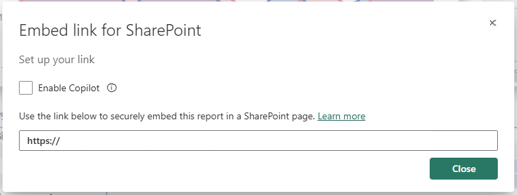

# Embed a report web part in SharePoint Online

With Power BI's new report web part for SharePoint Online, you can easily embed interactive Power BI reports in SharePoint Online pages.

When using the new **Embed in SharePoint Online** option, the embedded reports respect all item permissions and data security through [row-level security (RLS)](../admin/service-admin-rls.md), so you can easily create secure internal portals.

## Requirements

For **Embed in SharePoint Online** reports to work, the following is required:

* A Power BI Pro license or a [Power BI Premium capacity (EM or P SKU)](../admin/service-premium-what-is.md) with a Power BI license.
* The Power BI web part for SharePoint Online requires [Modern Pages](https://support.office.com/article/Allow-or-prevent-creation-of-modern-site-pages-by-end-users-c41d9cc8-c5c0-46b4-8b87-ea66abc6e63b).
* To consume an embedded report, users must sign in to Power BI service to activate their Power BI license.

> [!Note]
> For organizations in Power BI National clouds, there is no free license. In this environment, all users who want access to the embedded report in SharePoint need to have a Power BI Pro license.

## Embed your report
To embed your report into SharePoint Online, you need to get the report URL and use it with SharePoint Online's Power BI web part.

### Get a report URL

1. Within Power BI, view the report.

2. On the **More options (...)** dropdown menu, select **Embed** > **SharePoint Online**.

    

3. Copy the report URL from the dialog.

    

### Add the Power BI report to a SharePoint Online page

1. Open the target page in SharePoint Online and select **Edit**.

    

    Or, in SharePoint Online, select **+ New**  to create a new modern site page.

    

2. Select the **+** dropdown and then select the **Power BI** web part.

    

3. Select **Add report**.

      

4. Paste the previously-copied report URL into the **Power BI report link** pane. The report loads automatically.

    

5. Select **Publish** to make the change visible to your SharePoint Online users.

    

## Grant access to reports

Embedding a report in SharePoint Online doesn't automatically give users permission to view the report - you need to set view permissions in Power BI.

> [!IMPORTANT]
> Make sure to review who can see the report within the Power BI service and grant access to those not listed.

There are two ways to provide report access in Power BI. The first way, if you're using a Microsoft 365 Group to build your SharePoint Online team site, is to list the user as a member of the **workspace within the Power BI service** and the **SharePoint page**. For more information, see how to [manage a workspace](service-manage-app-workspace-in-power-bi-and-office-365.md).

The second way is to embed a report within an app and share it directly with users:  

1. The author, who must be a Pro user, creates a report in a workspace. To share with *Power BI free users*, the workspace needs to be set as a *Premium workspace*.

2. The author publishes the app and installs it. The author must install the app so it has access to the report URL that is used for embedding in SharePoint Online.

3. Now all end users need to install the app too. You can also use the **Install app automatically** feature, which you can enable in the [Power BI admin portal](../admin/service-admin-portal.md), to have the app pre-installed for end users.

   

4. The author opens the app and goes to the report.

5. The author copies the embed report URL from the report the app installed. Don't use the original report URL from the workspace.

6. Create a new team site in SharePoint Online.

7. Add the previously-copied report URL to the Power BI web part.

8. Add all end users and/or groups who are going to consume the data on the SharePoint Online page and in the Power BI app you created.

    > [!NOTE]
    > **Users or groups need access to both the SharePoint Online page and the report in the Power BI app to see the report on the SharePoint page.**

Now the end user can go to the team site in SharePoint Online and view the reports on the page.

## Multi-factor authentication

If your Power BI environment requires you to sign in using multi-factor authentication, you may be asked to sign in with a security device to verify your identity. This occurs if you did not sign in to SharePoint Online using multi-factor authentication, but your Power BI environment requires a security device to validate an account.

> [!NOTE]
> Power BI does not yet support multi-factor authentication with Azure Active Directory 2.0 - users will see an error message. If the user signs in again to SharePoint Online using their security device, they may be able to view the report.

## Web part settings

Below are the settings you can adjust for the Power BI web part for SharePoint Online.

| Property | Description |
| --- | --- |
| Page name |Sets the web part's default page. Select a value from the drop-down. If no pages are displayed, either your report has one page, or the URL you pasted contains a page name. Remove the report section from the URL to select a specific page. |
| Display |Adjusts how the report fits within the SharePoint Online page. |
| Show Nav Pane |Shows or hides the page nav pane. |
| Show Filter Pane |Shows or hides the filter pane. |

## Reports that do not load

If your report does not load within the Power BI web part, you may see the following message:

There are two common reasons for this message.

1. You do not have report access.
2. The report was deleted.

Contact the SharePoint Online page owner to help resolve the issue.

## Licensing

Users viewing a report in SharePoint need either a **Power BI Pro license** or the content needs to be in a workspace that's in a **[Power BI Premium capacity (EM or P SKU)](../admin/service-admin-premium-purchase.md)**.

## Known issues and limitations

* Error: "An error occurred, please try logging out and back in and then revisiting this page. Correlation ID: undefined, http response status: 400, server error code 10001, message: Missing refresh token"
  
  If you receive this error, try one of the troubleshooting steps below.
  
  1. Sign out of SharePoint and sign back in. Be sure to close all browser windows before signing back in.

  2. If your user account requires multi-factor authentication (MFA), then sign in to SharePoint using your MFA device (phone app, smart card, etc.).
  
  3. Azure B2B Guest users accounts are not supported. Users see the Power BI logo that shows the part is loading, but it doesn't show the report.

* Power BI does not support the same localized languages that SharePoint Online does. As a result, you may not see proper localization within the embedded report.

* You may encounter issues if using Internet Explorer 10. <!--You can look at the [browsers support for Power BI](../fundamentals/power-bi-browsers.md) and for [Microsoft 365](https://products.office.com/office-system-requirements#Browsers-section). -->

* The Power BI web part is not available for [national clouds](https://powerbi.microsoft.com/clouds/).

* The classic SharePoint Server is not supported with this web part.

* [URL filters](service-url-filters.md) are not supported with the SPO web part.

## Next steps

* [Allow or prevent creation of modern site pages by end users](https://support.office.com/article/Allow-or-prevent-creation-of-modern-site-pages-by-end-users-c41d9cc8-c5c0-46b4-8b87-ea66abc6e63b)  
* [Create and distribute an app in Power BI](service-create-distribute-apps.md)  
* [Share a dashboard with colleagues and others](service-share-dashboards.md)  
* [What is Power BI Premium?](../admin/service-premium-what-is.md)
* [Embed report in a secure portal or website](service-embed-secure.md)

More questions? [Try asking the Power BI Community](https://community.powerbi.com/)