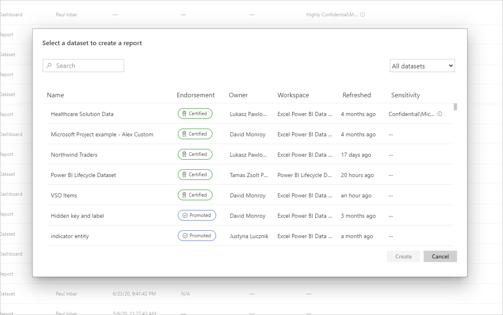
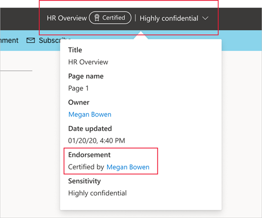
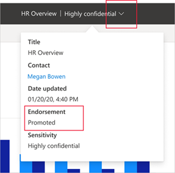

# Endorsement - Promoting and certifying Power BI content

## Endorsement overview

Organizations often have large amounts of Power BI content available for sharing and reuse by their Power BI users, and identifying trustworthy, authoritative content can be difficult. Endorsement is a way to make it easier for users to find the high-quality content they need. Endorsed content is clearly labeled, both in Power BI and in other places where users look for Power BI content (such as Excel). It is also given priority in some searches, and you can sort it for in some lists.

There are two kinds of endorsement: **promotion** and **certification**.

* **Promotion**: Promotion enables users to highlight content that they think is valuable, worthwhile, and ready for others to use. It encourages the collaborative spread of content within the organization.

    Any content owner, or any member with write permissions on the workspace where the content is located, can simply promote the content when they think it's good enough for sharing.

    [Learn how to promote your content](service-endorse-content.md#promote-content).

* **Certification**: Certification means that the content meets the organization's quality standards and can be regarded as reliable, authoritative content that is ready for use across the organization.

    Only a [select group of reviewers (defined by the Power BI administrator)](../admin/service-admin-setup-certification.md) is authorized to certify content. Content owners who wish to see their content certified and are not authorized to certify it themselves need to follow their organization's guidelines about getting their content certified.

    Learn how to [certify content](service-endorse-content.md#certify-content) or [request certification](service-endorse-content.md#request-content-certification).

    **Certification is available only if a Power BI administrator has [enabled and configured](../admin/service-admin-setup-certification.md) it for your organization**.

The image below illustrates how endorsed content (promoted and certified) is clearly identified when you're searching for a semantic model to build a report on.

## Content types that can be endorsed
Power BI currently supports endorsement for:
* Semantic models
* Dataflows
* Reports
* Apps

## Identifying endorsed content

Endorsed content is labeled with badges and icons in lists, cards, and other places, both in Power BI and in places such as Excel where it is possible to find Power BI content. The following badges and icons identify endorsed content.

|Badge|Icon|
|---------|---------|
|||
|||
|||

In addition, if you are in a report or an app, you can see the endorsement status via the header.
* Certification is indicated in both in the header and in the header drop-down, where you can also see who did the certification.

    

* Promotion is indicated in the header drop-down only.
 
    

## Deciding whether to endorse an app or a report

Endorsement is meant to be used for the content items (apps, reports, semantic models, and dataflows) you want people to find, use, and possibly re-share.

When you’re sharing data with a broad audience, a Power BI best practice is to share that data via an app. If you’re following this best practice, you want people to be able to find that app easily. In such cases then, you should endorse the app. 

If you still find it useful to share reports directly, however, then endorse the report itself. 

Whether you’re sharing a report or an app, if the underlying semantic models are clean and ready to be shared, it’s a good idea to endorse the semantic models as well. The same applies to dataflows.  

## Related content

* [Promote or certify Power BI content](service-endorse-content.md)
* [Enable certification for your organization](../admin/service-admin-setup-certification.md) (Power BI admins)
* Questions? [Try asking the Power BI Community](https://community.powerbi.com/)