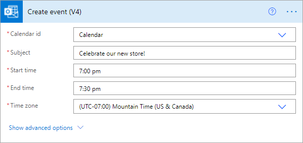

# Integrate Power BI data alerts with Power Automate

Use [Power Automate](/power-automate/getting-started) to integrate Power BI with your favorite apps and services. With Power Automate, you create automated workflows to get notifications, synchronize files, collect data, and more. In this article, you automate generating an email from a Power BI data alert.

## Prerequisites
This article shows how to create two different flows: one from a template and one from scratch. To follow along, [create a data alert in Power BI](../create-reports/service-set-data-alerts.md), and [sign up for Power Automate](https://flow.microsoft.com/#home-signup). It's free!

## Create a flow from a template
In this task, we use a template to create a simple flow that is triggered by a Power BI data alert (notification).

1. Sign in to Power Automate (flow.microsoft.com).
2. Select **Templates**, search for **Power BI** > **Send an e-mail to any audience when a Power BI data alert is triggered**.
   
    :::image type="content" source="media/service-flow-integration/power-automate-templates.png" alt-text="Screenshot of Power Automate Send an e-mail to any audience when a Power BI data alert is triggered template.":::

### Build the flow
This template has one trigger, a Power BI data alert, and one action, to send an email. As you select a field, Power Automate displays dynamic content that you can include.  In this example, we include the tile value and the tile URL in the message body.

1. Select **Continue**.

    :::image type="content" source="media/service-flow-integration/power-automate-power-bi-mail.png" alt-text="Screenshot of Power Automate, Power B I to mail.":::

1. In the **Alert ID** box, select a Power BI data alert. To learn how to create an alert, see [Data alerts in Power BI](../create-reports/service-set-data-alerts.md).
   
    :::image type="content" source="media/service-flow-integration/power-automate-select-alert-id.png" alt-text="Screenshot of Select an alert in the Alert ID box.":::
2. Enter one or more valid email addresses.

3. Power Automate automatically generates a **Subject** and **Body** for you, which you can keep or modify. The body text uses HTML for formatting.

    :::image type="content" source="media/service-flow-integration/power-automate-autogenerated-email.png" alt-text="Screenshot of Power Automate auto-generated email text.":::

1. When you're done with the message, select **Next step** or **Save**.  The flow is created and evaluated.  Power Automate lets you know if it finds errors.
2. If errors are found, select **Edit flow** to fix them, otherwise, select **Done** to run the new flow.
   
   
5. When the data alert is triggered, Power Automate sends an email to the addresses you indicated.  
   
   

## Create a flow from scratch
In this task, we create a simple flow from scratch that is triggered by a Power BI data alert (notification).

1. Sign in to Power Automate (flow.microsoft.com).
2. Select **Create** > **Automated flow**.

    :::image type="content" source="media/service-flow-integration/power-automate-create-automated-flow.png" alt-text="Screenshot of Power Automate > Create Automated flow.":::   
3. In **Build an automated flow**, give your flow a name.
1. In the **Choose your flow's trigger**, search for **Power BI**.
1. Select **Power BI - When a data driven alert is triggered** > **Create**.

    :::image type="content" source="media/service-flow-integration/power-automate-build-automated-flow.png" alt-text="Screenshot of Build an automated flow.":::

### Build your flow
1. In the **Alert ID** box, select the name of your alert. To learn how to create an alert, see [Data alerts in Power BI](../create-reports/service-set-data-alerts.md).

    :::image type="content" source="media/service-flow-integration/power-automate-select-alert-id-scratch.png" alt-text="Screenshot of Select the name of the alert.":::   

2. Select **New step**.
   
3. In **Choose an action**, search for **Outlook** > **Create event**.

    :::image type="content" source="media/service-flow-integration/power-automate-choose-action-create-event.png" alt-text="Screenshot of Choose an action > Create an event.":::   
4. Fill in the event fields. As you select a field, Power Automate displays dynamic content that you can include.
   
   
5. Select **Create flow** when done.  Power Automate saves and evaluates the flow. If there are no errors, select **Done** to run this flow.  The new flow is added to your **My flows** page.
   
   
6. When the flow is triggered by your Power BI data alert, you'll receive an Outlook event notification similar to this one.
   
    

## Next steps
* [Get started with Power Automate](/power-automate/getting-started/)
* [Export and email a Power BI report with Power Automate](service-automate-power-bi-report-export.md)
* More questions? [Try the Power BI Community](https://community.powerbi.com/)
