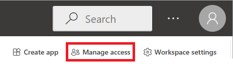

# Give users access to workspaces in Power BI

After you [create a workspace](service-create-the-new-workspaces.md) in Power BI, or if you have an admin role in a workspace, you can give others access to it by adding them to the different roles. Workspace creators are automatically admins. For an explanation of the different roles, see [Roles in workspaces](service-roles-new-workspaces.md).

> [!NOTE]
> To enforce row-level security (RLS) for Power BI Pro users who browse content in a workspace, assign them the Viewer Role.
> 
> After you add or remove a user or a group for workspace access, the permission change only takes effect the next time the user logs into Power BI.

## Give access to your workspace

1. Because you have the Admin role in the workspace, on the workspace content list page, you see **Access**.

    

1. Add security groups, distribution lists, Microsoft 365 groups, or individuals to these workspaces as admins, members, contributors, or viewers. 

    

9. Select **Add** > **Close**.

## Related content

* Read about [the workspace experience in Power BI](service-new-workspaces.md).
* [Create workspaces](service-create-the-new-workspaces.md).
* [Publish an app from a workspace in Power BI](service-create-distribute-apps.md).
* Questions? [Try asking the Power BI Community](https://community.powerbi.com/).
