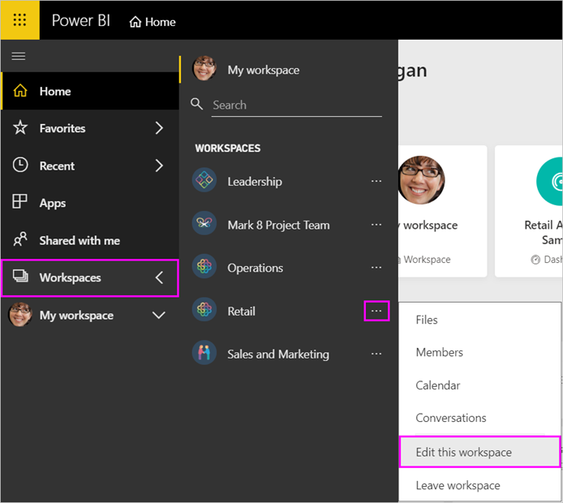
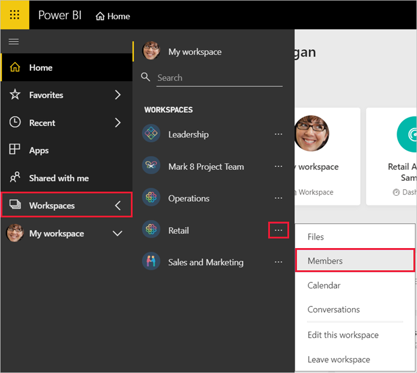
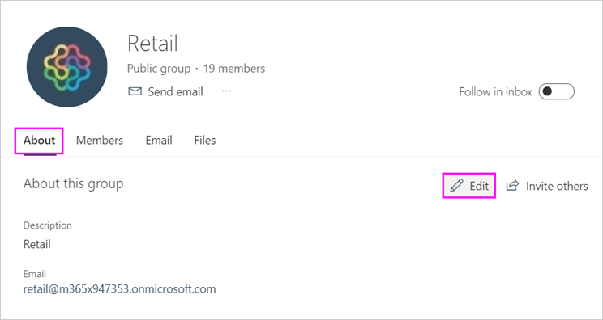
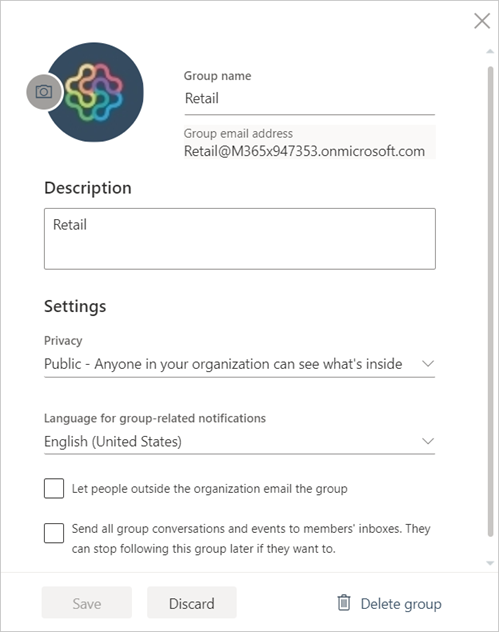

# Manage a 'classic' workspace in Power BI and Microsoft 365

As creator or admin of a ['classic' workspace in Power BI](service-create-workspaces.md), you manage some aspects of the workspace in Power BI. Other aspects you manage in Microsoft 365.

> [!NOTE]
> The [new workspace experience](service-create-the-new-workspaces.md) changes the relationship between Power BI workspaces and Microsoft 365 groups. You aren't automatically creating a Microsoft 365 group every time you create one of the new workspaces. Ready to migrate a classic workspace? See [Upgrade classic workspaces to the new workspaces](service-upgrade-workspaces.md).

In a classic workspace in **Power BI** you can:

* Add or remove workspace members, including making a workspace member an admin.
* Edit the workspace name.
* Delete the workspace, which also deletes the Microsoft 365 group.

In a classic workspace in **Microsoft 365** you can:

* Add or remove your workspace's group members, including making a member an owner.
* Edit the group name, image, description, and other settings.
* See the group email address.
* Delete the group.

You need a [Power BI Pro or Premium Per User (PPU) license](../fundamentals/service-features-license-type.md) to be an admin or member of a workspace. Your app users need a Power BI Pro or Premium Per User (PPU) license, too, unless your workspace is in a Power BI Premium capacity. Read [What is Power BI Premium?](../admin/service-premium-what-is.md) for details.

## Edit a classic workspace in Power BI

1. In the Power BI service, select the arrow next to **Workspaces** > select **More options** (...) next to your workspace name > **Edit this workspace**.

   

   > [!NOTE]
   > You only see **Edit this workspace** if you’re a workspace admin.

1. Here you can rename the workspace, add or remove members, or delete the workspace.

   

1. Select **Save** or **Cancel**.

## Edit classic workspace properties in Microsoft 365

You can also edit aspects of a workspace directly in Outlook for Microsoft 365.

### Edit the members of the workspace group

1. In the Power BI service, select the arrow next to **Workspaces** > select **More options** (...) next to your workspace name > **Members**.

   

   This opens the Outlook for Microsoft 365 group view of your workspace. You may need to sign in to your corporate account.

1. Select the role next to a teammate's name to make the person a **Member** or an **Owner**. Select the **X** to remove the person from the group.

   

### Add an image and set other workspace properties

When you distribute your app from the workspace, the image you add here is the image for your app. See [Add an image to your Microsoft 365 workspace](service-create-workspaces.md#add-an-image-to-your-microsoft-365-workspace-optional) in the **Create the new workspaces** article.

1. In the Outlook for Microsoft 365 view of your workspace, go to the **About** tab and select **Edit**.

    
1. You can edit the name, description, and language for group-related notifications. You can also add an image, and set other properties here.

   

1. Select **Save** or **Discard**.

## Next steps

* [Publish an app in Power BI](service-create-distribute-apps.md)
* [Create the new workspace experience](service-create-the-new-workspaces.md)
* [Upgrade classic workspaces to the new workspaces](service-upgrade-workspaces.md)
* More questions? [Try the Power BI Community](https://community.powerbi.com/)
