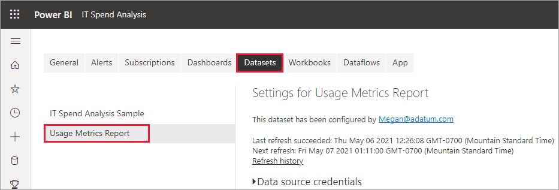

# Monitor usage metrics in the new workspace experience (preview)

Knowing how your content is being used helps you demonstrate your impact and prioritize your efforts. Your usage metrics may show that one of your reports is used daily by a huge segment of the organization. It may show that nobody is viewing a dashboard you created at all. This type of feedback is invaluable in guiding your work efforts.

If you create reports in modern workspaces, you have access to improved usage metrics reports. They enable you to discover who's using those reports throughout your organization, and and how they're using them. You can also identify high-level performance issues. The improved usage reports in the modern Workspace experience replace the existing usage metrics reports documented in [Monitor usage metrics for Power BI dashboards and reports](service-usage-metrics.md).

> [!NOTE]
> You can only run usage metrics reports in the Power BI service. However, if you save a usage metrics report or pin it to a dashboard, you can open and interact with that report on mobile devices.

## Prerequisites

- You need a Power BI Pro or Premium Per User (PPU) license to run and access the usage metrics data. However, the usage metrics feature captures usage information from all users, regardless of the license they're assigned.
- To access improved usage metrics for a report, the report must reside in a modern workspace and you must have edit access to that report.
- Your Power BI admin must have enabled usage metrics for content creators. Your Power BI admin may have also enabled collecting per-user data in usage metrics. Read about how to [enable these options in the admin portal](../admin/service-admin-portal.md#control-usage-metrics).

## Create & view an improved usage metrics report

Only users with admin, member, or contributor permissions can view the improved usage metrics report. Viewer permissions aren't sufficient. If you are at least a contributor on a modern workspace in which your report resides, you can use the following procedure to display the improved usage metrics:

1. Open the workspace that contains the report for which you want to analyze the usage metrics.
2. From either the workspace content list, open the context menu of the report and select **View usage metrics report**. Alternatively, open the report, then open the context menu on the command bar, and then select **Usage metrics**.

    

1. The first time you do this, Power BI creates the usage metrics report and lets you know when it's ready.

    

1. To see the results, select **View usage metrics**.
2. If this is the first time you do this, Power BI might open the old usage metrics report. To display the improved usage metrics report, in the upper right corner, toggle the New usage report off switch to **On**.

    

    > [!NOTE]
    > You can only see the New usage report switch if your report resides in a modern workspace. Legacy workspaces do not offer improved usage metrics reports.

## About the improved usage metrics report

When you display this improved usage metrics report, Power BI generates a pre-built report. It contains usage metrics for that content for the last 30 days. The report looks similar to the Power BI reports you're already familiar with. You can slice based on how your end users received access, whether they accessed via the web or mobile app, and so on. As your reports evolve, so too will the usage metrics report. It updates every day with new data.

> [!NOTE]
> Usage metrics reports don't show up in Recent, Workspaces, Favorites, or other content lists. They can't be added to an app. If you pin a tile from a usage metrics report to a dashboard, you can't add that dashboard to an app.

### Usage metrics report dataset

When you first launch the improved usage metrics report, Power BI automatically creates a Usage Metrics Report dataset. The improved usage metrics report relies on that dataset. Power BI then refreshes this dataset daily. While you can't change the refresh schedule, you can update the credentials that Power BI uses to refresh the usage metrics data. You may need to resume scheduled refresh if the credentials expired, or if you removed the user who first launched the usage metrics report from the workspace where the dataset resides.

> [!NOTE]
> While still in preview, the usage metrics dataset may have minor changes which affect custom reports.  

### Usage metrics report pages

The improved usage metrics report includes the following report pages:

- **Report usage**    Provides information about report views and report viewers, such as how many users viewed the report by date.
- **Report performance**    Shows the typical report opening times broken down by consumption method and browser types.
- **FAQ**     Provides answers to frequently asked questions, such as What is a "Viewer" and what is a "View"?

### Which metrics are reported?

| **Page** | **Metric** | **Description** |
| --- | --- | --- |
| Report usage | Report views/Report opens | A Report View is recorded each time someone opens a report and represents unique landings on the report. It answers the question, "How often is the report accessed?" This definition of a Report View differs from previous usage metrics reports. Changing report pages is no longer considered an additional Report View. Instead, changing report pages counts for the next metric, Report Page Views. Activities such as sharing and pinning are no longer considered in usage metrics. |
| Report usage | Report Page views | A Report Page View is recorded every time someone views a report page. It represents total views across any pages. It answers the question, "How often are report pages accessed?" So changing report pages counts for Report Page Views. See [Considerations and Limitations](#considerations-and-limitations) for important details. |
| Report usage | Unique viewers | A viewer is someone who opened the report at least once during the time period (based on the AAD user account). |
| Report usage | View trend | The view trend reflects view count changes over time. It compares the first half of the selected time period with the second half. |
| Report usage | Date slicer | You can change the time period on the Report usage page, such as to calculate week-over-week or biweekly trends. In the lower left corner of the Report usage page, you can determine the earliest and latest date for which usage data is available for the selected report. |
| Report usage | Rank | Based on view count, the rank shows the popularity of a report in comparison to all other reports in the organization. A rank of 1 would mean the report has the most views of all reports in the organization.   |
| Report usage | Report views per day | Total number of Report Views per day. Counted at report level, does not consider Report Page Views. |
| Report usage | Report viewers per day | Total number of different users who viewed the report (based on the AAD user account). |
| Report usage | Distribution method | How users got access to the report, such as being members of a workspace, having the report shared with them, or installing an app. |
| Report usage | Platform slicer | If the report was accessed via the Power BI service (powerbi.com), Power BI Embedded, or a mobile device. |
| Report usage | Users with report views | Shows the list of users who opened the report sorted by view count. |
| Report usage | Pages | If the report has more than 1 page, slice the report by the page(s) that was viewed. "Blank" means either a report page was added within 24 hours of the new page appearing in the slicer list, or report pages have been deleted. "Blank" captures these types of situations. |
| Report performance | Typical opening time | The typical report opening time corresponds to the 50th percentile of the time it takes to open the report. In other words, it is the time below which 50% of the open-report actions are completed. The Report performance page also breaks down the typical report opening time by consumption method and browser type. At present, we measure the performance for the initial report load and first page viewed. The measurement starts when the report is requested and ends when the last visual completes rendering. Report interactions such as slicing, filtering, or changing pages are not included in performance metrics.  |
| Report performance | Opening time trend | The opening time trend reflects open-report performance changes over time. It compares the opening times for the report of the first half of the selected time period with the opening times of the second half. |
| Report performance | Date slicer | You can change the time period on the Report performance page, such as to calculate week-over-week or biweekly trends. In the lower left corner of the Report performance page, you can determine the earliest and latest date for which usage data is available for the selected report. |
| Report performance | Daily performance | The performance for 10%, 50%, and 90% of the open report actions calculated for each individual day. |
| Report performance | seven-day performance | The performance for 10%, 50%, and 90% of the open report actions calculated across the past seven days for each date. |
| Report performance | Consumption method | How users opened the report, such as via the Power BI service (powerbi.com), Power BI Embedded, or a mobile device. |
| Report performance | Browsers | What browser the users used to open the report, such as Firefox, Edge, and Chrome. |

### Worked example of View and Viewer metrics

Suppose we have four reports that are accessed by three users as follows:

| **Report Name** | **Usage Pattern** |
| --- | --- |
| KPI Report | <ul><li>User A opens the report on page 1. |
| HR Report | <ul><li>User A opens the report on page 1, then views page 2, page 3, and page 4. Then they view page 1 again. |
| Finance Report | <ul><li>User A opens the report on page 1, then views page 2.</li><li>User B opens the report on page 1.</li><li>User C opens the report on page 1, then views page 3.</li></ul> |
| Sales Report | <ul><li>User A opens the report on page 1, then views page 2</li><li>User C opens the report on page 2 (e.g. via bookmark)</li><li>Later in the day, User C opens the report on page 1 </li></ul> |

Assuming all client telemetry reaches Power BI, the resulting metrics would be:

| **Report Name** | **Report Views** | **Report Page Views** | **Viewers** |
| --- | --- | --- | --- |
| KPI Report | 1 | 1 | 1 |
| HR Report | 1 | 5 | 1 | 
| Finance Report | 3 | 5 | 3 |
| Sales Report | 3 | 4 | 2 |

## Update usage metrics report credentials

Use the following procedure to take over a Usage Metrics Report dataset and update the credentials.

1. Open the workspace that contains the report for which you want to update the Usage Metrics Report dataset.
2. In the gray header bar at the top, select the **Settings** icon, then select **Settings**.

    

3. Switch to the **Datasets** tab.

1. Select the Usage Metrics Report dataset. 

    
    
    If you aren't the current dataset owner, you must take over ownership before you can update the data source credentials. 
    
5. Select the **Take over** button, then in the **Take over dataset settings** dialog box, select **Take over** again.

1. Under **Data source credentials**, select **Edit credentials**.

    

2. In the **Configure Usage Metrics Report** dialog box, select **Sign in**.

    

1. Complete the sign-in sequence and note the notification that the data source was updated successfully.

    > [!NOTE]
    > The Usage Metrics Report dataset contains usage data for the last 30 days. It can take up to 24 hours for new usage data to be imported. You can't trigger a manual refresh by using the Power BI user interface.

## Disable usage metrics reports

Usage metrics reports are a feature that the Power BI or global administrator can turn on or off. Administrators have granular control over which users have access to usage metrics; they are On by default for all users in the organization. See [Control usage metrics](../admin/service-admin-portal.md#control-usage-metrics) in the Admin portal article for details on these settings.

> [!NOTE]
> Only admins for the Power BI tenant can see the Admin portal and edit settings.

## Exclude user information from usage metrics reports

By default, per-user data is enabled for usage metrics. This means content consumer account information such as user name and email address is included in the usage metrics report. Admins can limit exposure of identifying user information in the Power BI admin portal tenant settings. They can enable per-user data for the entire organization or specified security groups.

If user information is excluded, the usage report refers to users as 'Unnamed User _[unique_id]_', where _[unique_id]_ is a meaningless unique identifier assigned to support distinct user count measures.

1. On the **Tenant settings** tab in the admin portal, under **Audit and usage settings**, expand **Per-user data in metrics for content creators** and select **Disabled**. This will hide user account information for all users.

2. Decide whether to **Delete all existing per-user data in current usage metrics content**. Select **Apply**.

    

When disabling usage metrics for their entire organization, admins can use the Delete all existing usage metrics content option to delete all existing reports and dashboard tiles that were built using the usage metrics reports. This option removes all access to usage metrics data for all users in the organization who may already be using it. Deleting existing usage metrics content is irreversible.

> [!NOTE]
> Only admins for the Power BI tenant can see the Admin portal and configure the Per-user data in usage metrics for content creators setting.

## Customize the usage metrics report

To dig into the report data, or to build your own reports against the underlying dataset, you have several options:

- **[Make a copy of the report](#create-a-copy-of-the-usage-report) in the Power BI service.**   Use **Save a copy** to create a separate instance of the usage metrics report, which you can customize to meet your specific needs.
- **[Connect to the dataset](#create-a-new-usage-report-in-power-bi-desktop) with a new report.**   For every workspace, the dataset has the name "Usage Metrics Report," as explained earlier in the section [Usage metrics report dataset](#usage-metrics-report-dataset). You can use Power BI Desktop to build custom usage metrics reports based on the underlying dataset.
- **[Use Analyze in Excel](#analyze-usage-data-in-excel).**   You can also analyze the Power BI usage data in PivotTables, charts, and slicer features in Microsoft Excel. Read more about the [Analyze in Excel](service-analyze-in-excel.md) feature.

### Create a copy of the usage report

When you create a copy of the read-only, pre-built usage report, Power BI creates an editable instance of the report. At first glance, it looks the same. However, you can now open the report in Editing view, add new visualizations, filters, and pages, modify or delete existing visualizations, and so on. Power BI saves the new report in the current workspace.

1. In the new usage metrics report, select the **File** dropdown, then select **Save a copy**.

    

2. In the **Save your report** dialog box, enter a name, then select **Save**.

    Power BI creates an editable Power BI report saved in the current workspace. Select **Go to report** in the **Report saved** dialog box that appears.

3. Select **Edit** to switch into Editing view.

    From here you can change filters, add new pages, build new visualizations, format the fonts and colors, and so on.

1. The new report is saved to the **All** tab and the **Content** tab in the current workspace and added to the **Recent** list.

    
    
> [!NOTE]
> When you save a copy of the usage metrics report it's treated like a regular Power BI report. It will be accessible to all users who have viewing permissions in the workspace, including users in the Viewer role.

### Create a new usage report in Power BI Desktop

You can create a new usage report in Power BI Desktop, based on the Usage Metrics Report dataset. To establish a connection to the Usage Metrics Report dataset and create your own report, you have to be signed in to the Power BI service in Power BI Desktop. 

1. Open Power BI Desktop.

2. If you aren't signed in to the Power BI service, on the **File** menu select **Sign in**.

1. To connect to the Usage Metrics Report dataset, on the **Home** ribbon select **Get Data** > **More**.

4. In the left pane, select **Power Platform**, then select **Power BI datasets** > **Connect**.

    

1. Scroll to the desired dataset or type *Usage Metrics* in the search box. 

6. Verify in the Workspace column that you are selecting the correct dataset, then select **Create**. 

    

7. Check the Fields list in Power BI Desktop, which gives you access to the tables, columns, and measures in the selected dataset.

    

1. Now you can create and share custom usage reports, all from the same Usage Metrics Report dataset.

### Analyze usage data in Excel

When you connect to the usage data in Excel, you can create PivotTables that use the pre-defined measures. Note that Excel PivotTables do not support drag-and-drop aggregation of numeric fields when connecting to a Power BI dataset.

1. First, if you haven't done so already, [create a copy of the usage metrics report](#create-a-copy-of-the-usage-report). 

2. Open the new usage metrics report, select **Export** > **Analyze in Excel**.

    

1. If you see the **First, you need some Excel updates** dialog box, select **Download** and install the latest updates for Power BI connectivity. Otherwise, select **I've already installed these updates**.

    

    > [!NOTE]
    > Some organizations may have Group Policy rules that prevent installing the required Analyze in Excel updates to Excel. If you can't install the updates, check with your administrator.

1. In the browser dialog asking what you want to do with the Usage Metrics report.odc file, select **Open**.

    

1. Power BI launches Excel. Verify the file name and path for the .odc file, then select **Enable**.

    

1. Now that Excel has opened and you have an empty PivotTable, you can drag fields onto the Rows, Columns, Filters, and Values boxes and create custom views into your usage data.

    

## Usage metrics in national clouds

Power BI is available in separate national clouds. These clouds offer the same levels of security, privacy, compliance, and transparency as the global version of Power BI, combined with a unique model for local regulations on service delivery, data residency, access, and control. Modern usage metrics are currently available in following national clouds: 

- US Government Community Cloud
- US Government Community Cloud High
- US Department of Defense
- China

For more information, see [national clouds](https://powerbi.microsoft.com/clouds/).

## Considerations and limitations

It's important to understand that differences can occur when comparing the improved usage metrics report with its predecessor. Particularly Report View metrics are now based on activity data collected from the Power BI service. Previous versions of the usage metrics report relied only on client telemetry, which doesn't always match usage metrics collected from the service. Moreover, the improved usage metrics report uses a different definition for a "Report View." A Report View is an open-report event, as recorded in the service each time someone opens a report. Changing report pages is no longer considered an additional Report View. We now include a Report Page View metric, which specifically counts every page view.

> [!NOTE]
> Because the improved usage metrics report relies on activity data collected from the Power BI service, the Report View metrics now match the aggregate counts of activities in audit logs and activity logs. Under- and overcounting of activities due to inconsistent network connections, ad blockers, or other client-side issues no longer skew the Viewer and Report View counts. However, Report Page Views still rely on client telemetry and can be affected.

In addition to the above differences between previous and improved usage metrics reports, note the following limitations for the preview release:

- Dashboard usage metrics still rely on the previous version of the usage metrics reports and are not yet available in modern usage metrics.
- Improved usage metrics reports are only available for reports in modern workspaces. Reports in legacy workspaces only support the previous version of the usage metrics reports.
- Performance data and Report Page View metrics rely on the client/device sending data to Power BI. Depending on network latency, ad blockers, firewalls, and network rules set by your organization, this data may never reach Power BI. Therefore, the performance and Report Page View data may not include all views or all users.
- Certain types of views aren't included in performance measurements. For example, when a user selects a link to a report in an email message, the Report View is accounted for in the report usage but there is no event in the performance metrics.
- Report performance metrics aren't available for Paginated Reports. The Pages tab on the Report usage page as well as the charts on the Report performance page don't show data for these types of reports.
- User masking isn't working as expected when using nested groups. If your organization has disabled Per-user data in usage metrics for content creators in the Power BI admin portal tenant settings, only the members on the top level are being masked. Members of subgroups are still visible.
- Initializing the Usage Metrics Report dataset might take a few minutes, resulting in showing a blank usage metrics report because the Power BI user interface does not wait for the refresh to finish. Check the refresh history in the Usage Metrics Report dataset settings to verify that the refresh operation succeeded.
- Initializing the Usage Metrics Report dataset might fail due to a timeout encountered during refresh. Refer to the Troubleshooting section below to resolve this issue.
- Sharing is disabled for the usage metrics report. To give people read access to the report, you first need to give them access to the workspace.
- In some scenarios, you may notice the performance data is missing. This can occur if a user opens a report and interacts with the report before it has completed loading or if an error occurred during the report load. 
- If your organization is using [Private Links](../admin/service-security-private-links.md), modern usage metrics reports will contain partial data (only Report Views). A current limitation when transferring client information over private links prevents us from capturing Report Page Views and performance data over Private Links. 

## Frequently asked questions

In addition to the above considerations and limitations, the following questions and answers about usage metrics might be helpful for users and administrators:

**Q:** Why do I see fewer Report Page Views than Report Views, shouldn't they be at least the same? 
**A:** Report Views rely on server telemetry that is generated when the report is first opened. Once a report is open, its page definitions are already loaded onto the users device. Report Page Views rely on usage information from the users device reaching Power BI. This can sometimes be blocked, as described in [Considerations and Limitations](#considerations-and-limitations).

**Q:** I can't run usage metrics on a report.
**A:** You can only see usage metrics for reports you own or have permissions to edit.

**Q:** Why can't I see the New usage report on toggle in the upper right corner of my existing usage metrics report?
**A:** The improved usage metrics report is only available for reports in modern workspaces.

**Q:** What time period is covered by the report?
**A:** The usage report is based on activity data for the last 30 days, excluding activities of the current day. You can narrow the time period by using the Date slicer on the Report usage page, such as to analyze only last week's data.

**Q:** When will I see the most recent activity data?
**A:** The usage report includes activity data up until the last complete day based on the UTC time zone. The data shown in the report is also dependent on the refresh time for the dataset. Power BI refreshes the dataset once per day.

**Q:** The data doesn't seem up to date.
**A:** Note that it might take up to 24 hours for new activity data to appear in the usage report.

**Q:** What is the data source for the usage data?
**A:** The Usage Metrics Report dataset imports data from a Power BI-internal usage metrics store by using a custom Usage Metrics Data Connector. You can update the credentials for the Usage Metrics Data Connector on the Usage Metrics Report dataset settings page.

**Q:** How can I connect to the data? Or change the default report?
**A:** You can create a copy of the read-only, pre-built usage report. The report copy connects to the same Usage Metrics Report dataset and enables you to edit the report details.

**Q:** What is a "Viewer" and what is a "View"?
**A:** A viewer is someone who opened the report at least once during the time period. A view is an open-report event. A report view is recorded each time someone opens a report.
Note that the definition of a view differs from previous usage metrics reports. Changing report pages is no longer considered an additional view.

**Q:** How is the "View trend" calculated?
**A:** The view trend reflects view count changes over time. It compares the first half of the selected time period with the second half. You can change the time period by using the Date slicer on the Report usage page, such as to calculate week-over-week or biweekly trends.

**Q:** What do "Distribution" and "Platform" mean?
**A:** Distribution shows how the viewers obtained access to a report: shared directly, through workspace access, or through an app.
The Platform indicates the technology a viewer used to open a report: via PowerBI.com, Mobile, or Embedded.

**Q:** How does report ranking work?
**A:** Based on view count, the rank shows the popularity of a report in comparison to all other reports in the organization. A rank of 1 would mean the report has the most views of all reports in the organization.

**Q:** What are "Unnamed Users"?
**A:** Your organization can decide to exclude user information from your usage report. If excluded, the usage report refers to users as Unnamed.

**Q:** What is the "Typical report opening time"?
**A:** The typical report opening time corresponds to the 50th percentile of the time it takes to open the report. In other words, it is the time below which 50% of the open-report actions are completed. The Report performance page also breaks down the typical report opening time by consumption method, and browser type.

**Q:** How is the "Opening time trend" calculated?
**A:** The opening time trend reflects open-report performance changes over time. It compares the opening times for the report of the first half of the selected time period with the opening times of the second half. You can change the time period by using the Date slicer on the Report performance page, such as to calculate week-over-week or biweekly trends.

**Q:**  There are four reports in the previous version of the usage metrics report, but the improved version only displays three.
**A:**  The improved usage metrics report only includes reports that have been opened in the past 30 days, while the previous version covers the past 90 days. If a report isn't included in the improved usage metrics report, it likely hasn't been used in more than 30 days.

## Troubleshoot refresh issues

If you suspect data consistency or refresh issues, it might make sense to delete the existing Usage Metrics Report dataset. Then you can run View Usage Metrics again to generate a new dataset with its associated improved usage metrics reports.

> [!NOTE]
> Power Automate can perform a refresh that can force the Report Usage model to reload data. This option may not resolve all refresh issues; for example, if an older version is stuck in the workspace.

Follow these steps to delete the dataset and then create a fresh data refresh report. 

### Delete the dataset

1. Open the workspace that contains the report for which you want to reset the Usage Metrics Report dataset.

2. In the black header bar at the top, select the **Settings** icon, then select **Settings**.

    

3. Switch to the **Datasets** tab, and select the Usage Metrics Report dataset. 

    

5. Copy the workspace and dataset IDs from the URL displayed in the address bar of your browser.

    

1. In your browser, go to [https://docs.microsoft.com/rest/api/power-bi/datasets/deletedatasetingroup](/rest/api/power-bi/datasets/deletedatasetingroup), and select the **Try It** button.

    

    > [!NOTE]
   > This **Try it** button does not apply to GCC customers since their API endpoint is different.

1. Sign in to Power BI, paste the Workspace ID in the **groupId** text box and the dataset ID into the **datasetId** text box, and then select **Run**. 

    

1. Under the **Run** button, verify that the service returns a Response Code of **200**. That code indicates that the dataset and its associated usage metrics reports have been deleted successfully.

    

### Create a fresh usage metrics report

1. Back in the Power BI service, you see the dataset is gone.

    

2. If you still see the Usage Metrics report in the Reports list, refresh your browser.

3. [Create a fresh usage metrics report](#create--view-an-improved-usage-metrics-report).

## Next steps

[Administering Power BI in the admin portal](../admin/service-admin-portal.md)

More questions? [Try the Power BI Community](https://community.powerbi.com/)
