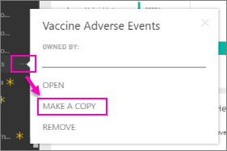

# Organizational content packs: Copy, refresh, and get access

> [!NOTE]
> Organizational content packs are being deprecated. Now is a good time to upgrade your content packs to apps, if you haven't started yet. See [Upgrade classic workspaces to the new workspaces in Power BI](service-upgrade-workspaces.md) for details.
> 

When an organizational content pack is published, all recipients see the same dashboard, reports, Excel workbooks, datasets, and data (unless it's a SQL Server Analysis Services (SSAS) data source).  [Only the content pack creator can edit and republish](service-organizational-content-pack-manage-update-delete.md) the content pack.  However, all recipients can save a copy of the content pack that can live alongside the original.

Creating content packs is different from sharing dashboards or collaborating on them in a group. Read [How should I collaborate on and share dashboards and reports?](service-how-to-collaborate-distribute-dashboards-reports.md) to decide on the best option for 

## Create a copy of an organizational content pack
Create your own copy of the content pack, not visible to others.

1. Select **More options** (...) next to the content pack dashboard > Make a copy.

    
2. Select **Save**.  

Now you have a copy that you can change. Nobody else will see changes you make.

> [!NOTE]
> Previously, each time you installed a content pack or created a copy one, a new dataset would appear in the workspace content list. A recent update simplified the experience to show just one item using the new referenced dataset icon:
>
> 
>

## Help!  I can no longer access the content pack
This can happen for several reasons:

* **Membership changes**:  Content packs are published to email distribution groups, security groups, and [Power BI groups based on Microsoft 365](https://support.office.com/article/Create-a-group-in-Office-365-7124dc4c-1de9-40d4-b096-e8add19209e9).  If you are removed from the group, you will no longer have access to the content pack.
* **Distribution changes**: The content pack creator changes the distribution. For example, if the content pack was originally published to the entire organization but the creator republished it to a smaller audience, you may no longer be included.
* **Security settings changes**: If the dashboard and reports connect to on-premises SSAS data sources and changes are made to the security settings, your permissions to that server may be revoked.

## How are organizational content packs refreshed?
When the content pack is created, the refresh settings are inherited with the dataset.  When you create a copy of the content pack, the new version retains its link to the original dataset and its refresh schedule.

See [Manage, update, and delete organizational content packs](service-organizational-content-pack-manage-update-delete.md).

## Next steps
* [Introduction to organizational content packs](service-organizational-content-pack-introduction.md)
* [Create a group in Power BI](service-create-distribute-apps.md)
* More questions? [Try the Power BI Community](https://community.powerbi.com/)
