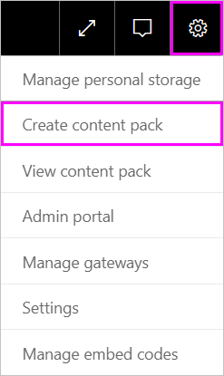
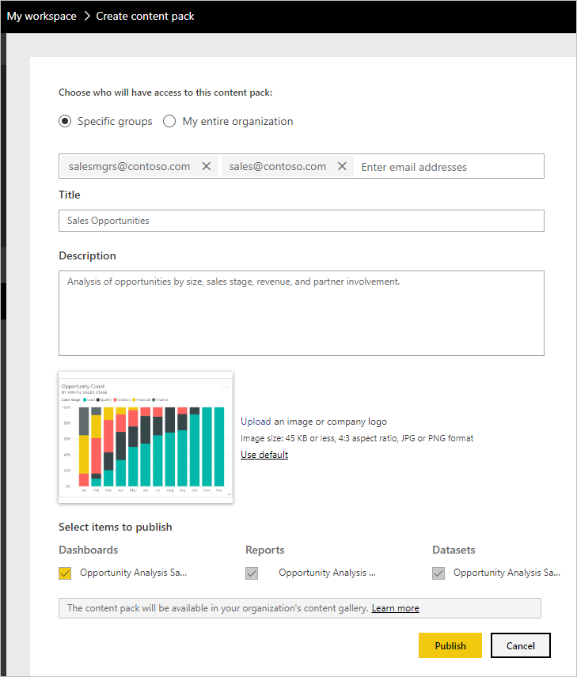
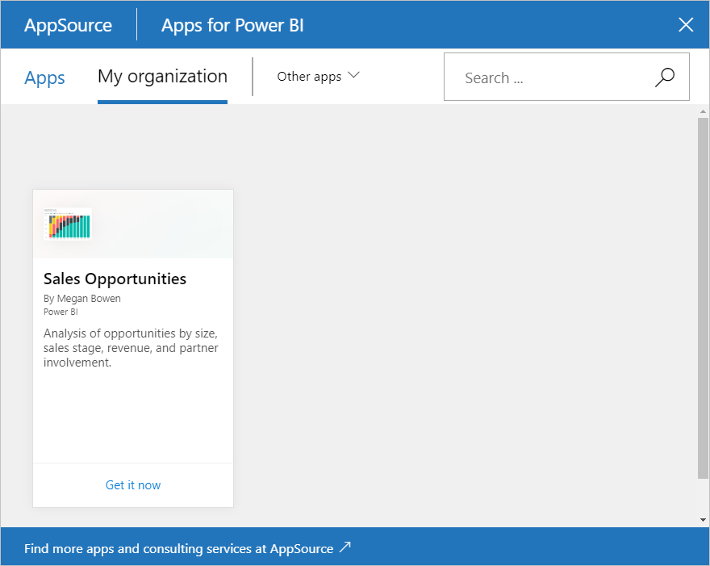

# Tutorial: Create and publish a Power BI organizational content pack

> [!NOTE]
> Organizational content packs are being deprecated. Now is a good time to upgrade your content packs to apps, if you haven't started yet. See [Upgrade classic workspaces to the new workspaces in Power BI](service-upgrade-workspaces.md) for details.
> 

In this tutorial, you create an organizational content pack, give access to a specific group, and publish it to your organization's content pack library on Power BI.

Creating content packs is different from sharing dashboards or collaborating on them in a group. Read [Ways to share your work in Power BI](service-how-to-collaborate-distribute-dashboards-reports.md) to decide on the best option for your situation.

Creating an organizational content pack requires a [Power BI Pro account](https://powerbi.microsoft.com/pricing) for you and your colleagues.

## Create and publish a content pack

Imagine you're the Release Manager at Contoso and you're getting ready for a new product launch.  You've created a dashboard with reports that you'd like to share. Other employees managing the launch may find them useful. You want a way to package up the dashboard and reports as a solution for your colleagues to use.

Want to follow along? In the [Power BI service](https://powerbi.com), go to your **My Workspace**. Then go to **Get Data** > **Samples** > **Opportunity Analysis Sample** > **Connect** to get your own copy.

1. In the nav pane, select **Workspaces** > **My workspaces**.

1. From the top nav pane, select the cog icon  > **Create content pack**.

   

1. In the **Create content pack** window, enter the following information.  

   Keep in mind that your organization's content pack library might fill up quickly. The library could end up with hundreds of content packs published for the organization or for groups. Take time to give your content pack a meaningful name, add a good description, and select the right audience.  Use words that makes your content pack easy to find via search. It makes it easier to find in the future.

      

    1. Select **Specific Groups**.

    1. Enter the full email addresses for individuals, [Microsoft 365 groups](https://support.office.com/article/Create-a-group-in-Office-365-7124dc4c-1de9-40d4-b096-e8add19209e9), distribution groups, or security groups. For example: salesmgrs@contoso.com; sales@contoso.com

        For this tutorial, try using your group's email address.

    1. Name the content pack *Sales Opportunities*.

        > [!TIP]
        > Consider including the name of the dashboard in the name of the content pack. That way, your colleagues can find the dashboard more easily after they connect to your content pack.

    1. Recommended: Add a description. It helps coworkers more easily find the content packs that they need. Besides a description, add keywords your coworkers might use to search for this content pack. Include contact information in case your coworkers have a question or need help.

    1. Upload an image or logo to make it easier for group members to find the content pack.

        It's faster to scan for an image than to scan for text. The screenshot shows an image of the **Opportunity Count** column chart tile.

    1. Select the **Opportunity Analysis Sample** dashboard to add it to the content pack.

        Power BI automatically adds the associated report and dataset. You can add others, if you want.

       > [!NOTE]
       > Power BI only lists the dashboards, reports, datasets, and workbooks that you can edit. Thus, the app doesn't display any that were shared with you.

   1. If you have Excel workbooks, you see them under **Reports**, with an Excel icon. You can add them to the content pack, too.

      

      > [!NOTE]
      > If members of the group can't view the Excel workbook, you may need to [share the workbook with them in OneDrive for Business](https://support.office.com/article/Share-documents-or-folders-in-Office-365-1fe37332-0f9a-4719-970e-d2578da4941c).

1. Select **Publish** to add the content pack to the group's organizational content pack library.  

   You see a success message when it publishes successfully.

1. When members of your group go to **Get Data** > **Organizational Content Packs**, they see your content pack.

   

   > [!TIP]
   > The URL displayed in your browser is an unique address for this content pack.  Want to tell your coworkers about this new content pack?  Paste the URL into an email.

1. When your group members select **Connect**, they can [view and work with your content pack](service-organizational-content-pack-copy-refresh-access.md).

## Next steps

* [Intro to organizational content packs in Power BI](service-organizational-content-pack-introduction.md).

* [Manage, update, and delete organizational content packs](service-organizational-content-pack-manage-update-delete.md).

* [Publish an app in Power BI](service-create-distribute-apps.md).

* [What is OneDrive for Business?](https://support.office.com/article/What-is-OneDrive-for-Business-187f90af-056f-47c0-9656-cc0ddca7fdc2)

* More questions? [Try the Power BI Community](https://community.powerbi.com/)
