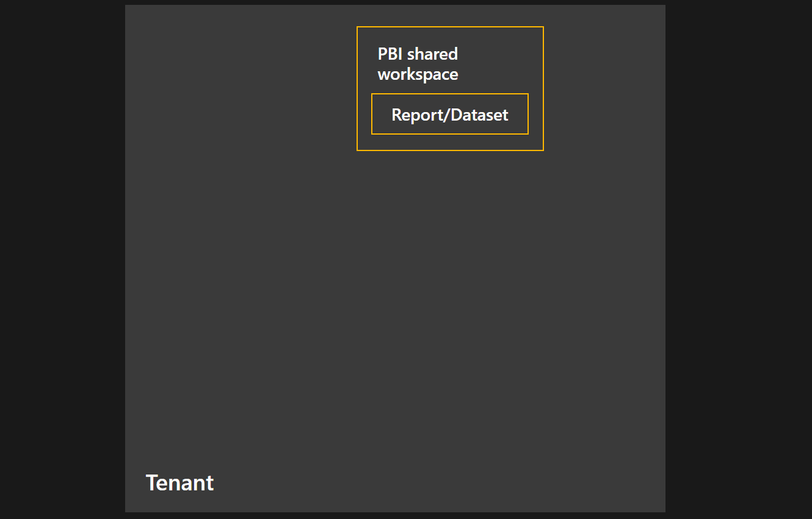

# About Power BI in Power Apps Solutions (preview)

> [!IMPORTANT]
> This feature will reach retirement on July 31st, 2024. We recommend removing all Power BI report and dataset components from existing solutions and using a [Power BI embedded system dashboard](/power-apps/maker/model-driven-apps/create-edit-powerbi-embedded-page) instead.

The Power BI/Power Apps solutions integration enables Power Apps app makers to add Power BI reports and semantic models as Dataverse components in Power Apps solutions. When a Power BI report or semantic model is added to a Power Apps solution, it will stay connected as the solution is deployed across environments and tenants, and can be seamlessly managed as part of the solutions Application Lifecycle Management process across environments and tenants.

## Flow overview

Working in Power Apps, the Power Apps maker creates Power BI report and semantic model components based on reports and semantic models in Power BI workspaces and adds them to a solution. When the Power BI report or semantic model component is created and added to a solution, the Power BI artifacts are exported and uploaded to Dataverse, and a new dedicated workspace in Power BI is automatically created to store the artifacts. This dedicated Power BI workspace inherits privileges from several predefined roles in the Power Apps environment (see Permission sync between Power Apps environment and Power BI workspace), giving the users in these roles permission in the workspace, thus enabling coauthoring between Power Apps and Power BI. This process ensures that your Power BI reports and semantic models can be embedded as system dashboards or inside forms, and will survive deployment across environments and tenants.

The animation below illustrates how a Power BI report and semantic model are exported from a shared Power BI workspace into Dataverse, and then stored in a specially provisioned dedicated Power BI workspace. When the solution is exported (managed or unmanaged) it includes the Power BI content.​ In the deployment environment (cross-environment and cross-tenant) Dataverse provisions the Power BI workspace and artifacts in a dedicated environment workspace.

## Enablement and considerations

For the integration to work, it needs to be enabled in Power BI by a Power BI administrator. See [Enable the Power BI/Power Apps Solutions integration](./service-power-bi-powerapps-integration-enable.md).

There are some nontypical ways in which Power BI reports and semantic models linked to Power BI components in Power Apps may behave. See [Using the Power BI/Power Apps solutions integration](./service-power-bi-powerapps-integration-using.md).

Finally, there are security and life cycle considerations to take into account when using Power BI components in Power Apps solutions. See [Considerations working with the Power BI/Power Apps solutions integration](./service-power-bi-powerapps-integration-considerations.md).

## Related content

* [Enable the Power BI/Power Apps Solutions integration](./service-power-bi-powerapps-integration-enable.md)
* [Using the Power BI/Power Apps solutions integration](./service-power-bi-powerapps-integration-using.md)
* [Considerations working with the Power BI/Power Apps solutions integration](./service-power-bi-powerapps-integration-considerations.md)
* [Power BI content management in Power Apps solutions](/power-apps/maker/model-driven-apps/power-bi-content-management-power-apps-solutions)
* More questions? [Try asking the Power BI Community](https://community.powerbi.com/)