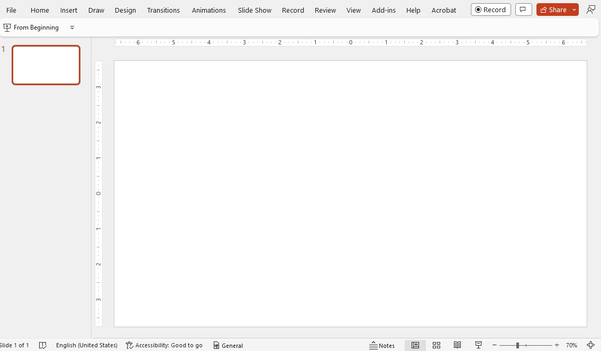

# About storytelling with Power BI in PowerPoint

With the Power BI add-in for PowerPoint, you can enhance your data storytelling in PowerPoint with live, interactive Power BI data. Not only will the data shown in your presentations be always up to date, but also, while you're presenting, you'll be able to filter and drill down on data in response to questions and feedback from your audience without having to switch contexts.

Currently, the add-in supports adding report pages to PowerPoint slides individually. The left-hand page navigation pane isn't brought in by the add-in, but any page navigation visuals on the report page itself will function normally as they do in the Power BI service.

You can add report pages to PowerPoint presentations starting from either PowerPoint or Power BI. For Power BI to be used as the starting point, Power BI storytelling functionality must be [enabled in your organization](../admin/service-admin-portal-export-sharing.md#enable-power-bi-add-in-for-powerpoint).

## Requirements

To use the Power BI add-in for PowerPoint, you must have access to the Office add-in store, or the add-in must be available to you as an [admin managed add-in](/microsoft-365/admin/manage/centralized-deployment-of-add-ins).

To be able to view live Power BI data in PowerPoint, you must have an active Power BI account and a Power BI Free license, as well as access to the data. If the Power BI report isn't located in a Premium capacity, a Power BI Pro license is needed.

## Security

Power BI data added to PowerPoint using the Power BI add-in remains in Power BI. No data is actually exported from Power BI. As such, the data respects all Power BI permissions and data security, including [row-level security (RLS)](../enterprise/service-admin-rls.md), so your data remains secure.

## Information for the Power BI administrator

If you're a Power BI administrator, see [Information for Power BI administrators](./service-power-bi-powerpoint-add-in-admin.md) for further details about the add-in.

## Considerations and limitations

* The Power BI storytelling add-in requires WebView2 to run Power BI in PowerPoint. WebView2 comes standard on recent Windows versions, but if you get an error when you try to use the add-in, you may need to install it manually. See [Troubleshoot the Power BI add-in for PowerPoint](./service-power-bi-powerpoint-add-in-troubleshoot.md) for details.
* The add-in currently supports Power BI report pages only. Other types of items such as dashboards and paginated reports are not supported.
* [Business-to-business (B2B)](../enterprise/service-admin-azure-ad-b2b.md) scenarios are not supported.
* The [add-in side pane options](./service-power-bi-powerpoint-add-in-view-present.md#add-in-side-pane) **Delete**, **Reload**, and **Show as Saved Image** are available only in the PowerPoint desktop application. This is because PowerPoint for the web doesn't support the add-in side menu.
* In sovereign clouds the add-in is supported as an [admin managed add-in](/microsoft-365/admin/manage/centralized-deployment-of-add-ins) only, as the Office add-in store isn't accessible from sovereign clouds.

## Next Steps

* [Add live Power BI report pages to PowerPoint](./service-power-bi-powerpoint-add-in-install.md)
* [View and present live Power BI report pages in PowerPoint](./service-power-bi-powerpoint-add-in-view-present.md)
* [Information for Power BI administrators](./service-power-bi-powerpoint-add-in-admin.md)
* [Troubleshoot the Power BI add-in for PowerPoint](./service-power-bi-powerpoint-add-in-troubleshoot.md)
* More questions? [Try asking the Power BI Community](https://community.powerbi.com/)