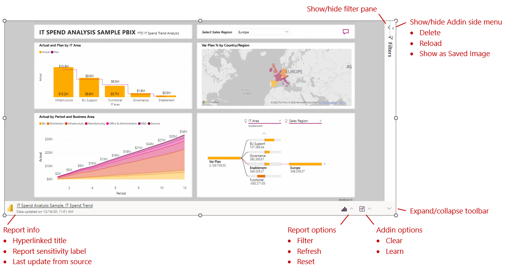

# Using the Power BI add-in for PowerPoint

When you first insert a report page into PowerPoint, the initial view is determined by the URL you used. This initial state is called the default view. As you work with the report, you can always restore the default view if you want to go back to it.

You interact with the report just as you would in the Power BI service. You can apply filters and slicers, select data points, and drill down on data.

You can interact with the report in both edit mode and presentation modes. The main difference between the two modes is that changes you make to a view in edit mode are persistent, whereas changes you make while in presentation mode are not persistent. This behavior is useful for preparing presentations, which will be discussed later. 

In addition to the report data and visuals of the report itself, there are a number of controls and features that help you with your work.

### Common actions

Common things you might want to do when viewing a report page in the add-in are described below. For more details and additional options, see the detailed descriptions of the menus and buttons.
* **Interact with the report**: You can apply filters and slicers, select data points, and drill down on data just like you can in the Power BI service. See XXX for details about interacting with reports in Power BI.
* **Refresh report page**: Choose Report actions menu > Refresh. Brings over the latest data from the Power BI service. Note: Does not initiate data update from the data source.
* **Restore the original report view**: Choose Report actions menu > Reset. Returns the report page’s state to what it was when the page was originally inserted.
* **Display report page as a static image**: Choose Add-in side menu > Display as static image. Turns the current state of the live report into a static image. Select again to restore the live view.
* **Expand/collapse the filter pane**: Choose Report actions menu > Filter, or click the Show/hide filter pane.
* **Reload the report page**: Choose Add-in site menu > Reload. Causes the report to reload. Use this option if you need to bring over non-data related changes to the report itself, such as the addition/deletion of visuals, etc. 
* **Expand/collapse toolbar**: Choose Expand/collapse the toolbar button. Hiding the toolbar create more space for the report. This can be especially useful in presentation mode.

### Preparing a presentation

One of the main differences between edit mode and presentation mode is that in edit mode the current state of the report page is persistent, while it is not in presentation mode. This makes it possible to set up your desired view in edit mode and then start presenting (the presentation will start with the state you set up), While you are presenting you can interact with the report just as you would in the Power BI service. When you leave presentation mode, the report view returns to the state it was in when you entered presentation mode. This makes it easy to repeat the presentation multiple times without having to reconfigure the report view each time.

### Report options

| Option | Description |
|---|---|
|Filter|Shows or hides the filters pane, where you can filter your report, just like in the service. This option is present only if the page has filters defined.|
|Refresh|Refreshes the report page with the latest data from the Power BI service. Note: Refresh does not trigger getting data from the data sources. It just gets the latest data from the Power BI service.|
|Reset|Restores the state of the report page to the state it was in when first inserted into the PowerPoint presentation.|

## Next steps

More questions? [Try asking the Power BI Community](https://community.powerbi.com/)
