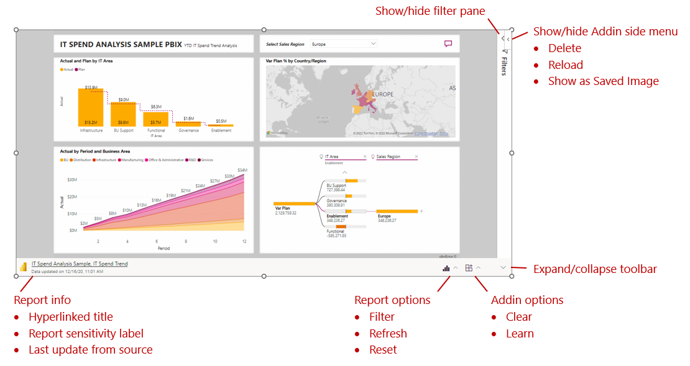
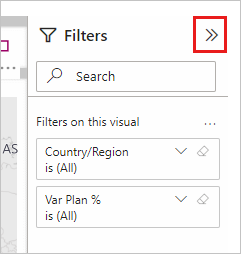

# Using the Power BI add-in for PowerPoint

When you first add a live Power BI report page into PowerPoint using the Power BI add-in for Powerpoint, the initial view is determined by the [URL](./service-power-bi-powerpoint-add-in-install.md#get-the-report-page-url) you used. This initial state is called the default view. As you work with the report, you can always restore the default view if you want to go back to it.

You interact with the report just as you would in the Power BI service. You can apply filters and slicers, select data points, and drill down on data. You can interact with the report in both edit mode and presentation modes.
* In edit mode, changes you make to the report state (via filtering, selection, slicing, etc.) are saved.
* In presentation mode, such changes aren't saved. When you leave presentation mode, the report goes back to the state it was in when you left edit mode.

This behavior is useful for preparing presentations. You set up your presentation in edit mode, and then you can present it in presentation mode multiple times without having to set it up again each time.

In addition to interactive features of the report itself (filters, selection, slicers, etc.) the add-in has several menus that provide other controls and features that help you with your work.

### Report info

* **Hyperlinked title**: Report name and page name. Click on the title to open Power BI to that report page.
* **Report sensitivity label**: Shows the sensitivity label applied to the report in Power BI. Note: This is not the sensitivity label (if any) applied to the PowerPoint file itself.
* **Last update from source**: Shows the date of the last data update from the data sources.

### Report Options

* **Filter**: Shows or hides the filters pane, where you can filter your report, just like in the Power BI service. This option is available only if the page has filters defined.
* **Refresh**: Refreshes the report page with the latest data from the Power BI service. Note: Refresh does not trigger getting data from the data sources.
* **Reset**: Restores the state of the report page to the state it was in when it was first added to the PowerPoint presentation.

### Add-in options

* **Clear**: Removes the report page from the add-in and returns you to the Insert screen, where you can start over by pasting in a new report page URL.
* **Learn**: Opens a carousal of help pages.

### Expand/collapse toolbar

Expands or collapses the toolbar across the bottom of the report. This feature is particulary useful in Slide Show mode, when you need more space and want a cleaner display.

### Add-in side pane

* **Delete**: Removes the add-in from the PowerPoint slide.
* **Reload**: Reloads the report page. Use this option if visuals have been changed, added or deleted. If all you need is data refresh, use the Refresh option on the report actions menu.
    
    The report page reloads every time PowerPoint is opened, so you need to use this option only if the report has changed while you’ve had PowerPoint open.
* **Show as saved image**: Converts the current state as a saved, static image. You can’t interact with this image. Data is not updated. You can copy and paste this image wherever you want. Select Show as Saved Image again to restore the live current view. The report will reload.

### Show/hide filters pane

Shows or hides the filters pane.

## Next steps

* [About the Power BI add-in for PowerPoint](./service-power-bi-powerpoint-add-in-about.md)
* [Add a live Power BI report page in PowerPoint](./service-power-bi-powerpoint-add-in-install.md)
* More questions? [Try asking the Power BI Community](https://community.powerbi.com/)
