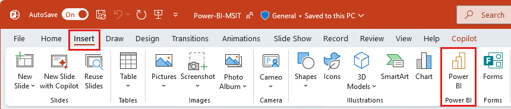

# Power BI add-in for PowerPoint - Admin info

The Power BI add-in for PowerPoint enables users to add live, interactive data from Power BI to PowerPoint presentations. Currently, users can add individual report pages and individual visuals. When a report page is added, the add-in doesn't bring in the left hand navigation pane, but any page navigation visuals on the report page itself will function normally as they do in the Power BI service.

## Requirements

To use the Power BI add-in for PowerPoint, users must either have access to the Office add-in store, or the add-in must be made available to them as an [admin managed add-in](/microsoft-365/admin/manage/centralized-deployment-of-add-ins).

In national/regional clouds, the add-in must be deployed as an admin managed add-in, since the Office add-in store isn't accessible from national/regional clouds. For more information, see [Deploying the add-in in national/regional clouds](#deploying-the-add-in-in-nationalregional-clouds).

## Licensing

To be able to view live Power BI data in PowerPoint, users must have an active Power BI account and a Fabric Free  license, and access to the data. If the Power BI report isn't located in a Premium capacity or Fabric F64 or greater capacity, a Power BI Pro license is needed.

If auto-licensing for Power BI is enabled, users without a Power BI account will be signed up automatically when they open a presentation containing a live Power BI report page or visual. **This may impact the assignment and availability of licenses in your organization**. For more information, see [Power BI license assignment](../enterprise/service-admin-disable-self-service.md).

If auto-licensing isn't enabled, users without Power BI accounts will be requested to sign up.

## Power BI entry points

By default, the Power BI service includes entry points that enable users to insert the add-in into new PowerPoint presentations directly from Power BI. Power BI admins can disable this functionality by turning off the **Enable Power BI add-in for PowerPoint** tenant setting. See [Enable Power BI add-in for PowerPoint](/fabric/admin/service-admin-portal-export-sharing#enable-power-bi-add-in-for-powerpoint) for detail.

>[!NOTE]
> Disabling this functionality in Power BI does not prevent people from adding Power BI report pages and visuals to PowerPoint slides starting from PowerPoint. To completely block adding live Power BI report pages and visuals to PowerPoint slides using the add-in, the functionality must be disabled in both Power BI and PowerPoint.

Power BI entry points for the add-in aren't available in national/regional, government, and air-gapped clouds. See the Microsoft Office documentation for information about the availability of the add-in in PowerPoint in these clouds.

## Power BI add-in button in PowerPoint Insert ribbon

If your organization has a Microsoft 365 Office subscription, a button for the add-in will appear in the PowerPoint ribbon.

The button is a shortcut to the add-in offering in the Office add-in store. The button itself doesn't provide access to the store. If the user doesn't have access to the store, the button won't work.

>[!NOTE]
> The rollout of the Power BI add-in for PowerPoint depends on the update cadence of your organization's Microsoft 365 subscription. Hence the add-in may not immediately be available in your organization. To ensure availability of the add-in, use the latest version of Microsoft 365.

## Deploying the add-in in national/regional clouds

In national/regional clouds, the add-in is supported as an admin managed add-in only. If you're a Power BI admin in a tenant located in a national/regional cloud, you must download the add-in from Power BI in your national/regional cloud and deploy it using Centralized Deployment. The add-in that is available from the public cloud will not work in national/regional clouds. Users in national/regional clouds must use the add-in you've deployed.

To download and deploy the add-in:

1. Sign into the Power BI service with an admin account.
1. Select the **Download** icon and choose **Power BI for PowerPoint** to download the add-in. You'll have this option only if your tenant is in a national/regional cloud.

    :::image type="content" source="media/service-power-bi-powerpoint-add-in-admin/power-bi-powerpoint-addin-download-option.png" alt-text="Screenshot of the Power BI for PowerPoint add-in download option.":::

1. Deploy the add-in according to the instructions at [Deploy add-ins in the Microsoft 365 admin center](/microsoft-365/admin/manage/manage-deployment-of-add-ins).

For a summary of the ways the add-in differs when deployed in a national/regional cloud from when it's deployed in a public cloud, see [The Power BI add-in for PowerPoint in national/regional clouds](./service-power-bi-powerpoint-add-in-national-clouds.md).

## Related content

* [About storytelling with Power BI in PowerPoint](./service-power-bi-powerpoint-add-in-about.md)
* [The Power BI add-in for PowerPoint in national/regional clouds](./service-power-bi-powerpoint-add-in-national-clouds.md)
* [Add live Power BI data to PowerPoint](./service-power-bi-powerpoint-add-in-install.md)
* [View and present live Power BI data in PowerPoint](./service-power-bi-powerpoint-add-in-view-present.md)
* [Troubleshoot the Power BI add-in for PowerPoint](./service-power-bi-powerpoint-add-in-troubleshoot.md)
* More questions? [Try asking the Power BI Community](https://community.powerbi.com/)