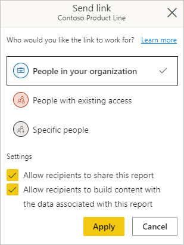
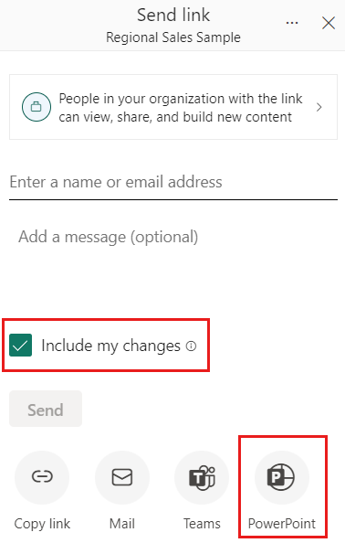
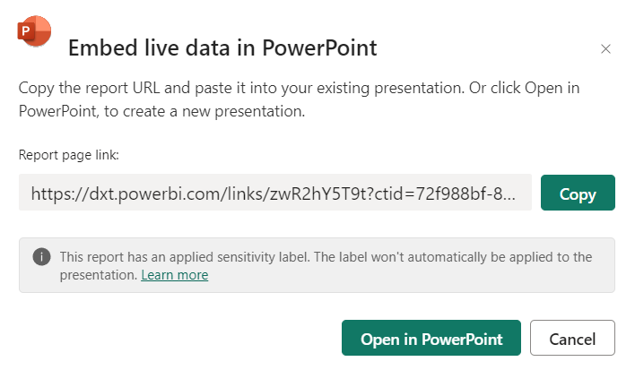
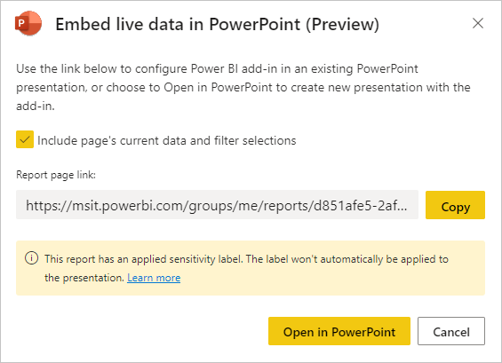
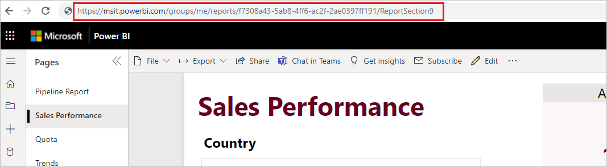
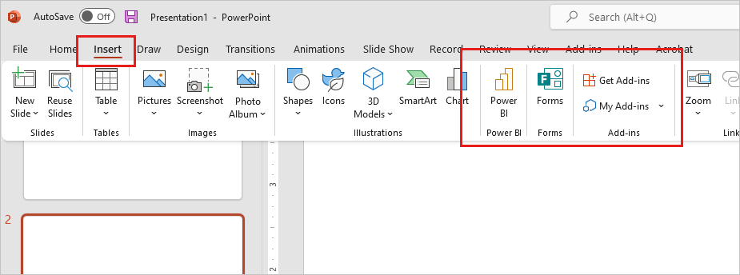

# Add a live Power BI report page to PowerPoint (preview)

To add a live Power BI report page to a PowerPoint slide, you first need to [get the URL](#get-the-report-page-url) to the page. You then [paste the URL](#paste-the-report-page-url-into-the-add-in) into the Power BI add-in in PowerPoint.

## Get the report page URL

There are three ways to get the report page URL:

* Through the **Share** option
* Through the **Export** option
* From the browser's address bar

These methods differ in whether or not they can preserve the report page's current state, and what permissions people who open the PowerPoint presentation will have for viewing the report. The table below summarizes the differences.

| URL source | URL can preserve current state | Can users who open the presentation view the report? |
|---------|---------|---------|
| Share     | Yes        | Yes, if you grant read permissions when generating the shareable link.        |
| Export     | Yes         |  Depends on the user's Power BI permissions |
| Address bar     | No        |  Depends on the user's Power BI permissions |

Use the **Share** option if you want to be sure that all users who open the presentation will be able to view the report.

Choose how you want to get the report page URL.

# [Share option](#tab/share)

1. Open the report to the page you want to insert. If desired, configure the page to the desired state using filters, selection, slicers, etc.

1. Choose **Share**.

    

1. Choose the permissions you want to grant and who you want to grant them to, as described in the [sharing reports documentation](service-share-dashboards.md#share-a-report-via-link). Click **Apply**.

    

1. Check the **Include my changes** box if you want to share the report pages current state, and then select **PowerPoint**.

    

1. Copy the URL to paste into the Power BI PowerPoint add-in. Alternatively, if you want to create a new presentation with the report already loaded into the add-in, choose **Open in PowerPoint**.

    

# [Export option](#tab/export)

1. Open the report to the page you want to insert. If desired, configure the page to the desired state using filters, selection, slicers, etc.

1. Choose **Export > PowerPoint > Embed live data**.

    

1. Check the **Include page's current data and filter selections** box if you want to export the current state, and then copy the URL to paste into the Power BI PowerPoint add-in. Alternatively, if you want to create a new presentation with the report already loaded into the add-in, choose **Open in PowerPoint**.

    

    >[!NOTE]
    > Although this option is located in the Export menu and is labeled "Embed live data", no data actually becomes part of the PowerPoint file. The data remains secure in Power BI.

# [Browser address bar](#tab/addressbar)

Open the report to the page you want to insert, copy the URL from the browser's address bar, and then copy the URL to paste into the Power BI add-in in PowerPoint.

---

## Paste the report page URL into the add-in

When you have the report page URL, paste it into the Power BI add-in in PowerPoint. This step doesn't apply if you chose **Open in PowerPoint** while in Power BI.

1. Open PowerPoint and navigate to the slide where you want to add the report.

1. Select the **Insert** ribbon and choose the **Power BI** button.

    

    >[!NOTE]
    > If you don't see the **Power BI** button, choose **Get Add-ins** and look for "Microsoft Power BI" in the Office Add-ins store. If the add-in is admin managed, it will appear in a separate ribbon.

1. Paste the report page URL into the text box and then click **Insert**. The report will load into the slide.

    >[!NOTE]
    > If you get a **Cannot run Power BI error message**, it is most likely because you need to install WebView2, a component necessary for running Power BI in PowerPoint. WebView2 is very simple and quick to install. See [Troubleshoot the Power BI add-in for PowerPoint](./service-power-bi-powerpoint-add-in-troubleshoot.md) for details.

    The image below illustrates inserting the add-in into a slide and using the report URL.

    :::image type="content" source="media/service-power-bi-powerpoint-add-in-install/inserting-power-bi-add-in.gif" alt-text="Screenshot of inserting the Power B I report page into the add-in.":::

    Once the report has loaded, it is live and you can select the data as desired. Any changes you make while editing the presentation will be saved. The next time you open the presentation, the report will appear in the state you last left it in.

## Next steps

* [About storytelling with Power BI in PowerPoint](./service-power-bi-powerpoint-add-in-about.md)
* [View and present live Power BI report pages in PowerPoint](./service-power-bi-powerpoint-add-in-view-present.md)
* [Information for Power BI administrators](./service-power-bi-powerpoint-add-in-admin.md)
* [Troubleshoot the Power BI add-in for PowerPoint](./service-power-bi-powerpoint-add-in-troubleshoot.md)
* More questions? [Try asking the Power BI Community](https://community.powerbi.com/)
