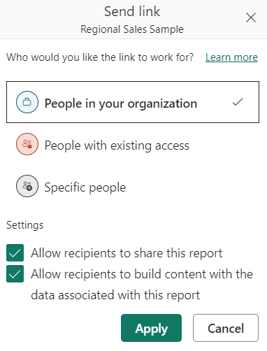
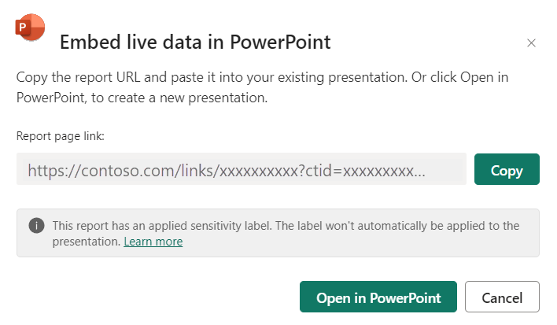

# Add a live Power BI report page in PowerPoint

To add a live Power BI report page to a PowerPoint slide, you first need to [get the URL](#get-the-report-page-url) to the page URL. You then [paste the URL](#paste-the-report-page-url-into-the-powerpoint-add-in) into the Power BI report add-in in PowerPoint.

## Get the report page URL

There are three ways to get the report page URL:

* Through the **Share** option
* Through the **Export** option
* From the browser's address bar

These methods differ in whether or not they can preserve the report page's current state, and what permissions people who open the PowerPoint presentation will have for viewing the report. The table below summarizes the differences.

| URL source | Supports inserting current state | Can users who open the presentation view the report? |
|---------|---------|---------|
| Share     | Yes        | Yes        |
| Export     | Yes         |  Depends on the user's Power BI permissions |
| Address bar     | No        |  Depends on the user's Power BI permissions |

Use the **Share** option if you want to be sure that all users who open the presentation will be able to view the report.

Choose how you want to get the report page URL.

# [Share option](#tab/share)

1. Open the report to the page you want to insert. If desired, configure the page to the desired state using filters, selection, slicers, etc.

1. Choose **Share**.

    

1. Choose the permissions you want to grant and who you want to grant them to, as described in the [sharing reports documentation](service-share-dashboards.md#share-a-report-via-link). Click **Apply**.

    

1. Check the **Include my changes** box if you want to share the report pages current state, and then select **PowerPoint**.

    

1. Copy the URL to paste into the Power BI PowerPoint add-in.

1. To create a new presentation with the report loaded into the add-in, choose **Open in PowerPoint**.

    

# [Export option](#tab/export)

1. Open the report to the page you want to insert. If desired, configure the page to the desired state using filters, selection, slicers, etc.

1. Choose **Export > PowerPoint > Embed live data**.

    

1. Check the **Include page's current data and filter selections** box if you want to export the current state, and then copy the URL to paste into the Power BI PowerPoint add-in. Alternatively choose **Open in PowerPoint** to insert the report page directly into a new, blank PowerPoint presentation.

    

Note: This option does not export a copy of the data. The date remains secure in Power BI.

# [Browser address bar](#tab/addressbar)

Open the report to the page you want to insert, copy the URL from the browser’s address bar, and then copy the URL to paste into the Power BI PowerPoint add-in.

---

## Paste the report page URL into the PowerPoint add-in

When you have the report page URL, paste it into the Power BI report add-in in PowerPoint.

1. Open PowerPoint and navigate to the slide where you want to add the report.
1. Select the **Insert** ribbon and choose the **Power BI** button.  If you don't see the **Power BI** button, choose **Get Add-ins** and look for the add-in in the Office Add-ins store or under the Admin Managed tab. Once you've used the add-in it will subsequently be available under **My Add-ins**.

    

    Note: If you don't see the **Power BI** button, choose **Get Add-ins** and look for the add-in in the Office Add-ins store or under the Admin Managed tab. Once you've used the add-in it will subsequently be available under **My Add-ins**.

1. The add-in will be added to the slide. Paste the report page URL into the text box and then click **Insert**. The report will load into the slide.
   
    The image below illustrates inserting the add-in in a slide and using the report URL.

    :::image type="content" source="media/service-power-bi-powerpoint-add-in-install/Animation.gif" alt-text="Screenshot of inserting the Power B I report page into the add-in.":::

## Set up your presentation

Any changes you make to the state in preparation for preeantaion, it is saved. 
Each time you open presenattion the data is refreshed.

New article: Sharing and presentation

## Next steps

More questions? [Try asking the Power BI Community](https://community.powerbi.com/)
