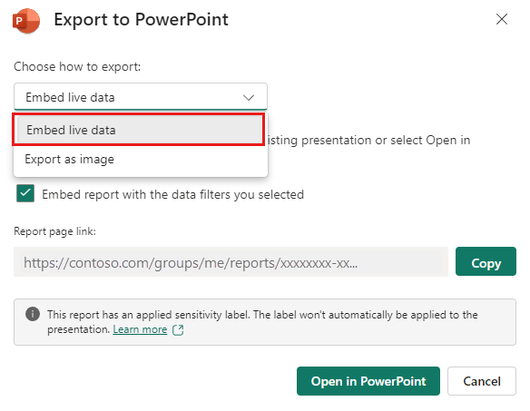

# Add live Power BI data to PowerPoint

You can use live data from Power BI to help create a story with your PowerPoint presentations. Add individual visuals and whole report pages to your PowerPoint slides with the Power BI add-in or create a new PowerPoint presentation with live data from the Power BI Service. With the Power BI add-in, you can also use recommended content from the add-in to use on an existing slide. You also insert a direct URL link into the Power BI add-in.

After you use your preferred method to load the data, the report or visual will be live and you can select the data as desired. Any changes you make while editing the presentation will automatically save. The next time you open the presentation, the report or visual will appear in the state you last left it in. For more information, see [View and present live Power BI data in PowerPoint](./service-power-bi-powerpoint-add-in-view-present.md).

> [!NOTE]
> If you don't see the **Power BI** button, choose **Get Add-ins** and look for "Microsoft Power BI" in the Office Add-ins store. If the add-in is admin managed, it will appear in a separate ribbon.

> [!IMPORTANT]
> If you get a **Cannot run Power BI error message** when you try to use the Power BI add-in, it is most likely because you need to install WebView2, a component necessary for running Power BI in PowerPoint. WebView2 is very simple and quick to install. See [Troubleshoot the Power BI add-in for PowerPoint](./service-power-bi-powerpoint-add-in-troubleshoot.md) for details.

Decide how you want to load your data and follow the procedure in one of following sections:
* [Create a new presentation and add live Power BI data](#create-a-new-presentation-and-add-live-power-bi-data)
* [Add live Power BI data to an existing presentation](#add-live-power-bi-data-to-an-existing-presentation)
* [Use the direct URL to add live data to a presentation](#use-the-direct-url-to-add-live-data-to-a-presentation)

## Create a new presentation and add live Power BI data

> [!NOTE]
> The **Open in PowerPoint** and **Export** options are not available in national/regional clouds.

### Create new presentation from a report or visual
Add the report or visual to a new PowerPoint presentation with the following method:
1. Go to the report or visual.
1. Make any changes or select filters that you want to the data before you add it to a new PowerPoint presentation.
1. Select **Share** the live data is a report.
1. Or, if the live data is in a visual, select **More options (...)** then **Share**.
1. When you add a report:
    1. Specify what users can access the content as described in the [sharing reports documentation](service-share-dashboards.md#share-a-report-via-link).
    1. Check the **Include my changes** box if you want to add the data in its current state.
    1. Select **Apply**.
1. Choose **Open in PowerPoint**.
1. In the **Embed live data in PowerPoint** dialog that appears, choose **Open in PowerPoint**. Then a new PowerPoint presentation will open with the visual already loaded into the add-in.

:::image type="content" source="media/service-power-bi-powerpoint-add-in-install/copy-link-dialog.png" alt-text="Screenshot showing the embed live data in PowerPoint dialog window."::: 

### Export a report to add live data to a new presentation
1. Select **Export**.
1. Choose **PowerPoint**.
1. Then select **Embed live data**.

    

1. Check the **Embed report with the data filters you selected** box if you want to export the current state,
1. Select **Open in PowerPoint**.

> [!NOTE]
> Although this option is located in the Export menu and is labeled "Embed live data", no data actually becomes part of the PowerPoint file. The data remains secure in Power BI.

## Add live Power BI data to an existing presentation

### Use the content recommended by the Power BI add-in

1. On the slide you want to add live content, type the title of the slide. The title should include the name of the report you wish to add.
1. select **Add-Ins** from the top ribbon.
1. Select the Power BI add-in. 
1. The add-in then automatically scans the title of your slide then suggests Power BI content that might be relevant under the *Recommended* section. 
    
    For example, if the title of your slide is "New stores sales," the add-in shows you a list of Power BI reports that contain those keywords. The add-in also shows you reports you recently visited in Power BI, so you can easily access reports you’re working on or frequently use.

    :::image type="content" source="./media/service-power-bi-powerpoint-add-in-whats-new/suggested-content.gif" alt-text="Screenshot showing suggest content for the Power BI add-in for PowerPoint.":::

1. Once you find the report you want, select it to insert it on the page.
1. When you have the report open on PowerPoint, you can select a specific page or visual to insert. You can also update filters or slicers before you insert it on the page.
1. If you want to allow others to access this report, select the **Give people automatic access to this data** checkbox, so that when others in your org view this presentation, they can see the data you added to the slide.

    > [!NOTE]
    > You must have permission to share the content you want to insert or you won't have the option to give others access to the data.

1. When you're ready to insert the page, select the **Insert** button to add the live content.

> [!NOTE]
> If the report you want to add doesn’t appear in the list of recommended content, use the  [Use the direct URL to add live data to a presentation](#use-the-direct-url-to-add-live-data-to-a-presentation) method.

## Use the direct URL to add live data to a presentation

If you want to add a live report page to your presentation with a URL, there are three ways to get the report page URL, you can get the URL from the **Share** option, **Export** option, or directly from the browser's address bar.

> [!NOTE]
> Use the **Share** option if you want to be sure that all users who open the presentation can view the report. With other methods, users can or can't view the report based on their permissions.  

Use the following procedure to add live data to a presentation with a URL:

1. In the Power BI service, open the report to the page you want to insert. 
1. If you want, set the page to your desired state using filters, selection, slicers, etc.
1. If you use the share method, select **Share**:
    1. Specify what users can access the content.
    1. Check the **Include my changes** box if you want to add the data in its current state.
    1. Select **Apply**.

        :::image type="content" source="media/service-power-bi-powerpoint-add-in-install/send-link-dialog.png" alt-text="Screenshot of Power BI report send link dialog.":::
    
    1. Copy the URL.
1. Or, if you use a visual:
    1. Select **More options (...)**.
    1. Select **Share**.
    1. Then choose **Link to this visual** to get the visual's URL.
    1. Copy the URL.
1. Or to use the browser link:
    1. Copy the URL from the browser's address bar.
1. After you copy the URL with one of the previously mentioned methods, go to your PowerPoint Presentation.
1. Go to the slide you want to add the data.
1. Select the **Power BI add-in** from the ribbon.
1. Paste the URL into the text box.
1. Select the **Insert** button and the visual will load into the slide.

    :::image type="content" source="media/service-power-bi-powerpoint-add-in-install/inserting-link-power-bi-add-in.gif" alt-text="Screenshot of inserting the Power BI report page into the add-in.":::

### Change a direct link to a shareable link

If you have sharable links enabled for your organization and you have permissions to re-share a report, you can turn your link into shareable link in the Power BI add-in. When you use a sharable link, other users viewing the presentation have the required permissions to see the report and don't have to request access when the viewing the presentation. So, you don't have to give everyone access in the Power BI service before you use the report in your presentation. For admins to learn more about how to enable sharable links, read [Allow shareable links to grant access to everyone in your organization](/fabric/admin/service-admin-portal-export-sharing#allow-shareable-links-to-grant-access-to-everyone-in-your-organization).

Use the following procedure to create a shareable link to a report in your presentation:

1. Copy the report page from the browser address bar.
1. Paste the direct link into the Power BI add-in.
1. Check the box next to **Give people automatic access to this data**. The add-in changes the direct link to a shareable link.
1. Select the **Insert** button and the report loads into the slide. The report will now be accessible to everyone who views the presentation.

    :::image type="content" source="media/service-power-bi-powerpoint-add-in-install/insert-shareable-link.gif" alt-text="Screenshot of inserting the direct link into the add-in and then changing it to a shareable link.":::

## Related content

* [About storytelling with Power BI in PowerPoint](./service-power-bi-powerpoint-add-in-about.md)
* [View and present live Power BI data in PowerPoint](./service-power-bi-powerpoint-add-in-view-present.md)
* [Information for Power BI administrators](./service-power-bi-powerpoint-add-in-admin.md)
* [Troubleshoot the Power BI add-in for PowerPoint](./service-power-bi-powerpoint-add-in-troubleshoot.md)
* More questions? [Try asking the Power BI Community](https://community.powerbi.com/)
