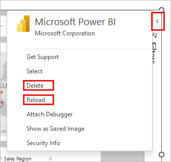

# View and present live Power BI data in PowerPoint

As soon as you add a live Power BI report page or visual to PowerPoint, you can start interacting with your data just as you would in Power BI. The initial view is determined by the [URL](./service-power-bi-powerpoint-add-in-install.md) you used. The following image shows a report page loaded into the add-in, with the add-in features labeled. The same add-in features are available when you load an individual visual.

:::image type="content" source="media/service-power-bi-powerpoint-add-in-view-present/power-bi-add-in-report-page-controls.png" alt-text="Screenshot of Power BI report page in PowerPoint, with controls labeled." lightbox="media/service-power-bi-powerpoint-add-in-view-present/power-bi-add-in-report-page-controls.png" border="false":::

|Select for option details|||
|:---------|:---------|:---------|
|[View menu](#freeze-a-snapshot-of-the-current-view)|[Info](#data-info)|[Data options](#data-options)|
|[Style options](#add-styles-to-your-presentation)|[Add-in options](#add-in-options)|[Expand/collapse toolbar](#expandcollapse-toolbar)|
|[Add-in side menu](#add-in-side-pane)|||

## Understanding what you see

In the add-in, you see:

* **The report page or visual**. The report page or visual is fully interactive, in both edit and slideshow modes, unless it has been [frozen as a static image](#freeze-a-snapshot-of-the-current-view). The left-hand report page navigation pane that you see in the Power BI service isn't included. If there are page navigation visuals in the report itself, you can use them to navigate to other pages in the report.
* **A toolbar across the bottom of the report page**. The toolbar contains info and menus with controls that help you work with the data and set up your presentations. See the [Controls](#controls) section for more detail.
* **A Show/Hide arrow at the upper right side** that opens the add-in side pane (desktop application only). The add-in side pane contains more controls for working with the add-in, such as deleting the add-in or forcing a refresh of the report while the add-in is open. See [Add-in side pane](#add-in-side-pane) for more detail.

**Tip**: To get a cleaner view and more space, you can collapse the toolbar by toggling the **Expand/Collapse the toolbar** in the bottom right corner of the add-in.

## Interact with data

You interact with the data just as you would in the Power BI service. You can apply filters and slicers, select data points, and drill down on data.

:::image type="content" source="media/service-power-bi-powerpoint-add-in-view-present/power-bi-add-in-interact-report.gif" alt-text="Animated gif that shows interacting with the report.":::

The live report page or visual is interactive in both edit and slide-show modes. Changes you make to the report or visual's state (via filtering, selection, slicing, etc.) in edit mode while setting up your slides are saved. By contrast, changes you make to the report or visual's state in slide show mode aren't saved. When you exit the show, the report or visual returns to the state it was in when you left edit mode.

As you work with the report or visual in edit mode, you can always restore the initial view if you want to go back to it. Use the **Reset** option in the [Data options](#data-options) menu.

## Prepare a slide show

To get more space and a cleaner display for your slide show, you can collapse the toolbar across the bottom of the report page or visual using the [Expand/collapse toolbar](#expandcollapse-toolbar) control.

If you need to present a slide show multiple times, you most likely want to set it up just once, and have it automatically return to its beginning state when it's finished, so you're ready to go for the next time. The add-in makes this easy. Since data selections you make in edit mode are saved, while selections you make in slide show mode aren't, you can set up the presentation just once in advance in edit mode, and then present it as a slide show multiple times without having to set it up again each time, no matter how much slicing, dicing, and filtering you do in the course of the show - when the slide show is over, the report page or visual goes back to the state it was in at the beginning of the slide show.

## Automatically refresh data during slide shows

PowerPoint allows you to continuously play back a presentation in slide show mode. This feature is especially useful when you want to present information in public displays without any human interaction. For information about setting up a continuously running slideshow, see [Create a self-running presentation](https://support.microsoft.com/office/create-a-self-running-presentation-57fc41ae-f36a-4fb5-94a3-52d5bc466037). 

If a presentation that is running continuously has slides that include the Power BI add-in, the data in the add-in might become outdated, since normally the add-in only gets the data from Power BI when the slide is loaded or when the user manually refreshes the data being presented.

To prevent the data in the add-in from becoming stale while being played back as part of a slideshow, you can set the add-in to automatically pull fresh data from Power BI while the presentation is in slide show mode. This ensures that the presentation will always show the most recent data.

To enable automatic refresh, go to the add-in footer, select **Add-in options**, choose **Slide show settings**, check **Automatic refresh in slide show**, and set the desired frequency.

:::image type="content" source="media/service-power-bi-powerpoint-add-in-view-present/slide-show-settings.png" alt-text="Screenshot showing the Slide show settings option in the Power BI add-in options.":::

> [!NOTE]
> This feature requires that your Office version meet the add-in's [minimum Office version requirement](./service-power-bi-powerpoint-add-in-about.md#requirements).
> Auto refresh only happens in slide show mode, and not while you're editing the presentation.

## Add styles to your presentation

You can improve the appearance of your presentation by applying styles to the add-in. Currently, you can put a border around the add-in to give it a clear definition on the slide.

To put a border around the add-in, open **[Style options](#style-options)** and select **Outline**. To change the line color, width, style, or transparency, expand the Outline option.

:::image type="content" source="media/service-power-bi-powerpoint-add-in-view-present/power-bi-powerpoint-addin-add-border.gif" alt-text="Animation showing adding a border around the Power BI add-in for PowerPoint."::: 

## Enrich your presentation with data insights

Data insights help you explore and find insights such as anomalies and trends as you consume and interact with your data. With the add-in, you can easily generate insights, which you can then paste directly into your slide or copy to the clipboard for pasting elsewhere, such as in the slide's notes.

> [!NOTE]
> Not all visuals can generate insights. See [Smart narrative considerations and limitations](../visuals/power-bi-visualization-smart-narrative.md#considerations-and-limitations) for details.
>
> Once you've copied an insight to the slide or clipboard, the text is static and won't change when the data changes. To update the insight, you need to re-generate it.

The following animation shows how you can generate data insights, edit them in the **Data insights** dialog, and then paste them directly into the slide or copy them into the notes.

:::image type="content" source="media/service-power-bi-powerpoint-add-in-view-present/power-bi-powerpoint-addin-insights-pasted-in.gif" alt-text="Screenshot showing presentation with insight next to a visual.":::

To generate data insights:

1. Select **Data options > Data insights**.

    :::image type="content" source="media/service-power-bi-powerpoint-add-in-view-present/power-bi-powerpoint-data-insights-option.png" alt-text="Screenshot showing Data insights pasted into slide and notes.":::

1. The insight appears in the **Data insights** dialog. The text is editable and you can change it as desired. When you're satisfied with the text, you can either paste it directly onto the slide as a PowerPoint textbox, or you can copy it onto the clipboard, from where you paste it wherever you like - into the slide notes, for example. 

    :::image type="content" source="media/service-power-bi-powerpoint-add-in-view-present/power-bi-powerpoint-addin-insights-dialog.png" alt-text="Screenshot of insights dialog.":::

## Freeze a snapshot of the current view

Every time you open your presentation, the report page or visual reloads into the add-in, bringing fresh data from the Power BI service. There might be times when you don't want this to happen, and instead would like the data to remain static. For this you can use the [View](#add-in-side-pane) menu in the toolbar. Choosing one of the snapshot options turns the current live view into a static, non-interactive image. Then, when you next open the presentation, you'll see the static view you saved.

The menu allows you to set the view to live data or to a snapshot. Two snapshot options provide you some control over who will be able to see the Power BI content in the snapshot:

* **Snapshot**: When you choose Snapshot, only users who have permission to view the report in Power BI will be able see the static image of the Power BI content. Users who don't have permission will be able to request access. This option helps keep you from inadvertently showing Power BI content to unauthorized users.

* **Public snapshot**: If you choose Public snapshot, anyone who can view the presentation to be able to see the static image of the Power BI content, regardless of their permissions in Power BI.

To restore the interactive view, select **Live data**. The live report page or visual will reload in the state it was last in, but with the latest data from Power BI.

> [!NOTE]
> The view menu with the snapshot options requires Office version 2312 (Build 17126) or later. If you're Office version meets this requirement, don't use the *Save as image* option located the add-in side pane.
>
> You can only switch between **Live Data** and **Snapshot** in the PowerPoint desktop application - you can't do this in PowerPoint for the web. However, PowerPoint for the web **does** respect the the choice you made in the desktop application. So whatnever view you selected in the desktop app will be the view that you'll see in PowerPoint for the web.

## Share your presentation

When you share the presentation with others, to be able to view the data in the presentation they'll need an active Power BI account and a Microsoft Fabric free license, as well as access to the data. If the Power BI report or visual isn't located in a Premium capacity or Fabric F64 or greater capacity, they'll need a Power BI Pro license. None of this applies if you've frozen the view as a static image.

To make sure people in your organization can access the report or visual and take advantage of the live data experience, when you add a live report page or visual to a presentation, be sure to use the link generated in Power BI by the [Share > PowerPoint option](./service-power-bi-powerpoint-add-in-install.md). This ensures that the people in your org who you shared the presentation with will be able to see the live data when they open the presentation.

:::image type="content" source="media/service-power-bi-powerpoint-add-in-view-present/power-bi-add-in-share-option.gif" alt-text="Animated gif showing how to use the Share option in Power BI to get a link for sharing.":::

Users who don't have permission to view the report or visual can request access directly from the presentation, and will be able to view the data once they've received access.

## Controls

Controls that help you work with your data in PowerPoint are described below.

### Data info

* **Hyperlinked title**: Report name and page or visual name. Select the title to open Power BI to that report page or visual.
* **Report sensitivity label**: Shows the sensitivity label applied to the report in Power BI. Note: this isn't the sensitivity label (if any) applied to the PowerPoint file itself.
* **Last update from source**: Shows the time and date of the last data update from the data sources.

### Data options

:::image type="content" source="media/service-power-bi-powerpoint-add-in-view-present/power-bi-powerpoint-addin-data-options.png" alt-text="Screenshot of Power BI add-in for PowerPoint data options menu.":::

* **Filter**: Shows or hides the filters pane, where you can filter your data, just like in the Power BI service. This option is available only if filters have been defined on the page or visual.
* **Data Insights**: Generates [insights](../create-reports/insights.md) displays them in a dialog as editable text. You can then either paste them directly onto the slide or copy them to the clipboard for use elsewhere.
* **Refresh**: Refreshes the report page or visual with the latest data from the Power BI service. Note: Refresh doesn't trigger getting data from the data sources.
* **Reset**: Restores the state of the report page or visual to the state it was in when it was first added to the PowerPoint presentation.

### Style options

:::image type="content" source="media/service-power-bi-powerpoint-add-in-view-present/power-bi-powerpoint-addin-style-options.png" alt-text="Screenshot of Power B I add-in for PowerPoint style options menu.":::

* **Outline**: Puts a border around the add-in. Select the expand arrow to access border line-style formatting options.

### Add-in options

:::image type="content" source="media/service-power-bi-powerpoint-add-in-view-present/power-bi-powerpoint-addin-addin-options.png" alt-text="Screenshot of Power BI add-in for PowerPoint add-in options menu.":::

* **Clear data**: Removes the report page or visual from the add-in and returns you to the add-in **Insert** screen, where you can start over by pasting in the URL of a different report page or visual.
* **Slide show settings**: Controls data refresh during slide shows. With this setting, you can turn on/turn off automatic data refresh during a slide show, and set the refresh frequency. For more information, see [Automatically refresh data during slide shows](#automatically-refresh-data-during-slide-shows).
* **Learn**: Opens help pages.

### Expand/collapse toolbar

Expands or collapses the toolbar across the bottom of the report or visual. This feature is useful in Slide Show mode, when you need more space and want a cleaner display.

### Add-in side pane

* **Delete**: Removes the add-in from the PowerPoint slide.
* **Reload**: The report page reloads every time PowerPoint is opened, so you need to use this option only if the report has changed while you’ve had PowerPoint open.

    If all you want to do is refresh the data, use the **Refresh** option in the [Data options](#data-options) menu instead.

> [!NOTE]
> The add-in side pane is available only in the PowerPoint desktop application. It isn't supported in PowerPoint for the web.

## Keyboard Shortcuts

To get around the report, you can use the usual [Power BI keyboard shortcuts](../create-reports/desktop-accessibility-keyboard-shortcuts.md), with the following exceptions:

|Keyboard shortcut   | Action                        |
|--------------------|-------------------------------|
|**Ctrl + Enter**    |Focus in                       |
|**Ctrl + [**        |Focus out                      |
|**Ctrl + ]**        |Move forward over open panels  |
|**Ctrl + Shift + ]**|Move backward over open panels |
|**Ctrl**            |Hide Power BI tooltips         |

## Related content

* [About storytelling with Power BI in PowerPoint](./service-power-bi-powerpoint-add-in-about.md)
* [Add live Power BI data to PowerPoint](./service-power-bi-powerpoint-add-in-install.md)
* [Information for Power BI administrators](./service-power-bi-powerpoint-add-in-admin.md)
* [Troubleshoot the Power BI add-in for PowerPoint](./service-power-bi-powerpoint-add-in-troubleshoot.md)
* More questions? [Try asking the Power BI Community](https://community.powerbi.com/)