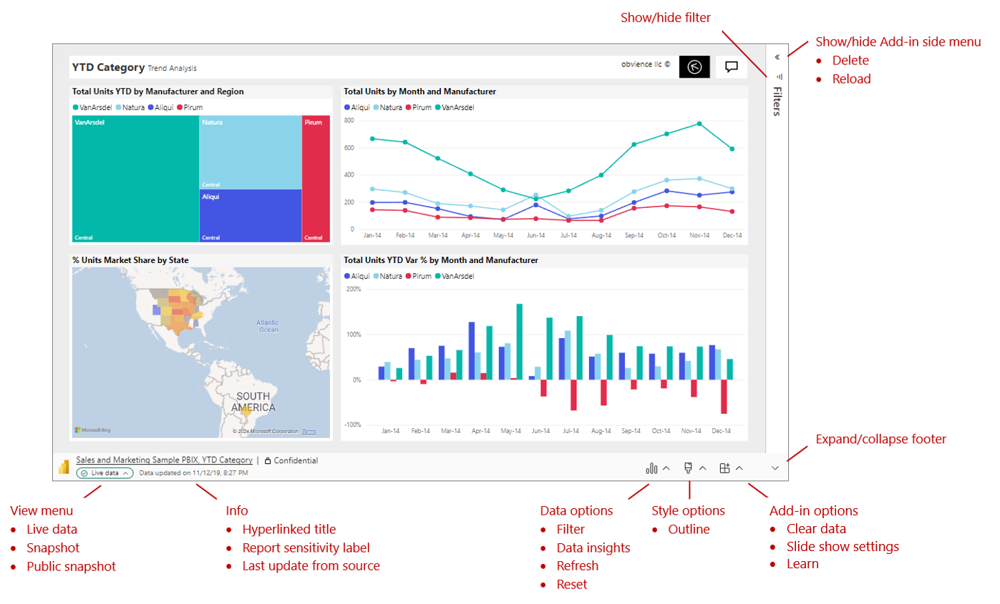
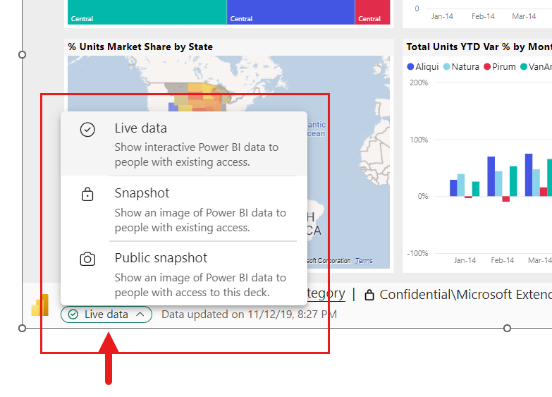
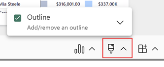
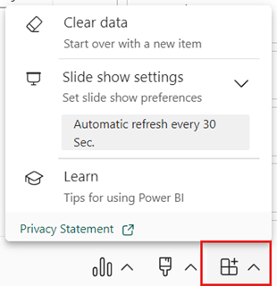

# View and present live Power BI report pages in PowerPoint (preview)

As soon as you add a live Power BI report page to PowerPoint, you can start interacting with your data just as you would in Power BI. The initial view is determined by the [URL](./service-power-bi-powerpoint-add-in-install.md#get-the-report-page-url) you used.

## Understanding what you see

In the add-in, you see:

* The report page. The report page is fully interactive, in both edit and slideshow modes, unless it has been [frozen as a static image](#freeze-the-current-view). The left-hand page navigation pane that you see in the Power BI service isn't included. If there are page navigation visuals in the report itself, you can use them to navigate to other pages in the report.
* A toolbar across the bottom of the report page. The toolbar contains report info and menus with controls that help you work with the data and set up your presentations. See the [Controls](#controls) section for more detail.
* A Show/Hide arrow at the upper right side that opens the add-in side pane (desktop application only). The add-in side pane contains additional controls for working with the add-in, such as freezing the page as a static image. See [Add-in side pane](#add-in-side-pane) for more detail.

To get a cleaner view and more space for the report page, you can collapse the bottom toolbar by toggling the **Expand/Collapse the toolbar** in the bottom right corner of the add-in.

## Interact with data

You interact with the report just as you would in the Power BI service. You can apply filters and slicers, select data points, and drill down on data.

The live report page is interactive in both edit and slide-show modes. Changes you make to the report state (via filtering, selection, slicing, etc.) in edit mode while setting up your slides are saved. By contrast, changes you make to the report state in slide show mode aren't saved. When you exit the show, the report goes back to the state it was in when you left edit mode.

As you work with the report in edit mode, you can always restore the initial view if you want to go back to it. Use the **Reset** option in the [Report options](#report-options) menu.

## Prepare a slide show

To get more space and a cleaner display for your slide show, you can collapse the toolbar across the bottom of the report page using the [Expand/Collapse the toolbar](#expandcollapse-toolbar) control.

If you need to present a slide show multiple times, you most likely want to set it up just once, and have it automatically return to its beginning state when it's finished, so you're ready to go for the next time. The add-in makes this easy. Since data selections you make in edit mode are saved, while selections you make in slide show mode are not, you can set up the presentation just once in advance in edit mode, and then present it as a slide show multiple times without having to set it up again each time, no matter how much slicing, dicing, and filtering you do in the course of the show - when the slide show is over, the report page goes back to the state it was in at the beginning of the slide show.

## Freeze the current view

Every time you open your presentation, the report page reloads into the add-in, bringing fresh data from the Power BI service. There may be times when you don't want this to happen, and instead would like the data to remain static. For this you can use the [Show as Saved Image](#add-in-side-pane) option. Show as Saved Image turns the current live view into a static, non-interactive image. Then, when you next open the presentation, you'll see the static view you saved.

To restore the interactive view, select the Show as Saved Image option again. The live report page will reload in the state it was last in, but with the latest data from Power BI.

> [!NOTE]
> **Show as Saved Image** is available only in the PowerPoint desktop application. PowerPoint for the web doesn't support the add-in side menu.

## Share your presentation

When you share the presentation with others, to be able to view the data in the presentation they'll need an active Power BI account and a Power BI Free license, as well as access to the data. If the Power BI report isn't located in a Premium capacity, they'll need a Power BI Pro license. None of this applies if you've frozen the view as a static image.

To make sure people in your organization can access the report and take advantage of the live data experience, when you add a live report page to a presentation, be sure to use the link generated in Power BI by the [Share > PowerPoint option](./service-power-bi-powerpoint-add-in-install.md?tabs=share#get-the-report-page-url). This ensures that the people in your org who you shared the presentation with will be able to see the live data when they open the presentation.

Users who don't have permission to view the report can request access directly from the presentation, and will be able to view the data once they've received access.

## Controls

Controls that help you work with your data in PowerPoint are described below.

### Report info

* **Hyperlinked title**: Report name and page name. Select on the title to open Power BI to that report page.
* **Report sensitivity label**: Shows the sensitivity label applied to the report in Power BI. Note: this isn't the sensitivity label (if any) applied to the PowerPoint file itself.
* **Last update from source**: Shows the time and date of the last data update from the data sources.

### Data options

* **Filter**: Shows or hides the filters pane, where you can filter your report, just like in the Power BI service. This option is available only if filters have been defined on the page.
* **Data Insights**: Creates a PowerPoint text box containing [insights](../create-reports/insights.md) 
* **Refresh**: Refreshes the report page with the latest data from the Power BI service. Note: Refresh does not trigger getting data from the data sources.
* **Reset**: Restores the state of the report page to the state it was in when it was first added to the PowerPoint presentation.

### Style options

* **Outline**: 

### Add-in options

* **Clear**: Removes the report page from the add-in and returns you to the add-in **Insert** screen, where you can start over by pasting in a new report page URL.
* **Learn**: Opens help pages.

### Expand/collapse toolbar

Expands or collapses the toolbar across the bottom of the report. This feature is particularly useful in Slide Show mode, when you need more space and want a cleaner display.

### Add-in side pane

* **Delete**: Removes the add-in from the PowerPoint slide.
* **Reload**: Reloads the report page. Use this option if visuals have been changed, added or deleted. The report page reloads every time PowerPoint is opened, so you need to use this option only if the report has changed while you’ve had PowerPoint open.

    If all you want to do is refresh the data, use the **Refresh** option in the [Report options](#report-options) menu instead.

* **Show as Saved Image**: Converts the current state as a saved, static image. You can't interact with this image. Data is not updated. You can copy and paste this image wherever you want. Select **Show as Saved Image** again to restore the live current view. The report will reload. Note: If you select **Show as Saved Image** and then share the PowerPoint file, other users will be able to restore the live current view.

> [!NOTE]
> The add-in side pane is available only in the PowerPoint desktop application. It isn't supported in PowerPoint for the web.

## Keyboard Shortcuts

To get around the report, you can use the usual [Power BI keyboard shortcuts](../create-reports/desktop-accessibility-keyboard-shortcuts.md), with the following exceptions:

|Keyboard shortcut   | Action                        |
|--------------------|-------------------------------|
|**Ctrl + Enter**    |Focus in                       |
|**Ctrl + [**        |Focus out                      |
|**Ctrl + ]**        |Move forward over open panels  |
|**Ctrl + Shift + ]**|Move backward over open panels |
|**Ctrl**            |Hide Power BI tooltips         |

## Next steps

* [About storytelling with Power BI in PowerPoint](./service-power-bi-powerpoint-add-in-about.md)
* [Add live Power BI report pages to PowerPoint](./service-power-bi-powerpoint-add-in-install.md)
* [Information for Power BI administrators](./service-power-bi-powerpoint-add-in-admin.md)
* [Troubleshoot the Power BI add-in for PowerPoint](./service-power-bi-powerpoint-add-in-troubleshoot.md)
* More questions? [Try asking the Power BI Community](https://community.powerbi.com/)