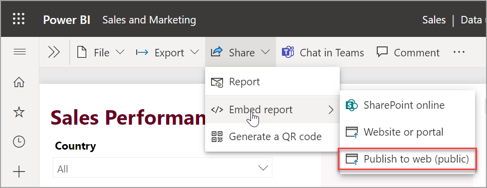
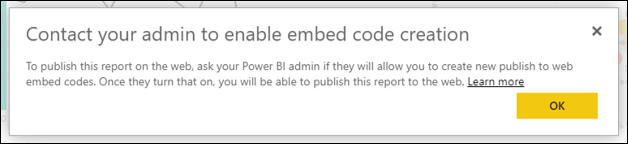
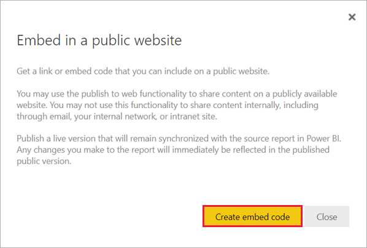
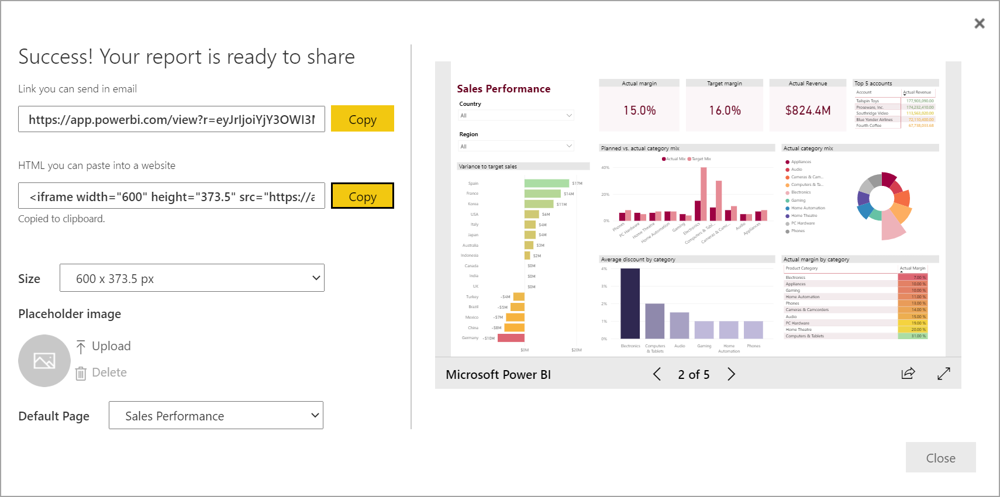
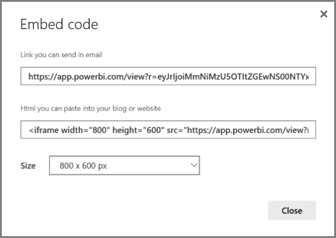
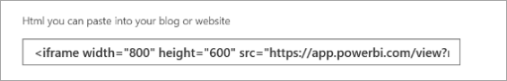
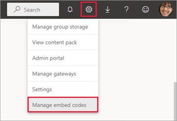
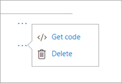
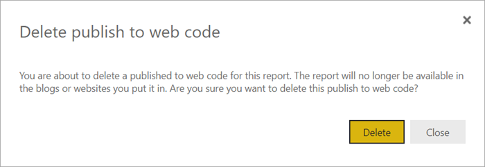
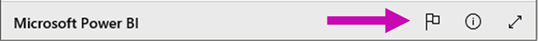

# Publish to web from Power BI

With the Power BI **Publish to web** option, you can easily embed interactive Power BI content in blog posts, websites, emails, or social media. You can also easily edit, update, refresh, or stop sharing your published visuals.

> [!WARNING]
> When you use **Publish to web**, anyone on the Internet can view your published report or visual. Viewing requires no authentication. It includes viewing detail-level data that your reports aggregate. Before publishing a report, make sure it's okay for you to share the data and visualizations publicly. Don't publish confidential or proprietary information. If in doubt, check your organization's policies before publishing.

>[!Note]
>You can embed your content securely in an internal portal or website. Use the [Embed](service-embed-secure.md) or [Embed in SharePoint Online](service-embed-report-spo.md) options. These options ensure that all permissions and data security are enforced when your users view your internal data.

## Prerequisites

- You need a Microsoft Power BI license to publish to web from My Workspace. 
- You need a Microsoft Power BI Pro or Premium Per User license to publish to web from workspaces. 
- Publish to web is available for reports you can edit in your My Workspace and workspaces.  
- It isn't available for reports shared with you, or ones relying on row-level security to secure data. 
- Your report viewers don't need to be Power BI users.

See the [**Considerations and limitations**](#considerations-and-limitations) section below for a complete list of cases where Publish to web isn't supported. 

## Create embed codes with Publish to web

Follow these steps to use Publish to web. Review the **Warning** earlier in this article before publishing to web.

1. Open a report in a workspace that you can edit, and select **File**  > **Embed report** > **Publish to web (public)**.

   
   
2. If your Power BI admin hasn't allowed you to create embed codes, you may need to contact them.

   
   
   For help with finding the person who can enable Publish to web in your organization, see [How to find your Power BI administrator](#find-your-power-bi-administrator) later in this article.

3. Review the dialog content and select **Create embed code**.

   

4. Review the warning, as shown here, and confirm that the data is okay to embed in a public website. If it is, select **Publish**.

   :::image type="content" source="media/service-publish-to-web/embed-publish-public-web-site.png" alt-text="Screenshot of dialog box with the warning":::

5. In the **Success** dialog, you see a preview of how the report will look. Select the **Size** and **Default page**. 

    You can also add a **Placeholder** image, to make the web page load faster. With a placeholder image, people viewing your report on the web see a **View interactive content** button they can select to view the report itself. 

    Make those changes first. Then copy the link to send it in email, or copy the HTML to paste into a website. You can embed it in code such as an iFrame, or paste it directly into a web page or blog.

   

6. If you previously created an embed code for a report and you select **Publish to web**, you won't see the dialogs in steps 2-4. Instead, you see the **Embed code** dialog.

   

   You can only create one embed code for each report.

### Tips for view modes

When you embed content within a blog post, you typically need to fit it within a specific screen size.  You can adjust the height and the width in the iFrame tag as needed. However, you need to ensure your report fits within the given iFrame area, so set an appropriate View Mode when you're editing the report.

The following table provides guidance about the View Mode, and how it will appear when embedded.

| View Mode | How it looks when embedded |
| --- | --- |
|  |**Fit to page** respects your report's page height and width. If you set your page to *dynamic* ratios like 16:9 or 4:3, your content scales to fit within the iFrame. When embedded in an iFrame, using **Fit to page** can result in *letterboxing*: a gray background is shown in iFrame areas after the content scales to fit within the iFrame. To minimize letterboxing, set the height and width of the iFrame appropriately. |
|  |**Actual size** ensures the report preserves its size as set on the report page. This can result in scrollbars appearing in your iFrame. Set the iFrame height and width to avoid scrollbars. |
|  |**Fit to width** ensures the content fills the horizontal area of the iFrame. A border is still shown, but the content scales to use all the horizontal space available. |

### Tips for iFrame height and width

A Publish to web embed code looks like the following example:

 
You can edit the width and height manually to ensure it's precisely how you want it to fit in the page where you're embedding it.

To achieve a more perfect fit, you can try adding 56 pixels to the height of the iFrame to accommodate the current size of the bottom bar. If your report page uses the dynamic size, the table below provides some sizes you can use to achieve a fit without letterboxing.

| Ratio | Size | Dimension (width x height) |
| --- | --- | --- |
| 16:9 |Small |640 x 416 px |
| 16:9 |Medium |800 x 506 px |
| 16:9 |Large |960 x 596 px |
| 4:3 |Small |640 x 536 px |
| 4:3 |Medium |800 x 656 px |
| 4:3 |Large |960 x 776 px |

## Manage embed codes

Once you create a Publish to web embed code, you can manage your codes from the **Settings** menu in Power BI. Managing embed codes includes the ability to remove the destination visual or report for a code (rendering the embed code unusable), or getting the embed code.

1. To manage your Publish to web embed codes, open the workspace the report resides in, select the **Settings** gear, and select **Manage embed codes**.

   

2. The embed codes for the reports in that workspace appear.

   

3. You can either retrieve or delete an embed code. Deleting it disables any links to that report or visual.

   

4. If you select **Delete**, you're asked for a confirmation.

   

## Updates to reports, and data refresh

After you create your Publish to web embed code and share it, the report updates with any changes you make. The embed code link is immediately active. Anyone who opens the link can view it. The data is cached for one hour from the time it is retrieved. We don’t recommend using Publish to web for data that needs to refresh frequently. To learn more, see the [**How it works**](#howitworks) section later in this article. 

### Data refresh

Data refreshes are automatically reflected in your embedded report or visual. When data is refreshed for an import data model in the Power BI service, the service clears the data cache, making data update quickly. To disable automatic refresh, select **don't refresh** on the schedule for the semantic model the report uses.  

### Heavy usage

A heavy usage experience can occur when a report receives too many queries in a short amount of time. When heavy usage occurs, users can't view or interact with the report until the period of heavy usage passes. 

We recommend setting a placeholder image for your report. If heavy usage occurs, users see the placeholder image. 

To help avoid the heavy usage experience, limit the number of distinct queries your report can generate and the frequency of data refresh. See the [Power BI optimization guide](../guidance/power-bi-optimization.md) for tips on streamlining your reports.

## Power BI visuals

Power BI visuals are supported in Publish to web. When you use Publish to web, users with whom you share your published visual don't need to enable Power BI visuals to view the report.

## Understanding the embed code status column

>[!Note]
>Review the embed codes you've published often. Remove any that no longer need to be available publicly.

The **Manage embed codes** page includes a status column. By default, embed codes are **Active**, but could also be one of the statuses listed below.

| Status | Description |
| --- | --- |
| **Active** |The report is available for Internet users to view and interact with. |
| **Blocked** |The report content violates the [Power BI Terms of Service](https://powerbi.microsoft.com/terms-of-service). Microsoft has blocked it. Contact support if you believe the content was blocked in error. |
| **Not supported** |The report's semantic model is using row-level security, or another unsupported configuration. See the [**Considerations and imitations**](#considerations-and-limitations) section for a complete list. |
| **Infringed** |The embed code is outside the defined tenant policy. This status typically occurs when an embed code was created and then the **Publish to web** tenant setting was changed to exclude the user owning the embed code. If the tenant setting is disabled, or the user is no longer allowed to create embed codes, existing embed codes show an **Infringed** status. See the [Find your Power BI administrator](#find-your-power-bi-administrator) section in this article for details. |

## Report a concern with Publish to web content

To report a concern related to Publish to web content embedded in a website or blog, select the **Share** icon in the bottom bar of the Publish to web report, then select the **Flag** icon in the **Share** dialog box.

You're asked to send an email to Microsoft explaining your concern. Microsoft evaluates the content based on the [Power BI Terms of Service](https://powerbi.microsoft.com/terms-of-service) and takes appropriate action.

## How it works (technical details)

When you create an embed code using Publish to web, the report is made visible to Internet users. It's publicly available, so you can expect viewers to easily share the report through social media in the future. Users view the report either by opening the direct public URL or viewing it embedded in a web page or blog. As they do, Power BI caches the report definition and the results of the queries required to view the report. This caching ensures that thousands of concurrent users can view the report without impacting performance.

The data is cached for one hour from the time it is retrieved. If you update the report definition (for example, if you change its View mode) or refresh the report data, it can take some time before changes are reflected in the version of the report that your users view. When a data refresh occurs for an import data model, the service clears the cached data and retrieves new data. In most cases, the data is updated nearly simultaneous with the import of the data. However, for reports with many distinct queries, it may take some time to update. Since each element and data value is cached independently, when a data update occurs, a user may see a mix of current and previous values. Therefore, we recommend staging your work ahead of time, and creating the Publish to web embed code only when you're satisfied with the settings. If your data will refresh, minimize the number of refreshes and perform the refreshes at off hours. We don’t recommend using Publish to web for data that needs to refresh frequently.

## Find your Power BI administrator

The Power BI admin portal has settings that control who can publish to the web. Work with your organization's [Power BI administrator](../admin/service-admin-role.md) to change the [Publish to web tenant settings](/fabric/admin/service-admin-portal-export-sharing#publish-to-web) in the admin portal.

For smaller organizations or individuals who signed up for Power BI, you may not have a Power BI administrator yet. Follow our [process for admin takeover](/azure/active-directory/users-groups-roles/domains-admin-takeover). Once you have a Power BI administrator, they can enable creating embed codes for you.

Established organizations usually already have a Power BI administrator. Users with the Fabric administrator role in Microsoft Entra ID can act as a Power BI administrator.

You need to [find one of these people](/microsoft-365/business-video/admin-center-overview#who-has-admin-permissions-in-my-business) in your organization and ask them to update the [Publish to web tenant settings](/fabric/admin/service-admin-portal-export-sharing#publish-to-web) in the admin portal.

## Considerations and limitations

Publish to web is supported for the vast majority of data sources and reports in the Power BI service. However, the following kinds of reports are currently *not* supported or available with Publish to web:

- Reports using row-level security.
- Reports connecting to data using DirectQuery. Connect using composite or import mode instead. Read about the [differences between the modes](../connect-data/service-dataset-modes-understand.md).
- Reports using any Live Connection data source, including Analysis Services Tabular hosted on-premises, Analysis Services Multidimensional, and Azure Analysis Services.
- Reports using a [shared semantic model](../connect-data/service-datasets-across-workspaces.md) that is stored in a different workspace from the report.
- [Shared and certified semantic models](../connect-data/service-datasets-share.md).
- Reports shared to you directly or through an app.
- Reports in a workspace in which you aren't an edit member.
- "R" and Python visuals aren't currently supported in Publish to web reports.
- Exporting data from visuals in a report that has been published to the web.
- Q&A for Power BI visuals.
- Reports containing report-level DAX measures.
- Single sign-on data query models, including [composite models on Power BI semantic models or Azure Analysis Services](../connect-data/desktop-directquery-datasets-azure-analysis-services.md).
- Secure confidential or proprietary information.
- The automatic authentication capability provided with the **Embed** option doesn't work with the Power BI JavaScript API. For the Power BI JavaScript API, use the [user owns data](../developer/embedded/embed-sample-for-your-organization.md) approach to embedding.
- Admins can block public internet access, as described in [Private links for secure access to Fabric](/fabric/security/security-private-links-overview). In that case, the Publish to Web option is grayed out for your tenant in the Power BI admin portal.
- License enforcement for custom visuals.
- Uncertified visuals from the organizational store, when the global tenant switch of the organization for uncertified visuals is on.
- Public visuals from the organizational store, when the global tenant switch of the organization doesn't allow visuals created using the Power BI SDK.
- The user who created the embed code needs to maintain access to the report for the embed code to work. This includes requiring a Pro or Premium Per User license as required by the workspace. 
- Paginated reports.
- Multiple-language reports. 

## Related content

- [SharePoint Online report web part](service-embed-report-spo.md) 
- [Embed report in a secure portal or website](service-embed-secure.md)

More questions? [Try the Power BI Community](https://community.powerbi.com/)
