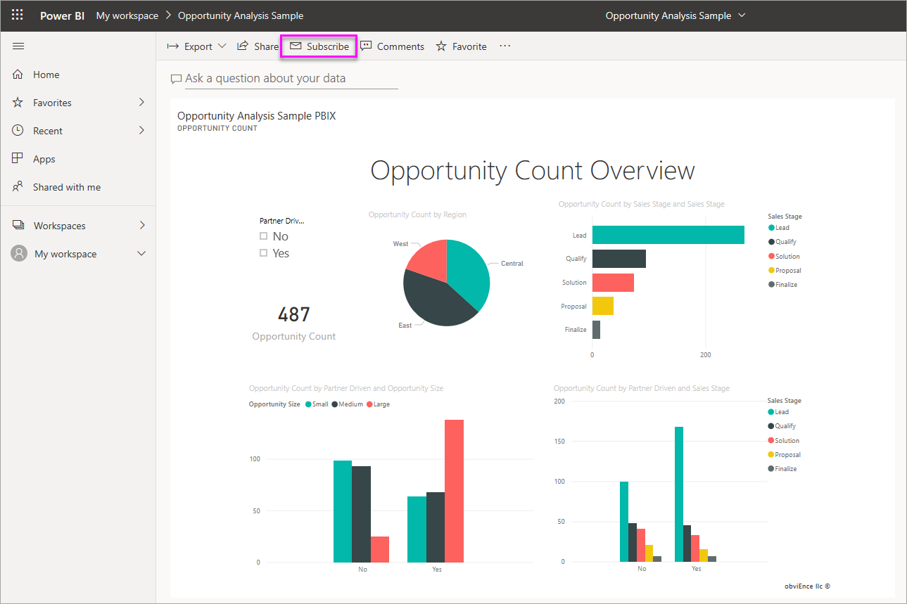
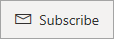
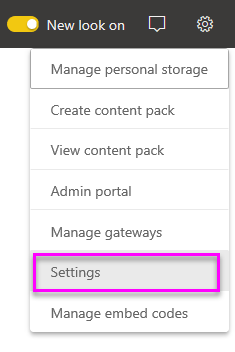

# Subscribe yourself and others to reports and dashboards in the Power BI service

You can subscribe yourself and your colleagues to the report pages, dashboards, and paginated reports that matter most to you. Power BI e-mail subscriptions allow you to:

- Decide how often you want to receive the emails: daily, weekly, hourly, monthly, or once a day after the initial data refresh.
- Choose the time you want to receive the email, if you choose daily, weekly, hourly, or monthly.
- Set up 24 different subscriptions per Power BI report or dashboard.  There is no limit to the number of subscriptions you can set up for paginated reports.
- Have a mail sent with an image of the report and link to the report in the service.  On mobile devices with Power BI apps installed, selecting this link launches the Power BI app, instead of opening the report or dashboard in the Power BI web site.
- Include an attachment of the full report, if you're subscribing to a paginated report.
- Send email to users outside your tenant, if your Power BI content is hosted in a Premium capacity.  Administrators can control access to who can send email subscriptions to external users by leveraging the existing external sharing control settings in the Power BI admin center.

 

## Requirements

**Creating** a subscription can be done by:

- Users with a Power BI Pro license 
- Users viewing content in a Premium workspace or app may also subscribe to content located there, even without a Power BI Pro license. 

You don't need edit permissions to the content (dashboard or report) to create a subscription for yourself, but you must have edit permissions to create one for someone else.

## Subscribe to a dashboard, report page, or paginated report

Whether you're subscribing to a dashboard, report, or paginated report, the process is similar. The same button allows you to subscribe to Power BI service dashboards and reports.

Subscribing to paginated reports is a little different. See [Subscribe yourself and others to a paginated report in the Power BI service](../consumer/paginated-reports-subscriptions.md) for details.
 
.

1. Open the dashboard or report.
2. From the top menu bar, select **Subscribe** or select the envelope icon :::image type="icon" source="media/service-report-subscribe/power-bi-icon-envelope.png" border="false":::.
   
    

1. Use the yellow slider to turn the subscription on and off. Setting the slider to  **Off**  doesn't delete the subscription. To delete the subscription, select the trashcan icon.

2. Your email is already in the  **Subscribe**  box. You can add other email addresses in the same domain to the subscription as well. If the report or dashboard is hosted in a [Premium capacity](../admin/service-premium-what-is.md), you can subscribe other individual email addresses and group aliases, whether they're in your domain or not. If the report or dashboard isn't hosted in a Premium capacity, you can subscribe other individuals, but they too must have Power BI Pro licenses. See [Considerations and troubleshooting](#considerations-and-troubleshooting) below for details.

3. Fill in the email  **Subject**  and  **Message**  details.

4. Select a  **Frequency**  for your subscription:  **Daily**,  **Hourly**,  **Weekly**,  **Monthly**, or **After Data Refresh (Daily)**. To receive the subscription email only on certain days, select  **Hourly**  or  **Weekly**  and select the days you'd like to receive it. For example, if you'd like to receive the subscription email only on weekdays, select  **Weekly**  and clear the boxes for  **Sat**  and  **Sun**. If you select  **Monthly**, enter the day(s) of the month you wish to receive the subscription mail.

5. If you choose  **Daily**,  **Hourly**,  **Monthly**, or  **Weekly**, you can also choose a  **Scheduled Time**  for the subscription. You have it run on the hour, or at 15, 30, or 45 minutes past. Select morning (AM) or afternoon/evening (PM). You can also specify the time zone. If you choose  **Hourly**, select the  **Scheduled Time**  you want the subscription to start, and it will run every hour after that.

6. By default, the start date for your subscription is the date you create it. You have the option to select an end date. If you don't set an end date, the end date is automatically one year after the start date. You can change it to any date in the future (up to the year 9999) at any time before the subscription ends. When a subscription reaches an end date, it stops until you re-enable it. You'll receive notification(s) before the scheduled end date to ask if you'd like to extend it.

    In the screenshot below, notice that when you subscribe to a report, you're actually subscribing to a report _page_. To subscribe to more than one page in a report, select  **Add another subscription**  and select a different page.
     
      

1. (Optional) Select whether to include a link back to the content in Power BI and whether to give users access to the content you're subscribing them to.  If you choose to include a link, for the best experience, ensure that all users have access to the report.
2. Select  **Save and close**. Those subscribed receive an email and snapshot of the dashboard or report page for the frequency and time you selected. In all, you may create up to 24 subscriptions per report or dashboard, and can provide unique recipients, times, and frequencies for each subscription. All subscriptions set to  **After Data Refresh**  for your dashboard or report will still only send an email after the first scheduled refresh.

    > [!NOTE]
    > If you edit the subscription after saving and closing, the selection for giving users access to the content you're subscribing is enabled, regardless of your previous selections.
    >

    > [!TIP]
    > Want to send the email from a subscription right away or on-demand at any time? Select  **Run Now**  for the subscriptions for the dashboard or report you want to send. You'll see a notification that an e-mail is on its way to everyone for that particular subscription. Taking this action doesn't count against your limit of 24 scheduled subscription runs per day per report or dashboard. It does NOT trigger a data refresh of the underlying dataset.
    >

## Manage your subscriptions

Only the person who created the subscription can manage it. There are two paths to the screen for managing your subscriptions. The first is to select  **Manage all subscriptions**  from the  **Subscribe to emails**  dialog (see step 4 above). The second is to select the Power BI cog icon  from the top menu bar and choose **Settings**.

The subscriptions displayed depend on which workspace is currently active. To see all of your subscriptions at once for all workspaces, be sure that  **My Workspace**  is active. For help understanding workspaces, see  [Workspaces in Power BI](service-create-workspaces.md).

A subscription ends in any of these cases:

- The Pro license expires.
- The owner deletes the dashboard or report.
- The user account used to create the subscription is deleted.

Power BI administrators can use the Power BI audit logs to view details around subscriptions. These details include:

- Created By
- Creation Date
- Content Subscribed to
- Recipients
- Frequency
- Modified By/
- Modified Date

## Considerations and troubleshooting

### General

- Like other BI products, the time you set your subscription for is when the subscription begins processing.  When the report processing is complete, the subscription is queued and sent to the e-mail recipients.  We strive to process and deliver all subscriptions as quickly as possible. However, sometimes at peak demand you may see a longer delay due to the number of subscriptions that Power BI can send at once. Most customers shouldn’t see a delay of more than 15 minutes to process and send reports. It may take up to 30 minutes for certain times and tenants that have significant usage.  We never expect any delay in delivery to be more than 60 minutes from the time the subscription is scheduled.  If you experience a delay that long, first ensure that the address `no-reply-powerbi@microsoft.com` is on your safe sender list and isn't blocked by your e-mail provider.  If the email isn't being blocked, contact Power BI support for assistance.
- Currently, email subscriptions for reports and dashboards using live connection datasets aren't supported when subscribing users other than yourself, except for paginated reports. You can subscribe others to a paginated report, using your security context. Read more about [subscribing to paginated reports](../consumer/paginated-reports-subscriptions.md).
- Power BI automatically pauses refresh on datasets associated with dashboards and reports that haven't been visited in more than two months. However, if you add a subscription to a dashboard or report, it doesn't pause even if it goes unvisited.
- If you aren't receiving the subscription emails, ensure that your User Principal Name (UPN) can receive emails.
- If your dashboard or report is in Premium capacity, you can use group email aliases for subscriptions, instead of subscribing colleagues one email address at a time. The aliases are based on the current active directory.
- If your content isn't in a Premium capacity, only Power BI Pro users can receive email subscriptions. 
- Subscriptions don't currently support bookmarks.
- The option to provide access to the report/dashboard always shows as enabled when you edit an existing subscription.  If you clear this option and save the subscription, it saves that state. However, when you go to edit the report again it will be checked by default.

### Dashboards

- Dashboards with over 25 pinned tiles, or 4 pinned live report pages, may not render fully in subscription e-mails sent to users. Subscriptions to dashboards over these numbers of tiles aren't blocked. However, they're considered unsupported if you encounter issues. Consider modifying them accordingly to fall within a supported range.
- On rare occasions, e-mail subscriptions may take longer than fifteen minutes to be delivered to their recipients. If this happens, we recommend running your data refresh and e-mail subscription at different times to ensure timely delivery. If the issue persists, contact Power BI support.
- For dashboard email subscriptions, if any tiles have row-level security (RLS) applied, those tiles don't display.
- For dashboard subscriptions, certain types of tiles aren't yet supported. These include: streaming tiles, video tiles, and custom web content tiles.
- If you share a dashboard with a colleague outside of your tenant, you can't also create a subscription for that colleague *unless* the dashboard sits in a Premium workspace or app. So if you are `aaron@contoso.com`, you can share with `anyone@fabrikam.com`, but you can't yet subscribe `anyone@fabrikam.com` and they can't subscribe to shared content.

### Reports

- For report email subscriptions, if the dataset uses RLS, you can create a subscription for yourself. You can't subscribe others to a report with row-level security (RLS) applied, except for paginated reports. You can subscribe others to a paginated report, using your security context. Read more about [subscribing to paginated reports](../consumer/paginated-reports-subscriptions.md).
- Report page subscriptions are tied to the name of the report page. If you subscribe to a report page and then rename it, you have to re-create your subscription.
- Your organization may configure certain settings in Azure Active Directory that limit the ability to use email subscriptions in Power BI. These limitations include, but aren't limited to, having multi-factor authentication or IP range restrictions when accessing resources.
- Email subscriptions don't support most [custom visuals](../developer/visuals/power-bi-custom-visuals.md). The one exception is those custom visuals that have been [certified](../developer/visuals/power-bi-custom-visuals-certified.md).
- Email subscriptions don't support R-powered custom visuals at this time.
- Email subscriptions are sent with the report's default filter and slicer states. Any changes to the defaults that you make after subscribing don't show up in the email. Paginated reports do support this capability and allow you to set the specific parameter values per subscription.
- Say you have a report with a live connection to Analysis Services, and you have the subscription set to run after data refresh. It will run the first time the Power BI service detects a change in your on-premises model when it polls the Analysis Services instance.  Power BI checks every hour for a change in the Analysis Services data model, to determine when to send the subscription.

## Next steps

- [Subscribe yourself and others to a paginated report in the Power BI service](../consumer/paginated-reports-subscriptions.md)
- More questions? [Try asking the Power BI Community](https://community.powerbi.com/)    
- [Read the blog post](https://powerbi.microsoft.com/blog/introducing-dashboard-email-subscriptions-a-360-degree-view-of-your-business-in-your-inbox-every-day/)