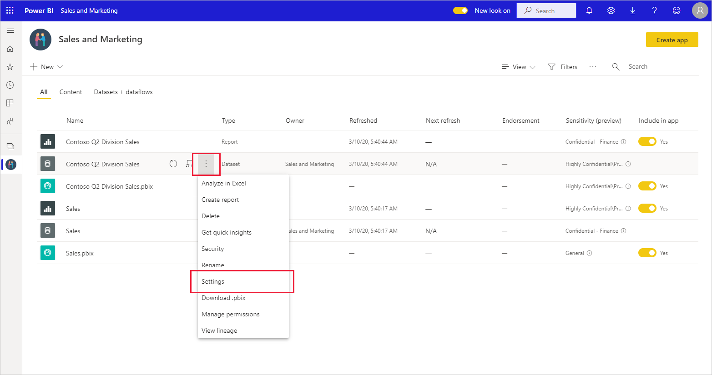

# Apply data sensitivity labels in Power BI

Applying Microsoft Information Protection sensitivity labels to your reports, dashboards, datasets, and dataflows guards against unauthorized data access and leakage. Labeling your data correctly with data sensitivity labels ensures that only authorized people can access your data. This article shows you how to apply sensitivity labels to your content.

To be able to apply sensitivity labels in Power BI:
* You must belong to a security group that has permissions to apply data sensitivity labels, as described in the article entitled [Enable data sensitivity labels in Power BI](../admin/service-security-enable-data-sensitivity-labels.md#enable-data-sensitivity-labels).
* You must have a Power BI Pro license and edit permissions on the resources you wish to label.
* All [prerequisites](../admin/service-security-data-protection-overview.md#requirements-for-using-sensitivity-labels-in-power-bi) and [licensing requirements](../admin/service-security-data-protection-overview.md#licensing) must have been met.

## Applying sensitivity labels

When data protection is enabled on your tenant, sensitivity labels appear in the sensitivity column in the list view of dashboards, reports, datasets, and dataflows.

To apply or change a sensitivity label on a report, click the report settings icon on the workspace list item and then go to the data sensitivity section in the settings side pane. Choose the appropriate sensitivity label and save the settings.

The updated sensitivity label appears in the sensitivity column. 

Applying or changing a sensitivity label on a dashboard follows the same process as described for reports. 

You can also set sensitivity labels on datasets and dataflows. The following image shows how to set a sensitivity label on a dataset; the steps for dataflows are similar.

To set a sensitivity label on a dataset, select the datasets tab, click the three dots on the dataset you want to apply a label to, and choose **Settings**.

On the settings page for the dataset, open the sensitivity label section, choose the desired sensitivity label, and click **Apply**.

## Removing sensitivity labels
To remove a sensitivity label from a report, dashboard, dataset, or dataflow, follow the [same procedure used for applying labels](#applying-sensitivity-labels), but choose **(None)** when prompted to classify the sensitivity of the data. 

## Data protection in exported files

The data protection associated with sensitivity labels is only applied to data when it is exported Excel, PowerPoint, and PDF files. It is not supported for Analyze in Excel, export to .csv, dataset downloads (.pbix), Power BI Service Live Connect, or any other export format. Data export options are controlled by Power BI tenant admin [export settings](../service-admin-portal.md#export-and-sharing-settings).

When you [export data from a report](https://docs.microsoft.com/power-bi/consumer/end-user-export) that has a sensitivity label to an Excel, PowerPoint, or PDF file, the sensitivity label is inherited by the generated file. The sensitivity label will be visible in the file, and access to the file will be restricted to those who have sufficient permissions.

## Considerations and limitations

The following list provides some limitations of sensitivity labels in Power BI:
* Sensitivity labels can be applied only on dashboards, reports, datasets and dataflows.
* Label and protection controls enforcement on exported files is supported only for Excel, PowerPoint and PDF files. Label and protection are not enforced when data is exported to .csv or .pbix files, Analyze in Excel, Subscribe to email, Embed visuals and print.
* A user who exports a file from Power BI has permissions to access and edit that file according to the sensitivity label settings. The user who exports the data does not get owner permissions to the file.
* Sensitivity labels are currently not available for [paginated reports](../paginated-reports/report-builder-power-bi.md) and workbooks.
* Sensitivity labels on Power BI assets are visible in the workspace list, lineage, favorites, recents, and apps views; labels are not currently visible in the "shared with me" view. Note, however, that a label applied to a Power BI asset, even if not visible, will always persist on data exported to Excel, PowerPoint, and PDF files.
* Sensitivity labels are only supported for tenants in the global (public) cloud. Sensitivity labels are not supported for tenants in other clouds.
* Data sensitivity labels are not supported for template apps. Sensitivity labels set by the template app creator are removed when the app is extracted and installed, and sensitivity labels added to artifacts in an installed template app by the app consumer are lost (reset to nothing) when the app is updated.
* Power BI does not support sensitivity labels of the [Do Not Forward](https://docs.microsoft.com/microsoft-365/compliance/encryption-sensitivity-labels?view=o365-worldwide#let-users-assign-permissions), [user-defined](https://docs.microsoft.com/microsoft-365/compliance/encryption-sensitivity-labels?view=o365-worldwide#let-users-assign-permissions), and [HYOK](https://docs.microsoft.com/azure/information-protection/configure-adrms-restrictions) protection types. The Do Not Forward and user-defined protection types refer to labels defined in the [Microsoft 365 security center](https://security.microsoft.com/) or the [Microsoft 365 compliance center](https://compliance.microsoft.com/).
* Applying a sensitivity label and protection to an exported file doesn’t add content marking to the file. However, if the label is configured to apply content markings, they are automatically applied by the Azure Information Protection unified labeling client when the file is opened in Office desktop apps. The content markings are not automatically applied when you use built-in labeling for desktop, mobile, or web apps. See [When Office apps apply content marking and encryption](https://docs.microsoft.com/microsoft-365/compliance/sensitivity-labels-office-apps?view=o365-worldwide#when-office-apps-apply-content-marking-and-encryption) for more detail.

## Next steps

This article described how to apply data sensitivity labels in Power BI. The following articles provide more details about data protection in Power BI. 

* [Overview of data protection in Power BI](../admin/service-security-data-protection-overview.md)
* [Enable data sensitivity labels in Power BI](../admin/service-security-enable-data-sensitivity-labels.md)
* [Using Microsoft Cloud App Security controls in Power BI](../admin/service-security-using-microsoft-cloud-app-security-controls.md)