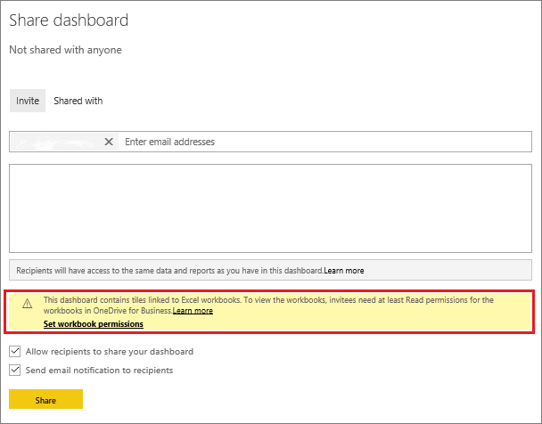

# Share a Power BI dashboard that links to an Excel file in OneDrive

In Power BI, you can [connect to Excel workbooks on OneDrive for Business](../connect-data/service-excel-workbook-files.md) and pin tiles to a dashboard from that workbook. When you share that dashboard clicking the tile opens the workbook inside of Power BI. The workbook only opens if your colleagues have at least [read permissions](https://support.office.com/article/Share-documents-or-folders-in-Office-365-1fe37332-0f9a-4719-970e-d2578da4941c) to the workbook on OneDrive for Business.

## Share a dashboard that contains workbook tiles
To share a dashboard that links back to an Excel workbook on OneDrive for Business, see [Share a dashboard](service-share-dashboards.md). The difference is that you have the option to modify the permissions for the linked Excel workbook before sharing.

  

1. Enter the email addresses for your colleagues.
2. To enable your colleagues to view the Excel workbook from Power BI, select **Go to OneDrive for Business to set workbook permissions**.
3. On OneDrive, [modify the permissions](https://support.office.com/article/Share-files-and-folders-and-change-permissions-9fcc2f7d-de0c-4cec-93b0-a82024800c07) as needed.
4. Select **Share**.

>[!NOTE]
>Your colleagues won't be able to pin additional tiles from that workbook, or make changes to the Excel workbook from Power BI.
> 
> 

## Share a dashboard from a Power BI workspace
Sharing a dashboard from a Power BI workspace is similar to sharing a dashboard from your own workspace, except that the files are located in a Microsoft 365 workspace site, instead of your private OneDrive for Business. Modify the permissions for the Excel workbook before sharing the dashboard with people outside the workspace.

## Next steps
* [Pin a tile to a Power BI dashboard from Excel](../create-reports/service-dashboard-pin-tile-from-excel.md)
* [Basic concepts for designers in the Power BI service](../fundamentals/service-basic-concepts.md)
* More questions? [Try the Power BI Community](https://community.powerbi.com/)
