# Share Power BI reports and dashboards with coworkers and others

[!INCLUDE [applies-no-desktop-yes-service](../includes/applies-no-desktop-yes-service.md)]

*Sharing* is the easiest way to give people access to your reports and dashboards in the Power BI service. You can share with people inside or outside your organization.

When you share a report or dashboard, the people you share it with can view it and interact with it but can't edit it. They see the same data that you see in the reports and dashboards and get access to the entire underlying dataset unless row-level security (RLS) is applied to the underlying dataset.  The coworkers you share with can also share with their coworkers if you allow them to.

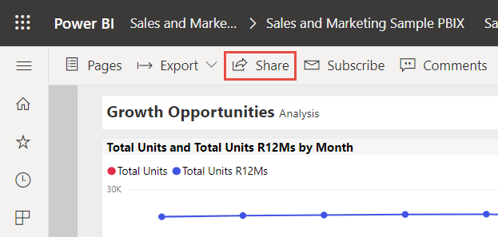

You can share reports and dashboards from many places in the Power BI service: Favorites, Recent, My Workspace. You can share from other workspaces, too, if you have the [Admin, Member, or Contributor role](service-roles-new-workspaces.md) in the workspace. And you can share reports and dashboards in Shared with me if the owner allows it. 

The Power BI service offers other ways to collaborate and distribute reports and dashboards, too. Read [Ways to collaborate and share in Power BI](service-how-to-collaborate-distribute-dashboards-reports.md) to see which way works best for your circumstances. You can't *share* directly from Power BI Desktop. You [publish reports from Power BI Desktop](../create-reports/desktop-upload-desktop-files.md) to the Power BI service. However, you can [share a report or dashboard from the Power BI mobile apps](../consumer/mobile/mobile-share-dashboard-from-the-mobile-apps.md).  

## Video

Sujata demonstrates how to share in the Power BI service.

> [!VIDEO https://www.microsoft.com/videoplayer/embed/RWO30a]

## Prerequisites

- You need a [Power BI Pro or Premium Per User (PPU) license](../fundamentals/service-features-license-type.md), whether you share content inside or outside your organization. 
- Your recipients also need Power BI Pro or Premium Per User (PPU) licenses, unless the content is in a [Premium capacity](../admin/service-premium-what-is.md). 

## Share a report via link

In a list of reports, or in an open report, select **Share** :::image type="icon" source="../media/power-bi-share-icon.png" border="false":::.

Then in the **Send link** dialog, you'll see the option to copy the sharing link or share it via Outlook and Teams to **People in your organization**:

   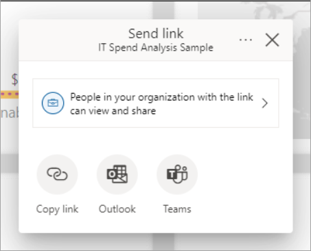

   > [!NOTE] 
   > Your organization may not allow you to create shareable links to **People in your organization**. Learn more about this [tenant setting](../admin/service-admin-portal.md#allow-shareable-links-to-grant-access-to-everyone-in-your-organization) in the admin portal documentation.
   
Selecting **Copy link** will automatically generate and copy a shareable link to your clipboard:

You can also choose to directly send the link to **Specific people** or groups (distribution groups or security groups). Just enter their name or email address, optionally type a message, and select **Send**.

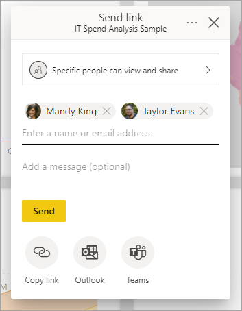

After you select **Send**, Power BI sends the link via email to your recipients.

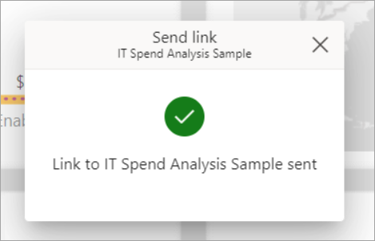

When your recipients receive the email, they can select **Open this report** and automatically get access to the report through the shareable link.

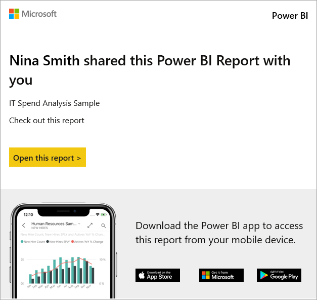

### Link settings
You can choose who your sharing link gives access to and what they can do with the report and associated data:

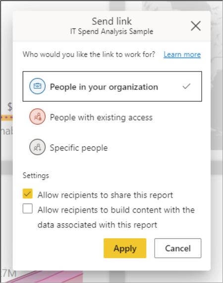

**People in your organization**

This type of link can allow people in your organization to access the report. This link will not work for external users nor guest users. Use this link when you want to share with someone in your organization and are comfortable with them passing the link around to other people inside your organization, but when you want to ensure that the link won’t work for external nor guest users.

**People with existing access**

This type of link generates a URL to the report, but it does not give any access to the report. Use this if you just want to send a link to somebody who already has access.

**Specific people**

This type of link allows specific people or groups to access the report. If you select this option, enter the names or email addresses of the people you wish to share with. With this link type you can share to guest users in your organization’s Azure Active Directory (AAD), but you cannot share to external users who are not guests in your organization.

**Settings**

Links that give access to **People in your organization** or **Specific people** will always include at least read access. However, you can also specify if you want the link to include or exclude the following permissions as well:

- Reshare permissions (included by default) – allows recipients to share the report to others
- Build permissions (excluded by default) – allows recipients to build their own reports in other workspaces based on the data associated with the report. Read more about [creating reports based on datasets from different workspaces](../connect-data/service-datasets-discover-across-workspaces.md).

Links for **People with existing access** do not have any additional settings because these links do not give any access to the report.

**Additional considerations**

- If a user tries to access a report using a link that they don't have access to, they can only access the report if there is another link granting them access or they have direct access to the report.    
- If your tenant admin has disabled shareable links to **People in your organization**, you can only copy and share links to **Specific people** or **People with existing access**.
- If you have reshare permissions to the report but, you do not have reshare permissions to the report’s underlying data, your shareable links will not give access to the underlying data.
- If you do not have reshare permissions to the report, you can only copy and share links to **People with existing access**.
- Additionally, if you do not have a Power BI Pro License, you only copy and share links to **People with existing access**.
- Currently, sharing via links doesn’t support the option to **Include my changes**; however, you can continue using direct access sharing for this scenario. 

## Manage permissions to a report
To manage permission and manage links that give access to the report, select **More options (...)** in the upper right of the sharing dialog, and then select **Manage permissions**:

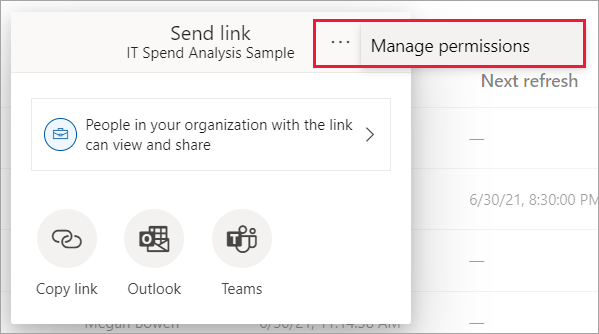

This will launch the **Manage permissions** pane where you can copy or modify existing links or grant users direct access. To modify a given link, select **More options (...)**.

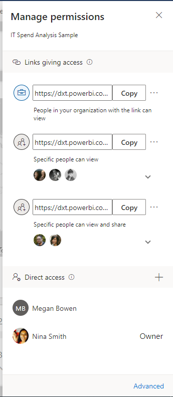

To grant users direct access to the report select the plus icon (+), enter their name or email address, optionally type a message, and select **Grant access**.

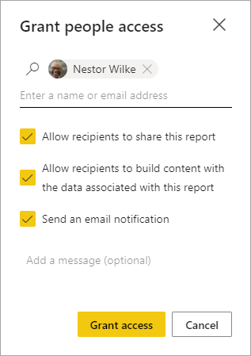

For additional access management capabilities, select the **Advanced** option in the footer of the **Manage permissions** pane. This takes you to the management page, where you can:
- View, manage, and create **Links**.
- View and manage who has **Direct access** and grant people direct access.
- View and manage **Pending** access requests and invitations.
- View and manage **Related content**.
- Apply **Filters** or **Search** for specific links or people.

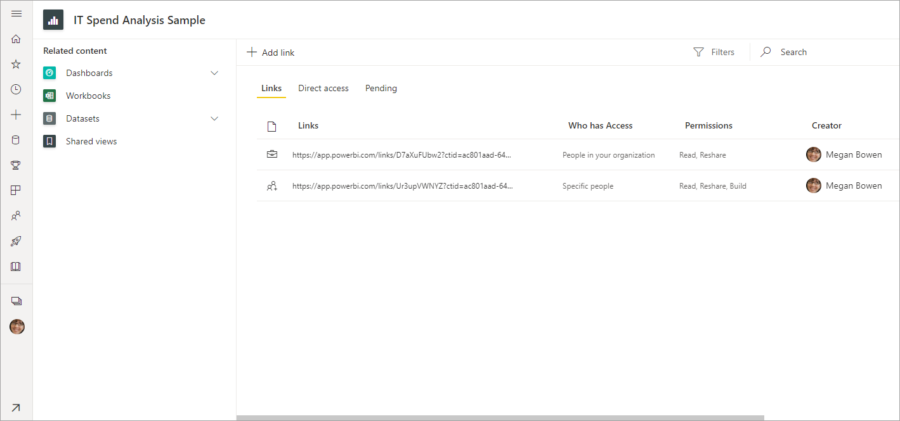

   >[!NOTE] 
   > Each report cannot have more than 1,000 sharing links. In the unlikely case that your report hits this max limit, we recommend removing links that give **Specific people** access and instead grant those users direct access.
 
## Share a dashboard
In a list of dashboards, or in an open dashboard, select **Share** :::image type="icon" source="../media/power-bi-share-icon.png" border="false":::.

Then in the **Share dashboard** dialog, you'll see the option to grant users or groups direct access to the dashboard:

Enter the name or email address of the user or group, optionally type a message, and click **Grant access**.

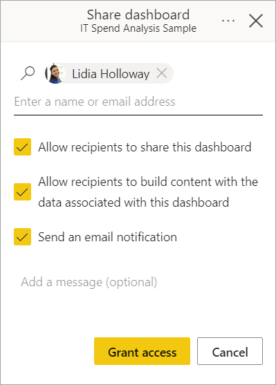

Similar to report sharing, you can specify if you want to grant users the following permissions as well:

- Reshare permissions (included by default) – allows recipients to share the dashboard to others
- Build permissions (included by default) – allows recipients to build content with the data associated with the dashboard

You can share the dashboard with guest users whose addresses are outside your organization, but guest users cannot reshare dashboards. Read more about [sharing outside your organization](#share-a-report-or-dashboard-outside-your-organization) in this article.

   >[!NOTE] 
   > The input box supports, at most, 100 separate users or groups. See [Share with more than 100 users](#share-with-more-than-100-separate-users) in this article for ways to share with more people.
 
## Manage permissions to a dashboard
To manage permission to the dashboard, select the **More options**  menu (. . .) in the upper right of the **Share dashboard** dialog, and then select **Manage permissions**:

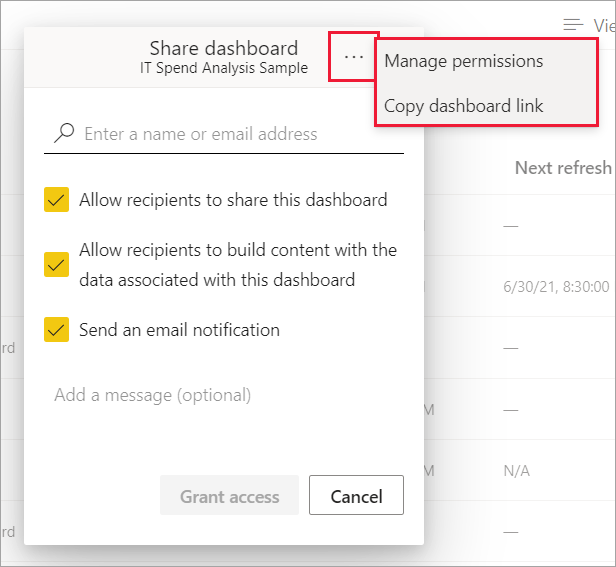

This will launch the **Manage permissions** pane where can see who has direct access and click the plus icon (+) to grant more users direct access to the dashboard. 

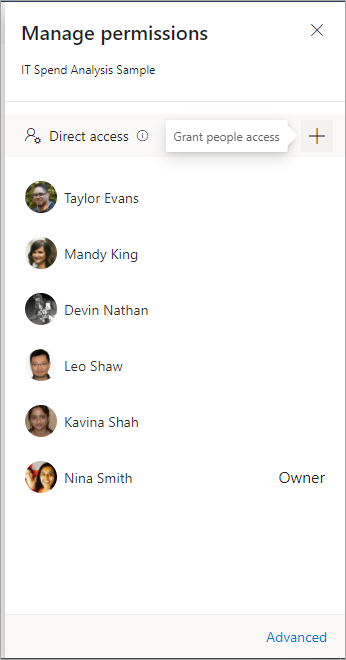

For additional access management capabilities, select the **Advanced** option in the footer of the **Manage permissions** pane. This will navigate you to the management page where you can:
- View and manage who has **Direct access** and grant people direct access
- View and manage **Pending** access requests and invitations
- View and manage **Related content**
- Apply **Filters** or **Search** for specific people

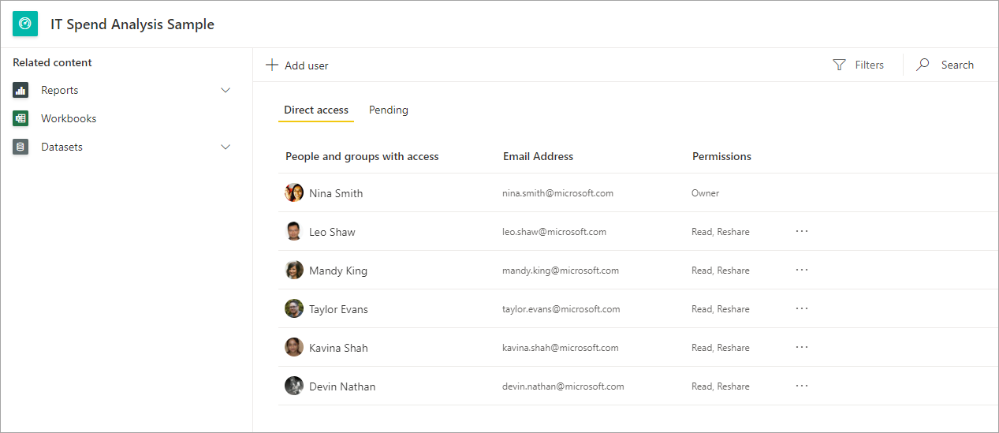

To remove a user's access to the dashboard, select the ellipsis (**...**) next to that user's permissions and select **Remove access**:
      
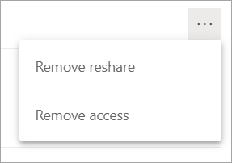

In the **Remove access** dialog, decide if you also want to remove access to related content, such as reports and datasets. It's best to also remove access to related content; otherwise, the related content may not display properly.

 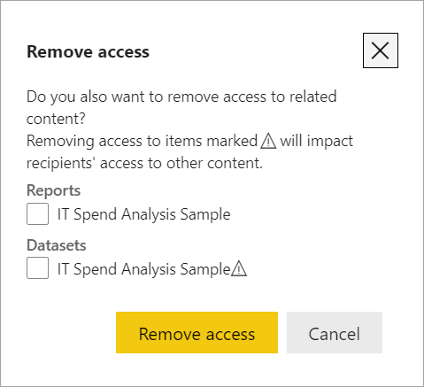

## Share a report or dashboard outside your organization
When you share with people outside your organization, they receive an email with a link to the shared report or dashboard. They must sign in to Power BI to see what you shared. If they don't have a Power BI Pro or Premium Per User (PPU) license, they can sign up for a license when they click the link.

After they sign in, they see the shared report or dashboard in its own browser window, not in the usual Power BI portal. To access this report or dashboard later, they must bookmark the link.

They can't edit any content in this report or dashboard. They can interact with the charts and change filters or slicers, but can't save their changes. 

Only your direct recipients see the shared report or dashboard. For example, if you sent the email to Vicki@contoso.com, only Vicki sees the dashboard. No one else can see the dashboard, even if Vicki forwards them the link. Vicki must use the same email address to access it; if Vicki signs in with any other email address, Vicki won't have access to the dashboard.

People outside your organization don't see any data at all if role- or row-level security is implemented on on-premises Analysis Services tabular models.

Use a security group, not a distribution group, to share with a group that includes people with external email addresses. People with external emails in a distribution group can't see the content you share, unless they are Azure Active Directory (Azure AD) B2B guest users. Learn more about [Azure AD B2B guest users](../admin/service-admin-azure-ad-b2b.md).

If you send a link from a Power BI mobile app to people outside your organization, clicking the link opens the dashboard in a browser, not in the Power BI mobile app.

### Allow external users to edit content

Your Power BI admin can allow external guest users to edit and manage content in your organization. If so, your external users won't have that consumption-only experience. They can edit and manage content within your organization. Learn more about [distributing Power BI content to external guest users with Azure AD B2B](../admin/service-admin-azure-ad-b2b.md).

## Share with more than 100 separate users

At most, you can share with 100 users or groups in a single share action. However, you can give more than 500 users access to an item. Here are some suggestions:

- Share multiple times by specifying the users individually.
- Share with a user group that contains all the users. 
- Create the report or dashboard in a workspace, then create an app from the workspace. You can share the app with many more people. Read more about [publishing apps in Power BI](service-create-distribute-apps.md).

## Considerations and limitations
Things to keep in mind about sharing reports and dashboards:
* Both reports and dashboards can be shared to users through direct access; however, only reports can be shared via links that give access to the report and underlying data.
* If you have reshare permissions to the underlying dataset and you share a report or dashboard with colleagues, you are sharing the underlying dataset as well. Your colleagues get access to the entire dataset unless [row-level security (RLS)](../admin/service-admin-rls.md) limits their access. Report authors may use capabilities that  customize user experiences when viewing or interacting with reports, for example hiding columns, limiting the actions on visuals, and others. These customized user experience do not restrict what data users can access in the dataset. Use [row-level security (RLS)](../admin/service-admin-rls.md) in the dataset so that each person's credentials determine which data they can access.
* Everyone you successfully share your dashboard with can see it and interact with the related reports in [Reading view](../consumer/end-user-reading-view.md#reading-view). In general, they can't create reports or save changes to existing reports. However, if you select **Allow recipients to build content with the data associated with this dashboard**, they can create their own reports in other workspaces based on the dataset for this dashboard.
* Although no one can see or download the dataset, they can access the dataset directly by using the Analyze in Excel feature. An admin can restrict the ability to use Analyze in Excel for everyone in a group. However, the restriction is for everyone in that group and for every workspace the group belongs to.
* Everyone can manually [refresh the data](../connect-data/refresh-data.md).
* If you use Microsoft 365 Exchange Online for email, you can share with members of a distribution group by entering the email address associated with the distribution group.
* You can’t use Microsoft 365 Unified groups for direct sharing. If you don’t want to specify individuals, you can use a security group to share with multiple users.
* Coworkers who share your email domain, and coworkers whose domain is different but registered within the same tenant, can share the dashboard with others. For example, say the domains contoso.com and contoso2.com are registered in the same tenant and your email address is konrads@contoso.com. Both ravali@contoso.com and gustav@contoso2.com can share your dashboard, as long as you give them permission to share.
* If your coworkers already have access to a specific report or dashboard, you can send a direct link by copying the URL when you're on the dashboard or report. For example: `https://app.powerbi.com/reports/g12466b5-a452-4e55-8634-xxxxxxxxxxxx`.
* Currently, sharing reports via links doesn’t support the option to **Include my changes**; however, you can use direct access sharing for this scenario.

## Next steps

- [How should I collaborate on and share dashboards and reports?](service-how-to-collaborate-distribute-dashboards-reports.md)
- [Troubleshoot sharing dashboards and reports](service-troubleshoot-sharing.md)
- [Request or grant access to shared dashboards or reports](service-request-access.md)
- [Share a filtered Power BI report](service-share-reports.md)
- Questions? [Try the Power BI Community](https://community.powerbi.com/)
