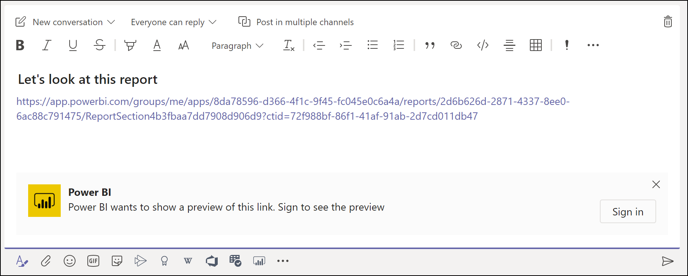
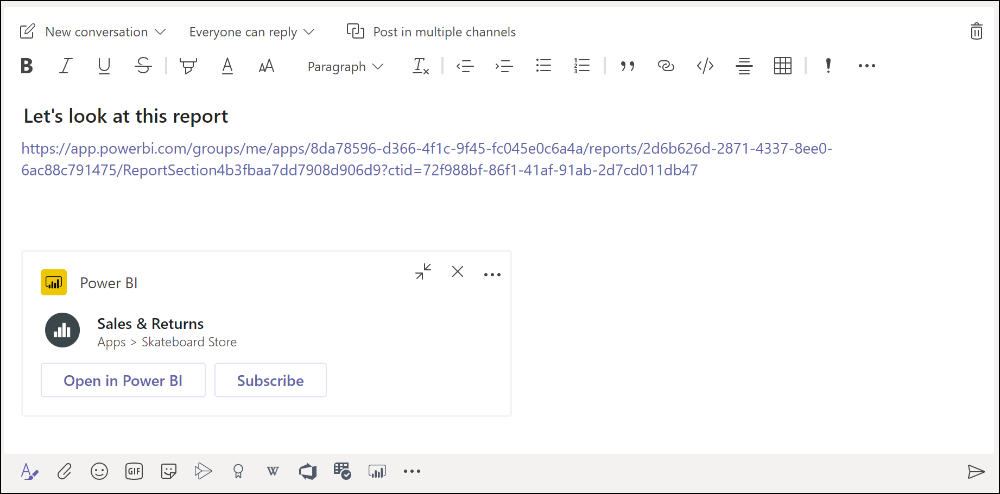

# Get a Power BI link preview in Microsoft Teams

When you paste a link to your reports, dashboards, and apps into the Microsoft Teams message box, the link preview shows information about the link. Link previews are provided for the following items in Power BI:

- Reports
- Dashboards
- Apps

See [Collaborate in Microsoft Teams with Power BI](service-collaborate-microsoft-teams.md) for background on how Power BI and Microsoft Teams work together, including requirements you need to meet.

## Get a link preview

Follow these steps to get a link preview for content in the Power BI service.

1. Copy a link to a report, a dashboard, or an app in the Power BI service. For example, copy the link from the browser address bar.

1. Paste the link in the Microsoft Teams message box. Sign in to the link preview service if prompted. You might need to wait a few seconds for the link preview to load.

    

1. The basic link preview appears after successful sign-in.

    

1. Select the **Expand** icon to show the rich preview card.

    

1. The rich link preview card shows the link and relevant action buttons.

    

1. Send the message.

## Known issues and limitations

- Link previews don't work in meeting chat or private channels.
- See the [Known issues and limitations](service-collaborate-microsoft-teams.md#known-issues-and-limitations) section of the "Collaborate in Microsoft Teams" article for other issues.

## Next steps

- [Collaborate in Microsoft Teams with Power BI](service-collaborate-microsoft-teams.md)

More questions? [Try asking the Power BI Community](https://community.powerbi.com/).
