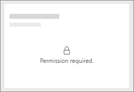
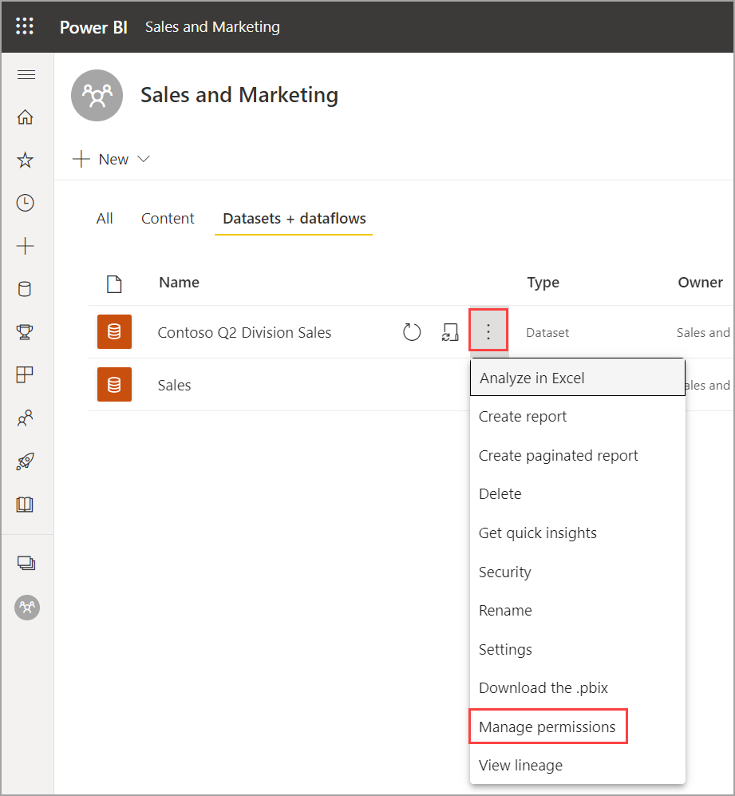
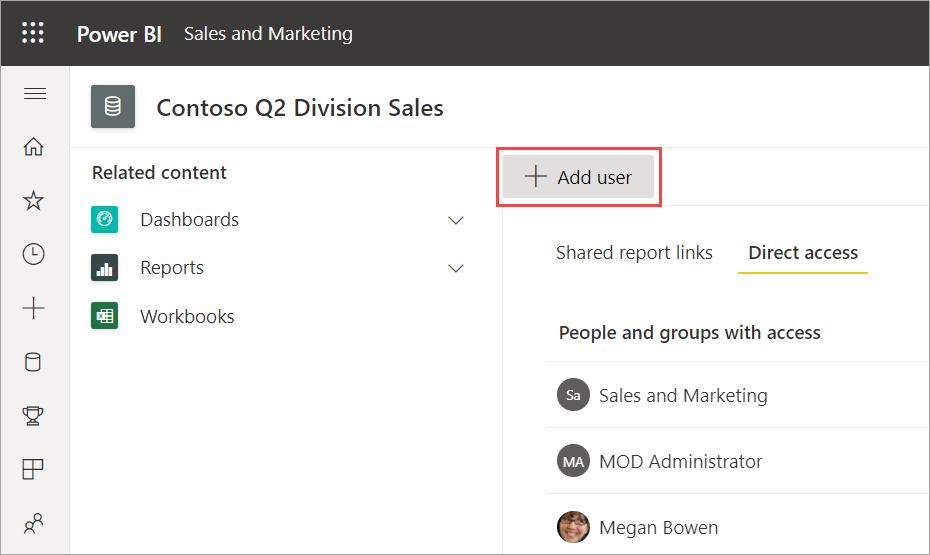
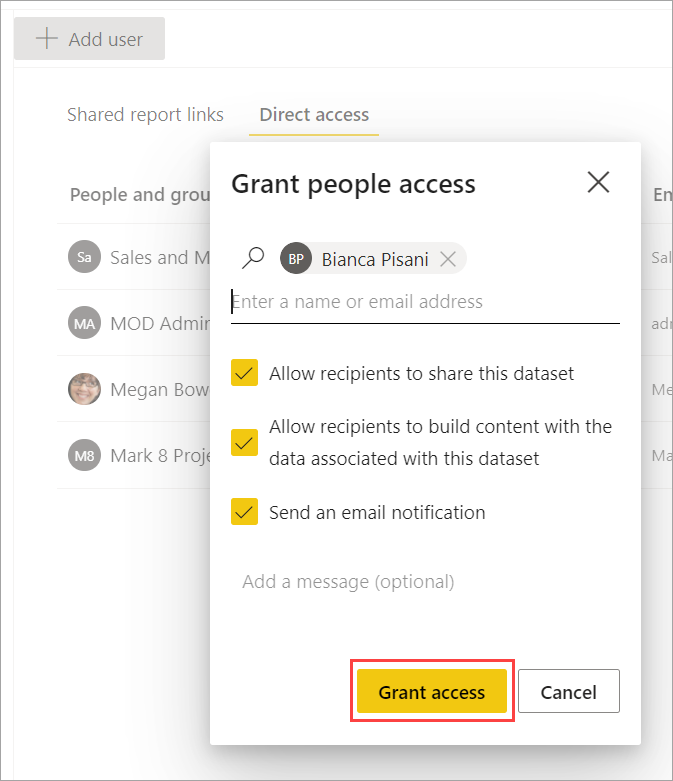

# Troubleshoot sharing dashboards and reports

Here are some common issues that may come up when you're sharing a dashboard or report, or when someone else is sharing with you. 

## Dashboard recipients see a lock icon in a tile

The people you share with may see a locked tile in a dashboard, or a "Permission required" message when they try to view a report.

If so, you need to grant them permission to the underlying dataset.

1. Go to the **All** or the **Datasets + dataflows** tab in your content list.

1. Select **More options (...)** next to a dataset, then select **Manage permissions**.

    

1. Select **Add user**.

    

1. Enter the full email addresses for individuals, distribution groups, or security groups. You can't share with dynamic distribution lists. Decide if they can **share this dataset** or **build content with the data associated with this dataset**, and if you want to **send an email notification**.

    

1. Select **Grant access**.

## I can't share a dashboard or report

To share a dashboard or report, you need permission to reshare the underlying content; that is, any related reports and datasets. If you see a message saying you can't share, ask the report author to give you reshare permission for those reports and datasets.

## I don't have access to a dashboard or report

If you see a "Request access" message when you select the link to a report or dashboard, you don't have permission to view it. You need to [request access to it](service-request-access.md).

## Next steps

- [Share Power BI dashboards and reports with coworkers and others](service-share-dashboards.md)
- [How should I collaborate on and share dashboards and reports?](service-how-to-collaborate-distribute-dashboards-reports.md)
- [Share a filtered Power BI report](service-share-reports.md)
- Questions? [Try the Power BI Community](https://community.powerbi.com/)
