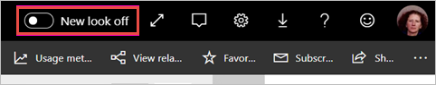
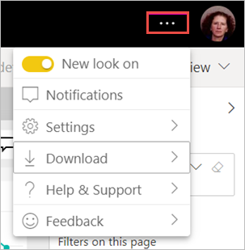

# Opt in to the workspace 'new look' (preview)

Workspaces have a new look that coincides with the [new look](../consumer/service-new-look.md) of the Power BI service. Anyone using the Power BI service (app.powerbi.com) can opt in. When you turn on the **New look** in the black header bar, you opt in to the new look for reports and workspaces. All workspaces, both classic and new, can benefit from the new look.

Looking for information about the new look in **Power BI Desktop**? See [Use the updated ribbon in Power BI Desktop](../create-reports/desktop-ribbon.md).

## Features of the new look

:::image type="content" source="media/service-workspaces-new-look/power-bi-workspace-new-look-numbered.png" alt-text="The new look for workspaces, with callout numbers for explanation":::

|Number  |How it works |
|---------|---------|
|    | **Get Data**: It's easier to add content to your workspace. Select the **+ New** button to connect to data, open files, and create reports, dashboards, and more.  |
|   | **View switcher**: To see the connections between dataflows, datasets, reports, and dashboards, and their connections to other data sources, switch between **List** view and **Lineage** view. |
|  | **Search within workspace**: Search all the content in a workspace in the new search box.  |
|   | **List and tabs**: All the content in a workspace is in a flat list of dashboards, reports, datasets, etc., like SharePoint. You no longer open a workspace to a potentially empty **Dashboards** tab, and wonder where your content is. Here's the new tab order:  **All**: Shows all content (dashboards, reports, workbooks, paginated reports, datasets, and dataflows) in the workspace.  **Content**: Gathers all content created for consumption (dashboards, reports, workbooks, and paginated reports) within the workspace.  **Datasets + dataflows**: Gathers all the datasets and dataflows in the workspace, for easy data management. |
|  | **Filters**: For workspaces with hundreds of artifacts, you can filter the content in the Filters pane. Once a filter is applied, you see the filter on top of the content list. |

**Quick actions**: When you hover over content in the list, you see the most common actions for that item, plus others available on the **More options** (...) menu.

:::image type="content" source="media/service-workspaces-new-look/power-bi-workspace-new-look-quick-actions.png" alt-text="Quick actions in the new workspace":::

## Opt in to the new look

Any Power BI service user can opt in to the new look. Just slide **New look off** to **New look on**.

If you need to return to the old look, just slide it back to **off** . If you don't see it, select the ellipsis menu in the upper-right corner.

## Next steps

- [Use the updated ribbon in Power BI Desktop](../create-reports/desktop-ribbon.md)
- [The 'new look' of the Power BI service](../consumer/service-new-look.md)
- Questions? [Try the Power BI Community](https://community.powerbi.com/)
