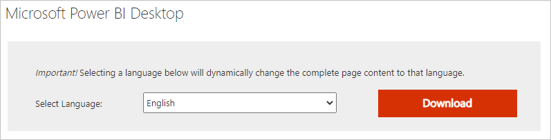
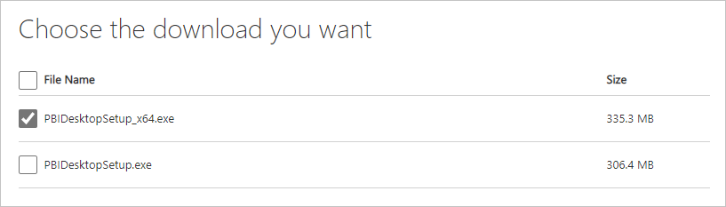

# Troubleshoot Access and Excel XLS import issues in Power BI Desktop

In Power BI Desktop, imported Access databases and Excel 97-2003 XLS files both use the *Access Database Engine*. Three common situations can prevent the Access Database Engine from working properly:

- No Access Database Engine is installed.
- The Access Database Engine bit version, 32-bit or 64-bit, is different from the Power BI Desktop bit version.
- You're using Access or XLS files with a Microsoft 365 subscription.

<a name="situation-1-no-access-database-engine-is-installed"></a>
## No Access Database Engine installed

If a Power BI Desktop error message indicates the Access Database Engine isn't installed, [install the Access Database Engine](https://www.microsoft.com/download/details.aspx?id=54920) from the downloads page. Install the version, either 32-bit or 64-bit, that matches your Power BI Desktop version.

If you work with dataflows and use a gateway to connect to the data, you must install the Access Database Engine on the computer that runs the gateway.

>[!NOTE]
>If the Access Database Engine bit version you install is different from your Microsoft Office bit version, your Office applications won't be able to use the Access Database Engine.

<a name="situation-2-the-access-database-engine-bit-version-32-bit-or-64-bit-is-different-from-your-power-bi-desktop-bit-version"></a>
## Access Database Engine bit version is different from Power BI Desktop bit version

This situation usually occurs when the installed Microsoft Office version is 32-bit and the installed Power BI Desktop version is 64-bit. The opposite can also happen, and the bit version mismatch occurs in either case.

Any of the following solutions can remedy this bit-version mismatch error. You can also apply these solutions to other mismatches, for example other 32-bit COM applications like Visual Studio SSDT.

If you're using Access or XLS files with a Microsoft 365 subscription, see [Access or XLS files with Microsoft 365](#situation-3-trouble-using-access-or-xls-files-with-a-microsoft-365-subscription) for a different issue and resolution.

### Solution 1: Change Power BI Desktop bit version to match Microsoft Office bit version

To change the bit version of Power BI Desktop, uninstall Power BI Desktop, and then install the version of Power BI Desktop that matches your Office installation.

>[!NOTE]
>If you use the 32-bit version of Power BI Desktop to create very large data models, you might experience out-of-memory issues.

To select a version of Power BI Desktop:

1. On the [Power BI Desktop download page](https://www.microsoft.com/download/details.aspx?id=58494), choose your language, and then select **Download**.
   
   
   
1. On the next screen, select the checkbox next to **PBIDesktop.msi** for the 32-bit version, or **PBIDesktop_x64.msi** for the 64-bit version, and then select **Next**.

   

### Solution 2: Change Microsoft Office bit version to match Power BI Desktop bit version

To change the bit version of Microsoft Office to match the bit version of your Power BI Desktop installation:

1. Uninstall Microsoft Office.

2. Install the version of Office that matches your Power BI Desktop installation.

### Solution 3: Save the XLS file as XLSX

If the error occurs with an Excel 97-2003 XLS workbook, you can avoid using the Access Database Engine by opening the XLS file in Excel and saving it as an XLSX file.

### Solution 4: Install both versions of the Access Database Engine

You can install both versions of the Access Database Engine to resolve the issue for Power Query for Excel and Power BI Desktop. This workaround isn't recommended, because it can introduce errors and issues for applications that use the Access Database Engine bit version you installed first.

To use both Access Database Engine bit versions:

1. [Install both bit versions of the Access Database Engine](https://www.microsoft.com/download/details.aspx?id=54920) from the download page.

1. Run each version of the Access Database Engine by using the `/passive` switch. For example:

   ```console
   c:\users\joe\downloads\AccessDatabaseEngine.exe /passive

   c:\users\joe\downloads\AccessDatabaseEngine_x64.exe /passive
   ```

<a name="situation-3-trouble-using-access-or-xls-files-with-a-microsoft-365-subscription"></a>
## You use Access or XLS files with Microsoft 365

Office 2013 and Office 2016 Microsoft 365 subscriptions register the Access Database Engine provider in a virtual registry location that only Microsoft Office processes can access. The Mashup Engine, which is responsible for running non-Microsoft 365 Excel and Power BI Desktop, isn't an Office process, so it can't use the Access Database Engine provider.

To fix this situation, [download and install the Access Database Engine Redistributable](https://www.microsoft.com/download/details.aspx?id=54920) that matches the bit version of your Power BI Desktop installation, 32-bit or 64-bit.

## Other import issues

The Power BI team regularly looks for issues that might affect many users, and tries to include them in documentation. If you encounter an issue that this article doesn't cover, submit a question about the issue to [Power BI Support](https://powerbi.microsoft.com/support).

