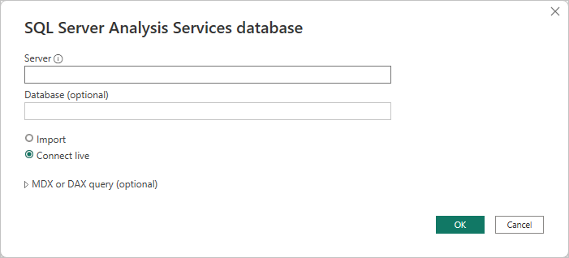
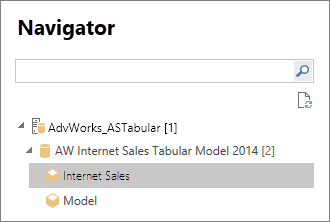
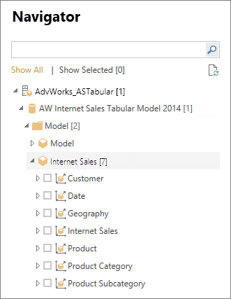

# Connect to Analysis Services tabular data in Power BI Desktop

With Power BI Desktop, there are two ways you can connect to and get data from your SQL Server Analysis Services tabular models:

- Explore by using a live connection
- Select items and import them into Power BI Desktop

**Explore by using a live connection**: When you use a live connection, items in your tabular model or perspective, like tables, columns, and measures, appear in your Power BI Desktop **Data** pane list. You can use Power BI Desktop's advanced visualization and report tools to explore your tabular model in new, highly interactive ways.

When you connect live, no data from the tabular model is imported into Power BI Desktop. Each time you interact with a visualization, Power BI Desktop queries the tabular model and calculates the results that you see. You're always looking at the latest data that is available in the tabular model, either from the last processing time, or from DirectQuery tables available in the tabular model.

Keep in mind that tabular models are highly secure. Items that appear in Power BI Desktop depend on your permissions for the tabular model that you're connected to.

When you've created dynamic reports in Power BI Desktop, you can share them by publishing to your Power BI workspace. When you publish a Power BI Desktop file with a live connection to a tabular model to your workspace, an on-premises data gateway must be installed and configured by an administrator. For more information, see [On-premises data gateway](service-gateway-onprem.md).

**Select items and import into Power BI Desktop**: When you connect with this option, you can select items like tables, columns, and measures in your tabular model or perspective and load them into a Power BI Desktop model. Use Power BI Desktop's Power Query Editor to further shape what you want and its modeling features to further model the data. Because no live connection between Power BI Desktop and the tabular model is maintained, you can then explore your Power BI Desktop model offline or publish to your Power BI workspace.

## To connect to a tabular model

1. In Power BI Desktop, on the **Home** ribbon, select **Get data** > **More** > **Database**.

1. Select **SQL Server Analysis Services database**, and then select **Connect**.

   

1. In the **SQL Server Analysis Services database** window, enter the **Server** name, choose a connection mode, and then select **OK**.

   

1. This step in the **Navigator** window depends on the connection mode you selected:

   - If you’re connecting live, select a tabular model or perspective.
  
     

   - If you chose to select items and get data, select a tabular model or perspective, and then select a particular table or column to load. To shape your data before loading, select **Transform data** to open Power Query Editor. When you’re ready, select **Load** to import the data into Power BI Desktop.

     

## Frequently asked questions

**Question:** Do I need an on-premises data gateway?

**Answer:** It depends. If you use Power BI Desktop to connect live to a tabular model, but have no intention to publish to your Power BI workspace, you don't need a gateway. On the other hand, if you do intend on publishing to your workspace, a data gateway is necessary to ensure secure communication between the Power BI service and your on-premises Analysis Services server. Be sure to talk to your Analysis Services server administrator before installing a data gateway.

If you choose to select items and get data, you import tabular model data directly into your Power BI Desktop file, so no gateway is necessary.

**Question:** What's the difference between connecting live to a tabular model from the Power BI service versus connecting live from Power BI Desktop?

**Answer:** When you connect live to a tabular model from your workspace in the Power BI service to an Analysis Services database on-premises in your organization, an on-premises data gateway is required to secure communications between them. When you connect live to a tabular model from Power BI Desktop, a gateway isn't required because the Power BI Desktop and the Analysis Services server you’re connecting to are both running on-premises in your organization. However, if you publish your Power BI Desktop file to your Power BI workspace, a gateway is required.

**Question:** If I created a live connection, can I connect to another data source in the same Power BI Desktop file?

**Answer:** No. You can't explore live data and connect to another type of data source in the same file. If you’ve already imported data or connected to a different data source in a Power BI Desktop file, you need to create a new file to explore live.

**Question:** If I created a live connection, can I edit the model or query in Power BI Desktop?

**Answer:** You can create report level measures in the Power BI Desktop, but all other query and modeling features are disabled when exploring live data.

**Question:** If I created a live connection, is it secure?

**Answer:** Yes. Your current Windows credentials are used to connect to the Analysis Services server. You can't use basic or stored credentials in either the Power BI service or Power BI Desktop when exploring live.

**Question:** In Navigator, I see a model and a perspective. What’s the difference?

**Answer:** A perspective is a particular view of a tabular model. It might include only particular tables, columns, or measures depending on a unique data analysis need. A tabular model always contains at least one perspective, which could include everything in the model. If you’re unsure which perspective you should select, check with your administrator.

**Question:** Are there any features of Analysis Services that change the way Power BI behaves?

**Answer:** Yes. Depending on the features your tabular model uses, the experience in Power BI Desktop might change. Some examples include:

- You might see measures in the model grouped together at the top of the **Data** pane list rather than in tables alongside columns. Don't worry, you can still use them as normal, it's just easier to find them this way.

- If the tabular model has calculation groups defined, you can use them only with model measures and not with implicit measures you create by adding numeric fields to a visual. The model might also have had the **DiscourageImplicitMeasures** flag set manually, which has the same effect. For more information, see [Calculation groups](/analysis-services/tabular-models/calculation-groups#Benefits).

## To change the server name after initial connection

After you create a Power BI Desktop file with an explore live connection, there might be some cases where you want to switch the connection to a different server. For example, if you created your Power BI Desktop file when connecting to a development server, and before publishing to the Power BI service, you want to switch the connection to a production server.

To change the server name:

1. Select **Transform data** > **Data source settings** from the **Home** tab.

2. In the **Data source settings** window, select the database from the list, then select the **Change Source...** button.

3. In the **SQL Server Analysis Services database** window, enter the new **Server** name, and then select **OK**.

## Troubleshooting

The following list describes all known issues when connecting to SQL Server Analysis Services (SSAS) or Azure Analysis Services:

- **Error: Couldn't load model schema**. This error usually occurs when the user connecting to Analysis Services doesn't have access to the database/model.
