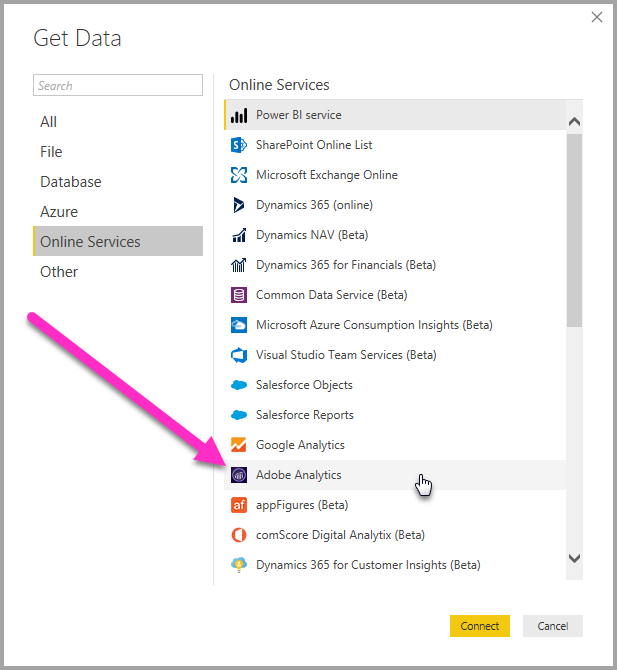
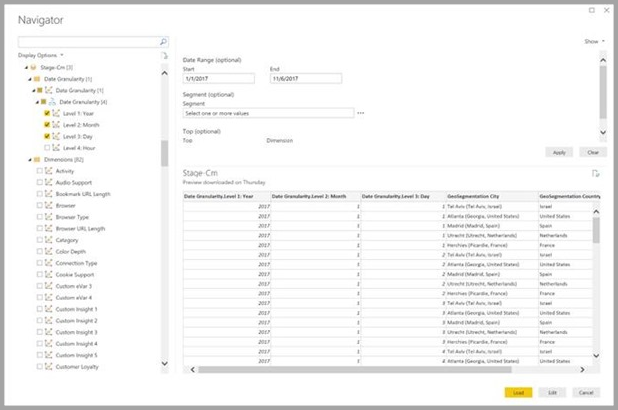
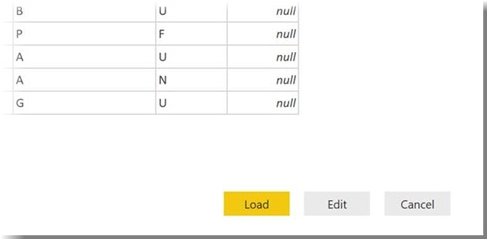

# Connect to Adobe Analytics in Power BI Desktop 
In **Power BI Desktop**, you can connect to **Adobe Analytics** and use the underlying data just like any other data source in Power BI Desktop. 

## Connect to Adobe Analytics data
To connect to **Adobe Analytics** data, select **Get Data** from the **Home** ribbon in Power BI Desktop. Select **Online Services** from the categories on the left, and you see **Adobe Analytics**.

In the **Adobe Analytics** window that appears, select the **Sign in** button, and provide your credentials to sign in to your Adobe Analytics account. The Adobe sign in window appears, as shown in the following image.

When prompted, put in your username and password. Once the connection is established, you can preview and select multiple dimensions and measures within the Power BI **Navigator** dialog to create a single tabular output. You can also provide any necessary input parameters required for the selected items. 

You can **Load** the selected table, which brings the entire table into **Power BI Desktop**, or you can **Edit** the query, which opens **Query Editor** so you can filter and refine the set of data you want to use, and then load that refined set of data into **Power BI Desktop**.

## Next steps
There are all sorts of data you can connect to using Power BI Desktop. For more information on data sources, check out the following resources:

* [What is Power BI Desktop?](../fundamentals/desktop-what-is-desktop.md)
* [Data Sources in Power BI Desktop](desktop-data-sources.md)
* [Shape and Combine Data with Power BI Desktop](desktop-shape-and-combine-data.md)
* [Connect to Excel workbooks in Power BI Desktop](desktop-connect-excel.md)   
* [Enter data directly into Power BI Desktop](desktop-enter-data-directly-into-desktop.md)   
