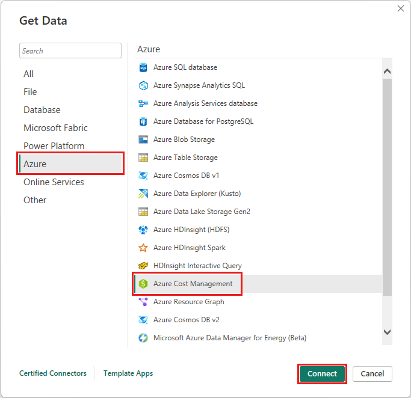
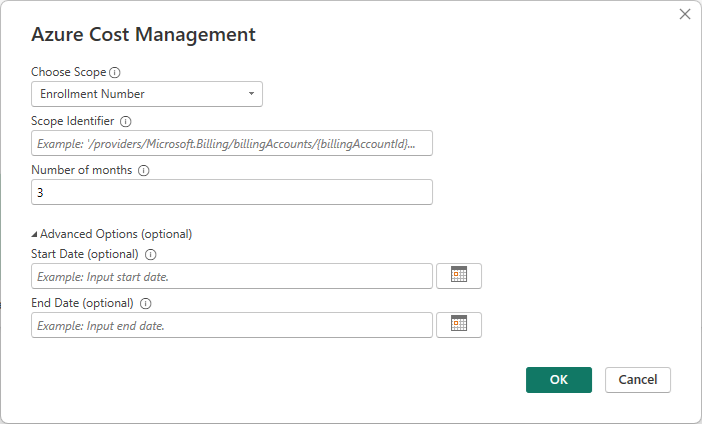

# Create visuals and reports with the Azure Cost Management connector in Power BI Desktop

You can use the Azure Cost Management connector for Power BI Desktop to make powerful, customized visualizations and reports that help you better understand your Azure spend. 

The Azure Cost Management connector currently supports customers with:

* A direct [Microsoft Customer Agreement](https://www.microsoft.com/Licensing/how-to-buy/microsoft-customer-agreement)
* An Enterprise Agreement (EA)
* A [Microsoft Partner Agreement](https://www.microsoft.com/licensing/news/introducing-microsoft-partner-agreement)

If you have an unsupported agreement, you can use Exports to save the cost data to a share and then connect to it using Power BI. For more information, see [Tutorial - Create and manage exported data from Azure Cost Management](/azure/cost-management-billing/costs/tutorial-export-acm-data?tabs=azure-portal).

The Azure Cost Management connector uses OAuth 2.0 for authentication with Azure and identifies users who are going to use the connector. Tokens generated in this process are valid for a specific period. Power BI preserves the token for the next sign-in. OAuth 2.0, is a standard for the process that goes on behind the scenes to ensure the secure handling of these permissions. To connect, you must use an [Enterprise Administrator](/azure/billing/billing-understand-ea-roles) account for Enterprise Agreements, or have [appropriate permissions](/microsoft-365/commerce/billing-and-payments/manage-billing-profiles) at the billing account or billing profile levels for Microsoft Customer Agreements. 

> [!NOTE]
> This connector replaces the previously available [Azure Consumption Insights and Azure Cost Management (Beta)](desktop-connect-azure-cost-management.md) connectors. Any reports created with the previous connector must be recreated using this connector.

## Connect using Azure Cost Management

To use the **Azure Cost Management connector** in Power BI Desktop, take the following steps:

1.	In the **Home** ribbon, select **Get Data**.
2.	Select **Azure** from the list of data categories.
3.	Select **Azure Cost Management**.

    

4. In the dialog that appears, for the **Choose Scope** drop down, use **Manually Input Scope** for **Microsoft Customer Agreements**, or use **Enrollment Number** for **Enterprise Agreements (EA)**. 


## Connect to a Microsoft Customer Agreement account 

This section describes the steps necessary to connect to a Microsoft Customer Agreement account.

### Connect to a billing account

To connect to a billing account, you need to retrieve your **Billing account ID** from the Azure portal:

1.	In the [Azure portal](https://portal.azure.com/), navigate to **Cost Management + Billing**.
2.	Select your Billing profile. 
3.	Under **Settings** in the menu, select **Properties** in the sidebar.
4.	Under **Billing profile**, copy the **ID**. 
    :::image type="content" source="media/desktop-connect-azure-cost-management/product-updates-02.png" alt-text="Screenshot of Cost management billing profile":::
5.	For **Choose Scope**, select **Manually Input Scope** and input the connection string as shown in the following example, replacing *{billingAccountId}* with the data copied from the previous steps. 
    ```/providers/Microsoft.Billing/billingAccounts/{billingAccountId}```

    Alternatively, for **Choose Scope**, select **Enrollment Number** and input the Billing Account ID string as copied from the previous steps.

6.	Enter the number of months and select **OK**.

    :::image type="content" source="media/desktop-connect-azure-cost-management/azure-cost-management-updates-05.png" alt-text="Screenshot of Azure Cost Management with number of months input":::

    Alternatively, if you want to download less than a month's worth of data you can set *Number of months* to zero, then specify a date range using *Start Date* and *End Date* values that equate to less than 31 days.

7.	When prompted, sign in with your Azure user account and password. You must have access to the Billing account scope to successfully access the billing data.

### Connect to a billing profile

To connect to a **billing profile**, you must retrieve your **Billing profile ID** and **Billing account ID** from the Azure portal:

1.	In the [Azure portal](https://portal.azure.com/), navigate to **Cost Management + Billing**.
2.	Select your Billing profile. 
3.	Under **Settings** in the menu, select **Properties** in the sidebar.
4.	Under **Billing profile**, copy the **ID**. 
5.  Under **Billing account**, copy the **ID**. 

    :::image type="content" source="media/desktop-connect-azure-cost-management/azure-cost-management-updates-04.png" alt-text="Screenshot of Azure Cost Management billing account information":::

6.	For **Choose Scope**, select **Manually Input Scope** and input the connection string as shown in the following example, replacing *{billingAccountId}* and *{billingProfileId}* with the data copied from the previous steps. 

    ```/providers/Microsoft.Billing/billingAccounts/{billingAccountId}/billingProfiles/{billingProfileId}```

7.	Enter the number of months and select **OK**.

8.  When prompted, sign in with your Azure user account and password. You must have access to the Billing profile to successfully access the billing profile data. 


## Connect to an Enterprise Agreement account

To connect with an Enterprise Agreement (EA) account, you can get your enrollment ID from the Azure portal:

1.	In the [Azure portal](https://portal.azure.com/), navigate to **Cost Management + Billing**.
2.	Select your billing account.
3.	On the **Overview** menu, copy the **Billing account ID**.
4.	For **Choose Scope**, select **Enrollment Number** and paste the billing account ID from the previous step. 
5.	Enter the number of months and then select **OK**.

    

6.	When prompted, sign in with your Azure user account and password. You must use an Enterprise Administrator account for Enterprise Agreements.

## Data available through the connector

Once you successfully authenticate, a **Navigator** window appears with the following available data tables:

| **Table** | **Account Type** | **Supported Scopes** | **Description** |
| --- | --- | --- | --- |
| **Balance summary** |  EA only | EA Enrollment | Summary of the balance for the current billing month for Enterprise Agreements (EA). |
| **Billing events** |  MCA only | Billing Profile | Event log of new invoices, credit purchases, etc. Microsoft Customer Agreement only. |
| **Budgets** |  EA, MCA | EA Enrollment,MCA Billing Account,MCA Billing Profile | Budget details to view actual costs or usage against existing budget targets. |
| **Charges** |  MCA only | MCA Billing Profile | A month-level summary of Azure usage, Marketplace charges, and charges billed separately. Microsoft Customer Agreement only. |
| **Credit lots** |  MCA only | MCA Billing Profile | Azure credit lot purchase details for the provided billing profile. Microsoft Customer Agreement only. |
| **Pricesheets** |  EA, MCA | EA Enrollment,MCA Billing Profile | Applicable meter rates for the provided billing profile or EA enrollment. |
| **RI charges** |  EA, MCA | EA Enrollment,MCA Billing Profile | Charges associated to your Reserved Instances over the last 24 months. This table is in the process of being deprecated, please use RI transactions |
| **RI recommendations (shared)** |  EA, MCA | EA Enrollment,MCA Billing Profile | Reserved Instance purchase recommendations based on all your subscription usage trends for the last 30 days. |
| **RI recommendations (single)** |  EA, MCA | EA Enrollment,MCA Billing Profile | Reserved Instance purchase recommendations based on your single subscription usage trends for the last 30 days. |
| **RI transactions** |  EA, MCA | EA Enrollment,MCA Billing Profile | List of transactions for reserved instances on billing account scope. |
| **RI usage details** |  EA, MCA | EA Enrollment,MCA Billing Profile | Consumption details for your existing Reserved Instances over the last month. |
| **RI usage summary** |  EA, MCA | EA Enrollment,MCA Billing Profile | Daily Azure reservation usage percentage. |
| **Usage details** |  EA, MCA | EA Enrollment,MCA Billing Account,MCA Billing Profile | A breakdown of consumed quantities and estimated charges for the given billing profile on EA enrollment. |
| **Usage details amortized** |  EA, MCA | EA Enrollment,MCA Billing Account,MCA Billing Profile | A breakdown of consumed quantities and estimated amortized charges for the given billing profile on EA enrollment. |

You can select a table to see a preview dialog. You can select one or more tables by selecting the boxes beside their name and then select **Load**.


When you select **Load**, the data is loaded into Power BI Desktop. 

When the data you selected is loaded, the data tables and fields are shown in the **Fields** pane.

## Considerations and limitations

The following considerations and limitations apply to the Azure Cost Management data connector:

* Data row requests exceeding one million rows isn't supported by Power BI. Instead, you can try using the export feature described in [create and manage exported data in Azure Cost Management](/azure/cost-management-billing/costs/tutorial-export-acm-data).
* The Azure Cost Management data connector doesn't work with Office 365 GCC customer accounts.
* **Data refresh:** The cost and usage data is typically updated and available in the Azure portal and supporting APIs within 8 to 24 hours, so we suggest you constrain Power BI scheduled refreshes to once or twice a day. 
* **Data source reuse:** If you have multiple reports that are pulling the same data, and don't need more report-specific data transformations, you should reuse the same data source, which would reduce the amount of time required to pull the Usage Details data. 

    For more information on reusing data sources, see the following:

    * [Introduction to semantic models across workspaces](service-datasets-across-workspaces.md)
    * [Create reports based on semantic models from different workspaces](service-datasets-discover-across-workspaces.md)


You might receive a *400 bad request* from the **RI usage details** when you try to refresh the data if you've chosen date parameter greater than three months. To mitigate the error, take the following steps:

1.	In Power BI Desktop, select **Home > Transform data**.
2.	In Power Query Editor, select the **RI usage details** semantic model and select **Advanced Editor**.
3.	Update the Power Query code as shown in the following paragraphs, which split the calls into three-month chunks. Make sure you note and retain your enrollment number, or billing account/billing profile ID.
    
    For **EA** use the following code update:
    
    ```
    let
        enrollmentNumber = "<<Enrollment Number>>",
        optionalParameters1 = [startBillingDataWindow = "-9", endBillingDataWindow = "-6"],
        source1 = AzureCostManagement.Tables("Enrollment Number", enrollmentNumber, 5, optionalParameters1),
        riusagedetails1 = source1{[Key="riusagedetails"]}[Data],
        optionalParameters2 = [startBillingDataWindow = "-6", endBillingDataWindow = "-3"],
        source2 = AzureCostManagement.Tables("Enrollment Number", enrollmentNumber, 5, optionalParameters2),    
        riusagedetails2 = source2{[Key="riusagedetails"]}[Data],
        riusagedetails = Table.Combine({riusagedetails1, riusagedetails2})
    in
        riusagedetails
    ```
    
    For **Microsoft Customer Agreements** use the following update:
    
    ```
    let
        billingProfileId = "<<Billing Profile Id>>",
        optionalParameters1 = [startBillingDataWindow = "-9", endBillingDataWindow = "-6"],
        source1 = AzureCostManagement.Tables("Billing Profile Id", billingProfileId, 5, optionalParameters1),
        riusagedetails1 = source1{[Key="riusagedetails"]}[Data],
        optionalParameters2 = [startBillingDataWindow = "-6", endBillingDataWindow = "-3"],
        source2 = AzureCostManagement.Tables("Billing Profile Id", billingProfileId, 5, optionalParameters2),    
        riusagedetails2 = source2{[Key="riusagedetails"]}[Data],
        riusagedetails = Table.Combine({riusagedetails1, riusagedetails2})
    in
        riusagedetails
    
    ```
4.	Once you've updated the code with the appropriate update from the previous step, select **Done** and then select **Close & Apply**. 

You might run into a situation where tags aren't working in the usage details or the tags column can't be transformed to json. This issue stems from the current UCDD API returning the tags column by trimming the start and end brackets, which results in Power BI being unable to transform the column because it returns it as a string. To mitigate this situation, take the following steps. 


1. Navigate to **Query Editor**.
2. Select the *Usage Details* table.
3. In the right pane, the **Properties** pane shows the **Applied Steps**. You need to add a custom column to the steps, after the **Navigation** step. 
4. From the menu, select **Add column** > **Add custom column**
5. Name the column, for example you could name the column *TagsInJson* or whatever you prefer, and then enter the following text in the query: 
    ```dax
    
    ```= "{"& [Tags] & "}"
6. Completing the previous steps creates a new column of *tags* in the json format
7. You can now transfer and expand the column as you need to.


**Authentication issues encountered with Microsoft Entra guest accounts:** You may have the appropriate permissions to access the enrollment or billing account, but receive an authentication error similar to one of the following: 

* *Access to the resource is forbidden* 
* *We couldn’t authenticate with the credentials provided. Please try again.*

These errors could be the result of having a user account in a different Microsoft Entra domain that has been added as a guest user. 

For guest accounts: Use the following settings or options as you're prompted with the **authentication dialog** when connecting with the Cost Management Power BI connector:

1.	Select **Sign-in**
2.	Select the **Use another account** (bottom of the dialog)
3.	Select **Sign-in options** (bottom of the dialog box)
4.	Select **Sign into an organization**
5.	For **Domain name**, provide the Fully Qualified Domain Name (FQDN) of the Microsoft Entra domain into which you've been added as a guest.
6.	Then, for **Pick an account** select the user account that you’ve previously authenticated.  


## Related content

You can connect to many different data sources using Power BI Desktop. For more information, see the following articles:

* [What is Power BI Desktop?](../fundamentals/desktop-what-is-desktop.md)
* [Data Sources in Power BI Desktop](desktop-data-sources.md)
* [Shape and Combine Data with Power BI Desktop](desktop-shape-and-combine-data.md)
* [Connect to Excel workbooks in Power BI Desktop](/power-query/connectors/excel)  
* [Enter data directly into Power BI Desktop](desktop-enter-data-directly-into-desktop.md)
