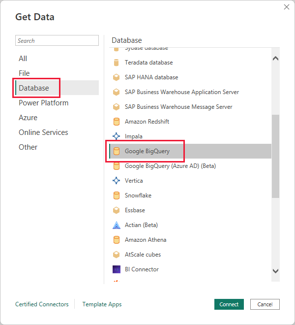
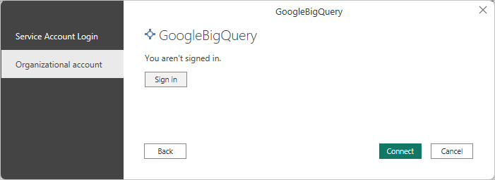
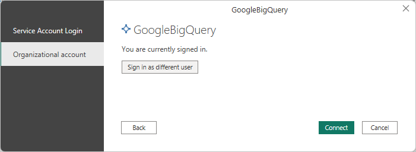
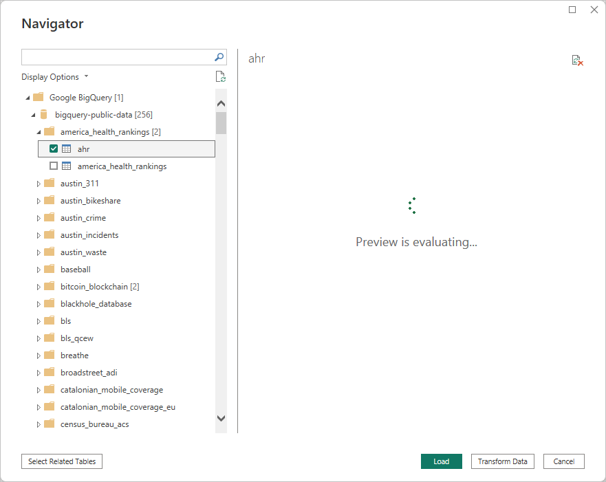

# Connect to a Google BigQuery database in Power BI Desktop
In Power BI Desktop, you can connect to a Google **BigQuery** database and use the underlying data just like any other data source in Power BI Desktop.

## Connect to Google BigQuery
To connect to a Google **BigQuery** database select **Get Data** from the **Home** ribbon in Power BI Desktop. Select **Database** from the categories on the left, and you see **Google BigQuery**.

In the **Google BigQuery** window that appears, sign in to your Google BigQuery account and select **Connect**.

When you're signed in, you see the following window indicated you've been authenticated. 

Once you successfully connect, a **Navigator** window appears and displays the data available on the server, from which you can select one or multiple elements to import and use in **Power BI Desktop**.

## Considerations and Limitations
There are a few limits and considerations to keep in mind with the Google **BigQuery** connector:

* The Google BigQuery connector is available in Power BI Desktop and in the Power BI service. In the Power BI service, the connector can be accessed using the Cloud-to-Cloud connection from Power BI to Google BigQuery.

For more detailed information about connecting to Google BigQuery, see the [Power Query article](/power-query/connectors/googlebigquery) that describes the connector in detail. 

## Next steps
There are all sorts of data you can connect to using Power BI Desktop. For more information on data sources, check out the following resources:

* [What is Power BI Desktop?](../fundamentals/desktop-what-is-desktop.md)
* [Data Sources in Power BI Desktop](desktop-data-sources.md)
* [Shape and Combine Data with Power BI Desktop](desktop-shape-and-combine-data.md)
* [Connect to Excel workbooks in Power BI Desktop](desktop-connect-excel.md)   
* [Enter data directly into Power BI Desktop](desktop-enter-data-directly-into-desktop.md)   
