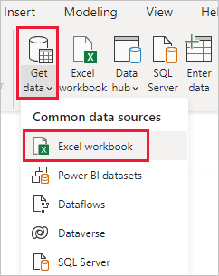
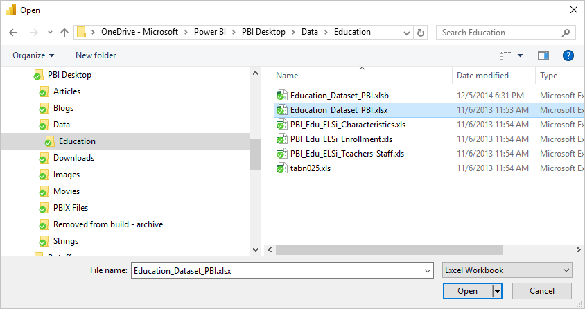
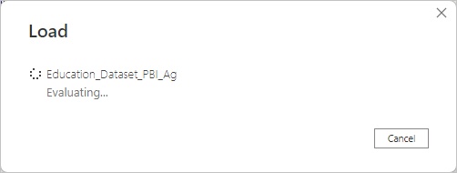
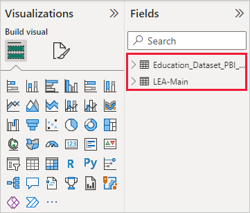

# Connect to Excel in Power BI Desktop
Connecting to an Excel workbook from Power BI Desktop is straightforward, and this article walks you through the steps.

In Power BI Desktop, select **Get Data > Excel** from the **Home** ribbon.

Select your workbook from the **Open** dialog that appears.

Power BI Desktop presents the tables on other data elements from the workbook in the **Navigator** window. When you select a table in the left pane, a preview of the data appears in the right pane.

You can select the Load button to import the data, or if you want to edit the data using **Power Query Editor** before bringing it into Power BI Desktop, select the **Edit** button.

When you load the data, Power BI Desktop displays the **Load** window and displays the activity associated with loading the data.  

When complete, Power BI Desktop displays the tables and fields it imported from your Excel workbook in the **Fields** pane, on the right side of the Desktop.

And that’s it!

You’re now ready to use the imported data from your Excel workbook in Power BI Desktop to create visuals, reports, or interact with any other data you might want to connect with and import, such as other Excel workbooks, databases, or any other data source.

## Next steps
There are all sorts of data you can connect to using Power BI Desktop. For more information on data sources, check out the following resources:

* [What is Power BI Desktop?](../fundamentals/desktop-what-is-desktop.md)
* [Data Sources in Power BI Desktop](desktop-data-sources.md)
* [Shape and Combine Data with Power BI Desktop](desktop-shape-and-combine-data.md)
* [Connect to CSV files in Power BI Desktop](desktop-connect-csv.md)   
* [Enter data directly into Power BI Desktop](desktop-enter-data-directly-into-desktop.md)   
