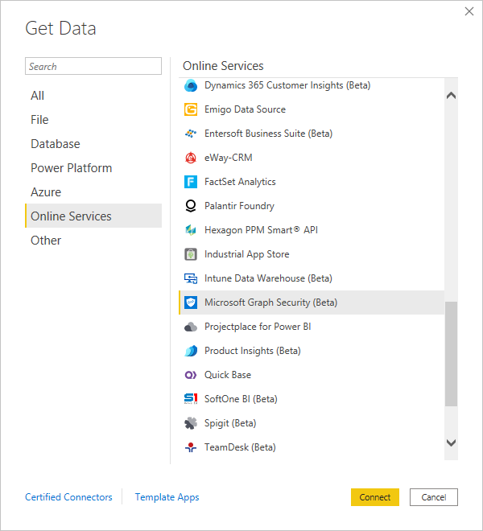
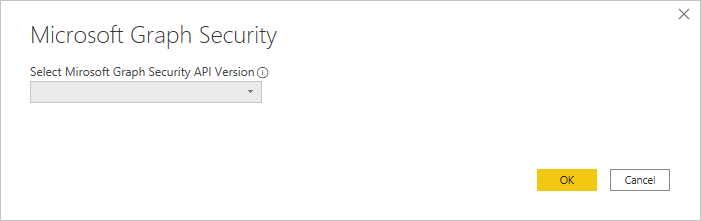

# Connect to the Microsoft Graph Security API in Power BI Desktop

> [!NOTE]
> The Microsoft Graph Security connector is deprecated as of May 2021 and has been removed from the "Get Data" experience in Power BI Desktop. We recommend that you replace existing connections that use this connector, and refrain from using this connector for new connections. For more information, see the [Microsoft Graph Security documentation](/power-query/connectors/microsoftgraphsecurity).

Use the Microsoft Graph Security connector of Power BI Desktop to connect to the [Microsoft Graph Security API](/graph/security-concept-overview). You can then build dashboards and reports to gain insights into your security-related [alerts](/graph/api/resources/alert) and [secure scores](/graph/api/resources/securescores).

The Microsoft Graph Security API connects [multiple security solutions](/graph/api/resources/security-api-overview#alerts) from Microsoft and its partners to make correlation of alerts easier. This combination provides access to rich contextual information and simplifies automation. It empowers organizations to quickly gain insights and act across multiple security products, while reducing cost and complexity.

## Prerequisites to use the Microsoft Graph Security connector

To use the Microsoft Graph Security connector, you must *explicitly* get consent by the Azure Active Directory (Azure AD) global administrator. See [Microsoft Graph Security authentication requirements](/graph/security-authorization).
Consent requires the connector's application ID and name, which is cited here and is available in the [Azure portal](https://portal.azure.com):

| Property | Value |
|----------|-------|
| **Application name** | `MicrosoftGraphSecurityPowerBIConnector` |
| **Application ID** | `cab163b7-247d-4cb9-be32-39b6056d4189` |
| **Redirect URI** | `https://oauth.powerbi.com/views/oauthredirect.html` |

To grant consent for the connector, your Azure AD global administrator can use either of these methods:

* [Grant consent for Azure AD applications](/azure/active-directory/develop/v2-permissions-and-consent)
* Respond to a request that your logic app submits during its first run-through the
   [application-consent experience](/azure/active-directory/develop/application-consent-experience)

The user account that signs in to the Microsoft Graph Security connector must be assigned the Azure AD Security Reader role, if the user isn't a member of the *Security Administrator* role. See [Assign Azure AD roles to users](/graph/security-authorization#assign-azure-ad-roles-to-users).

## Using the Microsoft Graph Security connector

Follow these steps to use the connector:

1. Select **Get data** > **More** from the **Home** ribbon in Power BI Desktop.
1. Select **Online Services** from the categories list on the left side of the window.
1. Select **Microsoft Graph Security (Beta)**.

    

1. In the **Microsoft Graph Security** window, select the Microsoft Graph API version to query: **v1.0** or **beta**.

    

1. Sign in to your Azure Active Directory account when you're prompted. This account needs to have the *Security Reader* or *Security Administrator* role, as mentioned in the previous section.

     

1. If you're the administrator *and* you don't yet have consent to the Microsoft Graph Security Power BI connector (application), you see the following dialog. Select **Consent on behalf of your organization**.

    

1. When you're signed in, you see the following dialog that indicates that you've been authenticated. Select **Connect**.

    

1. After you connect, the **Navigator** window displays the alerts, secure scores, and other entities that are available in the [Microsoft Graph Security API](/graph/security-concept-overview) for the version that you selected in step 4. Select one or more entities to import and use in Power BI Desktop. Then, select **Load** to get the result view that's shown after step 9.

   :::image type="content" source="media/desktop-connect-graph-security/import-navigator.png" alt-text="Screenshot shows the Navigator dialog." lightbox="media/desktop-connect-graph-security/import-navigator.png":::

1. If you want to use an advanced query with the Microsoft Graph Security API, select **Specify custom Microsoft Graph Security URL to filter results**. Use this function to issue an [OData.Feed](./desktop-connect-odata.md) query to the Microsoft Graph Security API with the required permissions.

   The following example uses the `https://graph.microsoft.com/v1.0/security/alerts?$filter=Severity eq 'High'` *serviceUri*. To see how to build queries to filter, order, or retrieve the most-recent results, refer to [OData system query options](/graph/query-parameters).

   :::image type="content" source="media/desktop-connect-graph-security/odata-feed-messages.png" alt-text="Screenshot shows the Odata feed for the example." lightbox="media/desktop-connect-graph-security/odata-feed-messages.png":::

   When you select **Invoke**, the **OData.Feed** function makes a call to the API, which opens Power Query Editor. Filter and refine the set of data that you want to use. Then, you load that data into Power BI Desktop.

Here's the results window for the Microsoft Graph Security entities that we queried for:

   :::image type="content" source="media/desktop-connect-graph-security/result-window.png" alt-text="Screenshot shows the results windows for the example." lightbox="media/desktop-connect-graph-security/result-window.png":::

Now you're ready to use the imported data from the Microsoft Graph Security connector in Power BI Desktop. You can create graphics or reports. Or, you can interact with other data that you import from Excel workbooks, databases, or other data sources.

## Next steps

* Check out Power BI samples and templates that use this connector at [Microsoft Graph Security GitHub Power BI samples](https://aka.ms/graphsecuritypowerbiconnectorsamples).

* For user scenarios and additional information, see [this Microsoft Graph Security Power BI connector blog post](https://aka.ms/graphsecuritypowerbiconnectorblogpost).

* You can connect to all sorts of data by using Power BI Desktop. For more information, check out the following resources:

  * [What is Power BI Desktop?](../fundamentals/desktop-what-is-desktop.md)
  * [Data sources in Power BI Desktop](desktop-data-sources.md)
  * [Shape and combine data with Power BI Desktop](desktop-shape-and-combine-data.md)
  * [Connect to Excel workbooks in Power BI Desktop](desktop-connect-excel.md)
  * [Enter data directly into Power BI Desktop](desktop-enter-data-directly-into-desktop.md)
